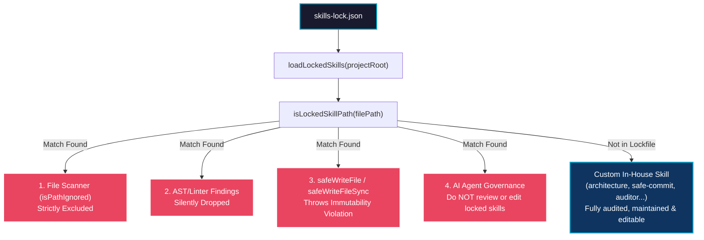

# Official Locked Skills Architecture & Isolation Guide

> **Module**: `.agents/skills/architecture/references/skills-lock.md`  
> **Auditor Engine Core**: `src/core/auditorBase.ts` & `src/core/safePath.ts`  
> **Test Coverage**: [`tests/locked_skills.test.ts`](../../../../tests/locked_skills.test.ts)

---

## 1. Overview & Architectural Motivation

In modern agentic software development, repositories frequently import official, upstream-curated **agent skills** from external vendor repositories (such as `antfu/skills`, `anthropics/skills`, `greensock/gsap-skills`, `fallow-rs/fallow-skills`, `vuejs-ai/skills`, `obra/superpowers`, etc.).

Without formal architectural boundaries, two critical hazards emerge:

1. **Agent Over-Auditing & False Positives**: Static analysis engines and AI agents mistakenly treat third-party vendor skills as project application code, attempting to enforce local naming conventions, CSS guidelines, or TypeScript types on immutable vendor assets.
2. **Accidental Vendor Mutation & Drift**: AI agents perform unauthorized refactorings, style tweaks, or "fixes" inside imported vendor skills, corrupting upstream integrity and diverging from upstream releases.

To eliminate these hazards, the framework establishes **Official Locked Skills Isolation** powered by `skills-lock.json`.

---

## 2. The `skills-lock.json` Manifest

Vendor skills are tracked declaratively in `skills-lock.json`. The framework searches candidate locations in strict order of precedence:

1. `skills-lock.json` (Project root)
2. `.auditor/skills-lock.json` (Auditor directory)
3. `.agents/skills-lock.json` (Agents directory)
4. Custom path declared via `config.paths.skillsLockFile` in `.auditor/audit.config.ts`.

### 2.1 Manifest Structure Example

```json
{
  "version": 1,
  "skills": {
    "brainstorming": {
      "source": "obra/superpowers",
      "sourceType": "github",
      "skillPath": "skills/brainstorming/SKILL.md",
      "computedHash": "b95dc657c5dd79caf7340ee6dead6faf2ce2d1cc613352a027fa8993966b41b7"
    },
    "gsap-core": {
      "source": "greensock/gsap-skills",
      "sourceType": "github",
      "skillPath": "skills/gsap-core/SKILL.md",
      "computedHash": "c4a01101d9e1aafbf4b49f75d74f9349790d8741981ba0237c990093863035a6"
    },
    "vitest": {
      "source": "antfu/skills",
      "sourceType": "github",
      "skillPath": "skills/vitest/SKILL.md",
      "computedHash": "21af2b13d47d31f3094b61c0f41abc8d6a7eed0df3c9a4029ea671f6978b7209"
    },
    "vue-best-practices": {
      "source": "vuejs-ai/skills",
      "sourceType": "github",
      "skillPath": "skills/vue-best-practices/SKILL.md",
      "computedHash": "3df585ad31aec78fe55c56c1411262737e6b231677a3153dec512a882fde80cd"
    }
  }
}
```

---

## 3. Four Core Architectural Guarantees



### 3.1 Immutability & Write Protection (`src/core/safePath.ts`)

The framework wraps all file write operations with `assertNotLockedSkill()`:

```typescript
function assertNotLockedSkill(filePath: string): string {
  const resolved = safeResolve(filePath);
  const root = path.resolve(process.cwd());
  if (isLockedSkillPath(resolved, root)) {
    throw new Error(`Security / Immutability Violation: Cannot write to official locked skill: '${resolved}'`);
  }
  return resolved;
}
```

Any attempt by a tool, subagent, or auto-fixer to mutate files under `.agents/skills/<lockedSkill>`, `skills/<lockedSkill>`, or `.skills/<lockedSkill>` fails immediately and loudly.

### 3.2 File Scanner Exclusion (`src/core/auditorBase.ts`)

During repository audits, `isPathIgnored()` checks `isLockedSkillPath()`. Files belonging to locked skills are cleanly skipped during file collection, preventing wasteful I/O and false positives.

### 3.3 Finding & Violation Suppression (`BaseAuditor.ts`)

If an external tool or holistic AST scanner processes a file that resolves into a locked skill directory, `BaseAuditor` drops the finding before recording metrics:

```typescript
// Findings belonging to official locked skills are discarded
if (this.isLockedSkillPath(finding.file)) {
  return;
}
```

This guarantees that project metrics (e.g., Fallow health score, linter error count) reflect **only** first-party workspace code.

### 3.4 AI Agent Governance & Review Scope

When an AI agent is instructed to audit skills, review governance rules, or check for conflicting directives:

- **Locked Skills**: **NEVER review or modify**. They are third-party external specifications.
- **Custom In-House Skills**: **Fully actionable**. Review, maintain, and refine according to repository standards.

---

## 4. Custom In-House Skills vs. Official Locked Skills

| Attribute | Official Locked Skills | Custom In-House Skills |
| :--- | :--- | :--- |
| **Tracked in** | `skills-lock.json` | Not in `skills-lock.json` |
| **Examples** | `gsap-*`, `vitest`, `fallow`, `vue-*`, `brainstorming` | `architecture`, `auditor`, `safe-commit`, `dox-navigator`, `learn-with-docs` |
| **Ownership** | External vendor / upstream ecosystem | Repository authors & tooling engineers |
| **Immutability** | Strictly immutable (write protected) | Maintainable, editable, and evolvable |
| **Audit Status** | Skipped by scanners, findings dropped | 100% audited by `@francogp/auditor` |
| **Governance** | Upstream upstream maintainer rules | Local repository DOX & contracts |

---

## 5. Developer & Agent Guidelines

1. **Checking Skill Status**:
   To determine whether a skill is locked or custom, inspect `skills-lock.json` or call `loadLockedSkills()`:

   ```typescript
   import { loadLockedSkills, isLockedSkillPath } from '@francogp/auditor';
   
   const locked = loadLockedSkills();
   const isLocked = locked.has('gsap-core'); // true
   const isCustom = !locked.has('safe-commit'); // true
   ```

2. **Promoting a Skill to Locked Status**:
   When importing an external skill, add its entry to `skills-lock.json` with `source`, `sourceType`, `skillPath`, and `computedHash`. The framework will automatically activate immutability and scan exclusions across all tools.

3. **Editing Custom Skills**:
   When editing skills like `safe-commit` or `learn-with-docs`, do so freely using standard tools; they are first-class codebase assets not restricted by `skills-lock.json`.
