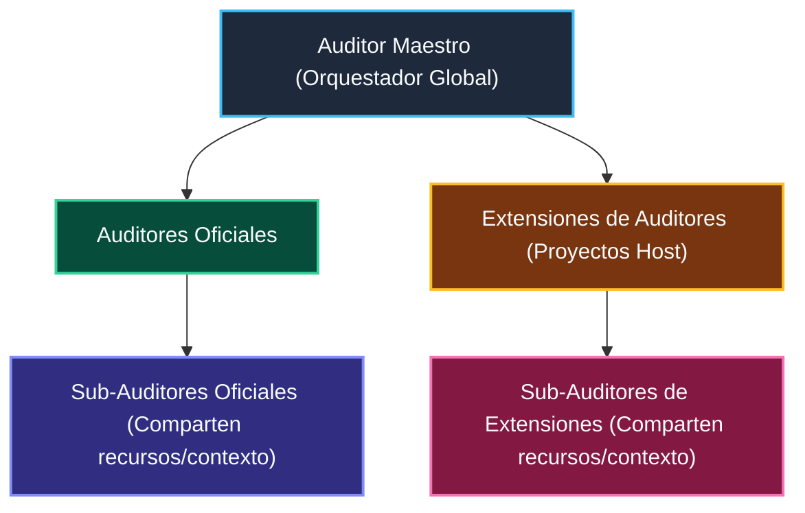

# Auditor: Architecture, Verification & Governance Engine

This skill defines the immutable standard and architectural contract for creating, administering, refactoring, and maintaining all sub-auditors, reporting scripts, and the `@francogp/auditor` engine across the repository.

Every sub-auditor and reporter is part of a unified static analysis and verification system orchestrated by `npm run auditor`.

## 🏗️ 3-Tier Hierarchical Architecture & Atomic Console Mandate

The auditor framework enforces a universal, 3-tier hierarchical and symmetric architecture where both official suites and host project extensions share the exact same OOP abstractions:



1. **Auditor Maestro (Global Orchestrator)**:
   - Discovers all registered auditors (official suites in `src/suites/` and project extensions in `.auditor/audit.config.ts`).
   - Runs worker processes with CPU parallelism and coordinates deterministic, in-order terminal output via `TaskStreamCoordinator`.
2. **Auditores Oficiales & Extensiones de Auditores (Symmetric OOP Model)**:
   - **Zero Code Duplication**: Both official auditors and host extensions inherit directly from `BaseAuditor` or `FileScanAuditor`. They implement identical interfaces, capability declarations, and error handling.
3. **Sub-Auditores (Oficiales y de Extensiones)**:
   - Heavy or multi-rule auditors can compose sub-auditors that share cached resources (e.g. `SharedAstContext`, filesystem reads, external CLI outputs) to maximize execution performance.
4. **Atomic Console Mandate**:
   - By framework contract, an auditor executing multiple sub-auditors **MUST wait for all its sub-auditors to complete** before emitting its step progress reports (`│  🔍 [X/Y] ...`). This prevents terminal race conditions, mixed line output, and cognitive friction during multi-worker execution.
5. **Mandatory Construction & Runtime Registration Contract (Zero Bypass / Zero Optional Defaults)**:
   - `AuditorOptions` strictly requires all metadata: `id`, `name`, `description`, `family`, `packageName`, `icon`, `ruleDescriptions`, `configKey`, and `defaultConfig`. Omitting any field or passing empty strings throws an immediate, blocking runtime `Error`.
   - For all subsystem suites (`configKey !== 'paths' && configKey !== 'core'`), `defaultConfig.enabled` MUST be explicitly defined as a boolean (`true` or `false`). Ambiguous or optional activation states are strictly prohibited.
   - If an auditor or extension attempts to emit a violation for any rule that was not declared at construction time in `ruleDescriptions`, `BaseAuditor.addViolation` immediately throws a loud, blocking runtime `Error`.
   - `createDefaultAuditConfigContent` and `AUDIT_CONFIG_REQUIREMENT` dynamically collect `task.defaultConfig` from all discovered tasks across the workspace, guaranteeing that new suites and extensions are automatically scaffolded into `.auditor/audit.config.ts` with zero hardcoding in generator engines.
6. **Post-Build Compiled Artifact Verification (`auditor:build` / `preset=build`)**:
   - Suites declaring `capabilities: { requiresBuild: true }` (`validate_bundle_budget`, `validate_package_distribution`, and `validate_package_types`) are excluded from pre-build source audit (`npm run auditor`) and executed post-build against `dist/` via `npm run auditor:build` (`auditor-build`).

---

## 🏛️ Core Principles & Tooling Mandates

0. **Absolute Prohibition on Backward-Compatible Code & Loud Failure Mandate**:
   - Writing backward-compatible shims, deprecated alias suites, legacy fallback wrappers, or dual-execution adapter code across `@francogp/auditor` is **STRICTLY PROHIBITED**.
   - Outdated consumers, legacy configurations, and unmigrated sub-auditor calls MUST fail loudly with immediate, explicit, and blocking errors (`throw new Error(...)` or exit code 1) forcing consumers to upgrade to canonical standards.
   - Maintaining duplicate suites or runtime compatibility bridges that introduce bloat, duplicate findings, or maintenance hazards is completely eradicated.
0.1. **Absolute Prohibition on Suppressing, Silencing, Nullifying, or Bypassing Audit Rules & Zero-Tolerance Fake Pass Mandate**:
   - When auditing a repository or running linters/auditors, AI agents and developers are **STRICTLY AND CATEGORICALLY PROHIBITED** from suppressing, silencing, disabling, or nullifying auditor rules, stylelint rules, ESLint rules, or any static analysis checks (e.g., setting `"rule": null`, `"rule": "off"`, `"rule": 0`, creating dummy override configs that neuter checks, or passing arbitrary skip flags) to make an audit pass or hide findings.
   - If the number of errors or warnings is massive (even hundreds or thousands of errors), **THEY ARE REAL ARCHITECTURAL, SECURITY, OR HYGIENE DEFECTS THAT MUST BE LEGITIMATELY RESOLVED IN THE SOURCE CODE OR FIXED WITH CANONICAL TOOLS (`auditor fix`)**.
   - Modernizing host configurations means **elevating the codebase to meet strict modern standards and exposing defects that were previously hidden**, NEVER degrading, diluting, or castrating the auditor's rules to fit legacy code.
   - Rushing to silence rules to achieve a fake clean pass is considered a critical architectural violation and gross misconduct.
0.1.1. **Primordial Mandate: Absolute Prohibition on Disabling or Modifying Configurations to Bypass Errors Without Explicit Programmer Consultation**:
   - **You MUST NEVER turn off, disable, relax, revert, or tamper with configurations** (`.auditor/audit.config.ts`, `eslint.config.js`, `.stylelintrc.json`, `.fallowrc.json`, etc.) because a verification suite reported errors or warnings.
   - If a suite reports errors — even dozens, hundreds, or thousands of errors — **THEY ARE REAL DEFECTS** that must be investigated and legitimately resolved in the source code or via canonical auto-repair tools (`auditor fix`).
   - Modifying or disabling configurations (e.g. setting `enabled: false`, deactivating subsystems, lowering thresholds, adding arbitrary whitelist entries, or reverting toggles) to make an audit "pass" without explicit programmer consultation is considered **critical architectural sabotage and gross misconduct**.
   - If an agent believes a configuration does not apply or genuinely requires adjustment, **THE AGENT MUST STOP IMMEDIATELY AND OBLIGATORILY CONSULT THE HUMAN PROGRAMMER** via an explicit question (`ask_question`), presenting the exact defects and waiting for human authorization before modifying any configuration. When requesting authorization, the agent MUST first render a comprehensive technical explanation directly in the visible chat conversation detailing the exact configuration diff, the specific defects reported, why the modification is necessary, the trade-offs, pros, and cons, accompanied by clickable links to the relevant files, BEFORE or alongside calling `ask_question`. Calling `ask_question` blindly without presenting the complete technical explanation in the chat is strictly prohibited.
0.2. **Absolute Prohibition on NPX & Mandate of Native Node.js 26+ (`node --experimental-strip-types`) / Canonical NPM Scripts**:
   - Running, recommending, or executing npx runners (e.g., tsx, legacy auditor, or vitest via npx) or third-party runtime wrappers across `@francogp/auditor` and consumer host projects is **STRICTLY AND CATEGORICALLY PROHIBITED**.
   - Node.js 26+ runs TypeScript natively without third-party transpiladores. All internal tool executions, inspections, and scripts MUST use native Node.js (`node --experimental-strip-types <script.ts>`) or canonical npm package scripts (`npm run <script>`, `npm test`).
   - If a host project lacks an auditor script in `package.json`, agents MUST run `npm run auditor:fix` (or `node --experimental-strip-types ...`) to synchronize scripts, NEVER attempt ad-hoc `npx` commands.
1. **Strict OOP Inheritance Mandate**:
   - Every sub-auditor MUST extend either `BaseAuditor<TRuleId>` or `FileScanAuditor<TRuleId>` from `@francogp/auditor`.
   - Creating standalone procedural scripts, custom CLI loggers, or ad-hoc result printers is **STRICTLY FORBIDDEN**.
2. **Unified Box-Drawing Table & Terminal Width Mandate (Max 80 Cols, Zero Wrapping)**:
   - ALL terminal tables, whether rendered by sub-auditors (`BaseAuditor`), orchestrators (`audit_full.ts`), or interactive reporters (`report_fallow.ts`, `report_complexity.ts`, `report_findings.ts`), MUST use the shared Box-Drawing utilities from `@francogp/auditor` (`renderBanner`, `renderBoxTable`, `formatStatusBadge`, `getVisualWidth`).
   - Hardcoding custom ASCII banners (`╔════...` exceeding 80 columns) or ad-hoc bulleted lists (`•`) is **STRICTLY FORBIDDEN**.
   - Tables must fit within the standard 80-column terminal width (`TERMINAL_WIDTH = 80`) and use `getVisualWidth()` for padding so emojis (`✅`, `❌`, `⚠️`) do NOT throw column borders out of alignment.
   - **Consolidated Total Row Requirement**: Every multi-row summary or breakdown table displaying numeric findings across categories or rules MUST include a dedicated `footerRows` entry labeled `TOTAL CONSOLIDADO` separated by a standard divider (`├───┼───┤`), providing explicit, mathematically transparent sums for all error and warning columns.
3. **Dynamic Auto-Discovery & Extension Mandate (Zero Hardcoded Lists)**:
   - The master orchestrator (`npm run auditor`, which also enforces the warning ratchet: 0 errors and 0 new warnings vs `.auditor/audit-baseline.json` at `ratchet.productionRef`) discovers all generic suites dynamically via `@francogp/auditor` and host-specific extensions registered in `.auditor/audit.config.ts`.
   - **Never hardcode an array of auditors or task IDs**. Any generic suite placed in `src/suites/<family>/` or host extension registered in `.auditor/audit.config.ts` is automatically discovered, categorized, timed, and executed.
4. **Strict Agnostic Engine & Zero Project Hardcoding Mandate**:
   - The `@francogp/auditor` core package MUST remain 100% project-agnostic.
   - It is **STRICTLY FORBIDDEN** to hardcode host-specific directory names (e.g. `external`, `backup_legacy_code`, `third_party`), host domain entity identifiers (e.g. `userId`, `invoiceId`, `tariffId`, `formulaId`), or project-specific test subpaths (`fuzzer`, `simulation`) inside `@francogp/auditor`.
   - All host-specific directories, ignore patterns, entity prefixes, and custom test roots MUST be declared in `.auditor/audit.config.ts`:
     - `paths.ignoredDirs`: Host-specific third-party or backup folders to skip globally.
     - `paths.ignoredPatterns`: Specific file paths or patterns (e.g. giant SQL migrations or generated data) to skip from standard code scans.
     - `paths.ignoreGlobs`: Glob patterns to exclude.
     - `paths.testFragmentationWhitelist`: Large test files or suites exempt from max test file size limit.
     - `paths.cliRoots`: CLI and tool root directories permitted to emit console output without logging wrappers.
     - `templates.safeTemplateFunctions`: Project-specific functions safe to invoke inside Vue templates.
     - `styles.baseScssFile`: Base SCSS file for global resets and overscroll locks.
     - `bundle.forbiddenUiImports`: Heavy backend modules or drivers barred from UI layers.
     - `animation.customTimerFunctions`: Additional timer function names recognized in UI animations.
     - `constants.ignoredNames`: Constant identifier names ignored during duplicate detection.
     - `constants.exemptMagicNumbers`: Numeric literals exempt from magic numbers validation.
     - `documentation.knownValidAbstractPaths`: Abstract docs paths recognized as valid.
     - `pinia.authorizedMutationFiles`: Files authorized for direct pinia state mutations outside store actions.
     - `domain.fallbackIdPatterns`: Domain-specific catalog ID patterns to disallow fallbacks on.
     - `persistence.allowedDatabaseFiles`: Database generator and schema files exempt from domain type checks.
     - `domain.infraIdWhitelist`: Host-specific infrastructure or external entity IDs (e.g. `cardId`, `slotId`, `assetId`, `serverId`) exempt from domain union rules.
     - `isTestPath(filePath)`: Dynamically checks `testRoots`, `e2eRoots`, and `integrationRoots` from configuration.
     - `isCliPath(filePath)`: Dynamically checks `cliRoots` from configuration.
5. **Mandatory GSAP UI Animation Governance, `gsapSleep` Standard & CSS/SCSS Transition Anti-Sabotage Mandate**:
   - GSAP animation enforcement rules (`manualAnimations`, `manualTimersFrontend`, `noLayoutAnimationInGsap`) are strictly mandatory and non-downgradable (`severity: 'error'`).
   - `manualTimersFrontend` scopes timer checks strictly to UI components and views (`.vue` or within `componentsRoots`/`viewsRoots`), barring uncoordinated timers (`setTimeout`, `setInterval`) in UI workflows.
   - `gsapSleep` and `delayedCall` are established, universal framework standards for UI delays and animation timing across all projects, ensuring deterministic test acceleration (scaling with `gsap.globalTimeline.timeScale(100)` during Playwright runs).
   - Additional custom timer functions can be registered dynamically via `config.animation.customTimerFunctions`.
   - Layout animations (`gsap-no-layout-properties`) require GPU transforms (`scaleX`, `scaleY`, `x`, `y`, `Flip`). When variable content height legitimately mandates layout animation (e.g. dynamic text accordions), developers MUST explicitly justify it via a statement-level `// layout-ok: <technical justification>` comment covering the tween. Silencing, auto-exempting, or downgrading layout animation rules to warning is strictly forbidden.
   - **Absolute Ban on Deleting CSS/SCSS Transitions & Anti-Sabotage Mandate (`gsap-banned-css-animations`)**: When static analysis or Stylelint flags CSS/SCSS `transition:` or `@keyframes` declarations in styles or `.vue` SFCs, AI agents and developers are **STRICTLY PROHIBITED from deleting or stripping the transition properties to achieve a fake clean pass, AND STRICTLY PROHIBITED from attempting to bypass or nullify GSAP with dummy comments**. Deleting transitions degrades the user interface and breaks visual fluidity. The MANDATORY resolution is: **Migrate the animation to GSAP tweens** (`gsap.to`, `gsap.from`, `gsap.timeline`, `useGSAP`) within the component's script setup using composables/reactive state. Deleting transitions without migration or attempting to bypass the check is classified as architectural sabotage.
6. **Config-Driven Path Ignored Engine (`isPathIgnored`)**:
   - `isPathIgnored(relPath)` in `auditorBase.ts` unifies `CANONICAL_IGNORE_DIRS` + `config.paths.ignoredDirs` + `config.paths.ignoredPatterns` + `config.paths.ignoreGlobs`.
   - Supports bidirectional leaf and path matching, ensuring both full relative paths and base directory scans in `fs.glob` respect configured ignores.
   - Any sub-auditor discovering or filtering files (`getFilesToAudit`, `FileScanAuditor`, `BaseAuditor`) MUST use `isPathIgnored(p)`.
7. **Concurrent Execution, Streaming Runner & Post-Run Coverage Architecture**:
   - `npm run auditor` executes suites concurrently across a pool of background workers (sized to CPU parallelism: `Math.max(1, Math.floor(availableCpus / 2))`).
   - Tasks are queued by family order (`architecture` ➔ `domain_data` ➔ `persistence` ➔ `documentation`) and dispatched dynamically as workers become free.
   - **Execution Duration vs Completion Order**: The duration printed next to each suite (`durationMs`) measures ONLY the child process active execution runtime (`performance.now() - taskStart`), NOT elapsed wall-clock time since the master audit began. Tasks appear in console strictly in the order they **FINISH** ($T_{\text{finish}} = T_{\text{start}} + D$), which is why short suites queued later (e.g., 1.2s or 3.8s) complete and appear after earlier heavy suites (e.g., 54s ESLint or 55s TypeCheck).
   - **Atomic Console Streaming & `printLock`**: Under an atomic async `printLock` mutex, each suite's entire output block (header, child checks, and duration) renders as an unbroken atomic unit, completely eradicating head-of-line blocking and console stalls while preventing interleaved lines between concurrent workers.
   - **Deferred Post-Run Phase (`capabilities.postRun: true`)**: Suites declaring `capabilities.postRun: true` (specifically `validate_audit_coverage`) are completely excluded from the concurrent worker pool. They execute sequentially ONLY AFTER 100% of all preceding worker suites have finished and written their individual coverage ledgers to `scratch/audits/coverage/<suiteId>.json`. This guarantees zero false `coverage-missing-ledger` alarms and explains why `validate_audit_coverage` deterministically executes at the final slot `[ 80/80 | 100% ]`.
8. **Shared AST Engine & Zero Duplicate Parse Mandate (`SharedAstContext`)**:
   - Whenever a sub-auditor performs TypeScript AST analysis or inspects Vue SFC `<script>` blocks, it MUST declare `requiresAst: true` in its constructor configuration (`BaseAuditor` or `FileScanAuditor`).
   - Sub-auditors MUST NEVER instantiate isolated AST parsers or call `ts.createProgram` / `ts.createSourceFile` inside ad-hoc file loops.
   - Sub-auditors consume the centralized `astContext: SharedAstContext` passed to `runAudit(astContext?: SharedAstContext)` or receive the pre-compiled `sourceFile?: ts.SourceFile` directly in `FileScanAuditor.scanFile(relPath, content, sourceFile)`.
   - The master orchestrator (`audit_full.ts`) initializes and preheats `SharedAstContext` **before any tasks run**, providing lazy AST parsing on demand.
9. **Prohibition of Ad-Hoc File Walkers**:
   - Sub-auditors MUST NEVER implement custom recursive directory traversals (`fs.readdir` loops, `getAllFiles`, `getAllVueFiles`, `getFilesRecursively`, `walkSourceFiles`, `walkFiles`, `walkDir`, `collectMarkdownFiles`).
   - File discovery MUST use the centralized, cached, and ignore-aware scanner: `this.context.collectFiles(roots, extensions)` or `collectRepositoryFiles()`.
10. **Unified Dual Output Standard (`StandardAuditResult`)**:
    - **Console (stdout)**: Emits formatted progress lines (`🔍 [X/N]`) followed by clean visual Box-Drawing tables (`[ ✅ PASS ]`, `[ ❌ FAIL ]`, `[ ⚠️ WARN ]`), runtimes in ms, and domain metrics via `@francogp/auditor`.
    - **Scratch Disk (`scratch/audits/`)**: ALWAYS saves 100% complete structured JSON conforming to `StandardAuditResult` to `scratch/audits/<family>/<id>.json` (and `scratch/audits/latest_audit.json` for global runs).
11. **Zero Double-Reporting Anti-Pattern**:
    - NEVER pass string arrays (`errors`, `warnings`) to `context.finish(...)` if violations were already registered with `this.addViolation(...)` or `context.addError()`. Doing so causes duplicate violation listings in the terminal summary table.
12. **Zero Runtime Data Auto-Heal in Tooling**:
    - Auditors verify structural and data integrity. They must never silently patch, mock, or auto-heal corrupt data or invalid structures. Failures must be detected loudly with clear, actionable context.
13. **Mandatory Modular Identity & Human-Friendly Description Mandate (Package + Pure Message, Max 50 chars)**:
    - Every sub-auditor MUST declare via inheritance:
      - `id: string`: Unique canonical auditor ID (e.g. `validate_my_feature`).
      - `name: string`: Formal suite name (e.g. `My Feature Validator`).
      - `packageName: string`: The mandatory scope or technology package of the sub-auditor (e.g. `'ESLint'`, `'TypeScript'`, `'Config'`, `'Estilos'`, `'DOX'`, `'Arquitectura'`).
      - `description: string`: Human-friendly Spanish explanation (strictly max 60 characters, single line, no `\n`) of what the suite verifies (`MAX_AUDITOR_SUITE_DESCRIPTION_LENGTH = 60`).
      - `ruleDescriptions: Record<TRuleId, string>`: Mandatory PURE human-friendly Spanish explanation for 100% of declared rule IDs. NEVER hardcode the package prefix inside rule descriptions (e.g. use `'Error de sintaxis o regla'`, NEVER `'ESLint: Error de sintaxis o regla'`).
    - **Dynamic Composition & 50-Character Box-Drawing Constraint**:
      - `BaseAuditor.formatRuleDescription(ruleId, rawDescription)` dynamically joins both parts strictly as `${packageName}: ${ruleDescription}`.
      - The composed description `${packageName}: ${ruleDescription}` MUST be `<= 50` characters (`MAX_AUDITOR_DESCRIPTION_LENGTH = 50`) and contain zero newlines so that in 80-column terminal tables (column width 52), every row displays cleanly without any `...` truncation.
      - If a composed rule description exceeds 50 characters, `BaseAuditor` throws an explicit runtime `Error` during instantiation detailing the violation. Silent truncation or prefix stripping is **STRICTLY FORBIDDEN**.
    - **Live Terminal Badge Standardization**:
      - When findings = 0: Silent, clean output without unnecessary suffixes (no badges, no "(0 encontradas)", no "(0 incidencias)").
      - When findings > 0: Formatted strictly as `(🐛 ${count})`.
    - Raw unexplained slugs without human context in console output are strictly forbidden.
14. **Absolute Prohibition of Homebrew SLOC Counters Mandate**:
    - Sub-auditors must NEVER implement manual line-counting loops, regex line filters, or ad-hoc SLOC checkers (`checkSloc`, line counting loops).
    - Fallow is the Single Source of Truth (SSoT) for all AST metrics, cognitive and cyclomatic complexity, function unit size, maintainability, dead code, and duplication detection across the codebase.
15. **Human-Friendly Descriptions & Category Breakdown Mandate (Zero Code Slugs & Zero Family Grouping)**:
    - The master audit orchestrator (`npm run auditor`) and warnings reporter (`npm run auditor:warnings`) MUST render results desglosados strictly by category/rule in an official Box-Drawing table.
    - The table MUST display **100% human-friendly Spanish descriptions** (`finding.ruleDescription` or `suite.description`) defined via inheritance in `BaseAuditor` (`ruleDescriptions: Record<TRuleId, string>`). Displaying raw code slugs, identifiers, or technical keys (e.g. displaying `icon-missing-asset` instead of `'Ícono no encontrado en catálogo de assets'`) is **STRICTLY FORBIDDEN**.
    - Following the table, they MUST output ONLY an illustrative sample of the last 5 errors (`❌ Muestra de errores detectados (últimos 5 de N)`).
    - Listing the full set of warnings or dumping all errors in console output is **STRICTLY FORBIDDEN**.
    - Grouping console results under opaque "FAMILIAS" headers is permanently eradicated. Full machine-readable findings reside in `scratch/audits/latest_audit.json`.
16. **Single Source of Truth Directory Ignore Mandate (`CANONICAL_IGNORE_DIRS` + `getEffectiveIgnoreDirs`)**:
    - Sub-auditors and maintenance scripts MUST NEVER declare local ignore sets (`const IGNORE_DIRS`, `const SKIP_DIRS`, `const SKIP_NAMES`, `const SKIP_SUBDIRECTORIES`).
    - Directory ignores are strictly governed by `CANONICAL_IGNORE_DIRS` in `@francogp/auditor`, combined with `getEffectiveIgnoreDirs()` which dynamically includes `config.paths.ignoredDirs`.
    - Documentation auditors that need to inspect documentation trees must configure `unignoreDirs: ['docs', '.agents']` instead of maintaining custom walkers.
    - Sub-auditors supporting unit-test sandboxes (`tempDir`) must forward `projectRoot: effectiveRoot` via `AuditorOptions` into `super({...})` to guarantee isolation from the live project repository.
17. **Mandatory Audit Metadata & Anti-Staleness Header Mandate (`AuditRunMetadata`)**:
    - The master orchestrator (`src/cli/audit_full.ts`) MUST embed an explicit `meta: AuditRunMetadata` header into `scratch/audits/latest_audit.json` and `scratch/audits/latest_summary.json` containing: `isFullAudit`, `runMode`, `preset`, `timestamp`, `totalDiscoveredSuites`, `executedSuiteCount`, `executedSuites`, and `omittedSuites`.
    - Partial audit runs (such as `npm run auditor:md`, `preset=lint`, or single suite executions) update `scratch/audits/latest_audit.json` with `isFullAudit: false` and populate `omittedSuites`.
    - **Strict 5-Minute Staleness Policy (`MAX_AUDIT_STALENESS_MS = 5 * 60 * 1000`)**: If more than 5 minutes have elapsed since `meta.timestamp`, the audit file is considered OBSOLETE. Any tool, script, or AI agent reading `latest_audit.json` MUST reject it with Exit Code 1, forcing a fresh run (`npm run auditor`) to prevent decisions based on stale code data.
    - **Zero Tolerated Misleading Reports**: Downstream scripts consuming audit results (`report_complexity.ts`, `report_fallow.ts`, `report_findings.ts`) MUST validate this metadata. If a required suite was omitted, if the report is older than 5 minutes, or if a global report is requested on a partial run, the script MUST fail fast with Exit Code 1 (`assertAuditorExecuted(...)`).
18. **Fallow 100% Error Severity & Zero-Warning Mandate**:
    - Sub-auditors, architecture runners, and plugins integrating Fallow (such as `audit_project.ts` or standalone Fallow inspectors) MUST map ALL Fallow findings to `severity: 'error'`.
    - Downgrading any Fallow finding to `severity: 'warning'` to mask technical debt or bypass audit gates is **STRICTLY PROHIBITED**.
19. **Static Security SSoT & Blind Spot Expansion Contract (Zero Duplicate Verifications)**:
    - **Source Code CWE Domain**: Codebase vulnerability analysis (CWE static sinks) is strictly and exclusively delegated to **Fallow** (`fallow security`). Using `eslint-plugin-security` in ESLint configurations remains **STRICTLY PROHIBITED** to prevent duplicate reporting and noisy regex false positives.
    - **Authorized Blind Spot Extensions**: Under the **Zero Duplicate Verifications Mandate**, the auditor framework explicitly authorizes incorporating specialized static analysis tools for vectors outside Fallow's architectural scope: (a) high-entropy secret and token leak detection (`@secretlint/core`), (b) dependency CVE scanning in `node_modules` and lockfiles (`npm audit`), (c) lockfile integrity and registry anti-tampering (`lockfile-lint`), (d) legal license compliance and copyleft gating (`license-checker`), (e) multi-resolution `.d.ts` module verification (`@arethetypeswrong/cli`), and (f) regular expression catastrophic backtracking (ReDoS) analysis (`eslint-plugin-regexp`). Every check must maintain a single authoritative owner without overlapping or duplicate findings.
20. **Standard Living Specification Engines Over Handcrafted Regex Mandate**:
    - When validating web standards, markup hygiene, accessibility, or obsolete HTML5 elements/attributes, the auditor framework and linters MUST NOT implement handcrafted manual regular expressions or arbitrary AST pattern lists (e.g. in ESLint).
    - Sub-auditors MUST delegate to authoritative, actively maintained specification engines (`html-validate` with `html-validate-vue`) that embody the W3C / WHATWG Living Standard, bridging their output into canonical `AuditFinding[]` objects.
21. **Child Process Stream Isolation & Ephemeral Scratch Output Mandate**:
    - Sub-auditors invoking external CLI tools or linters (`html-validate`, `vue-tsc`, `fallow`) via child processes (`spawnSync`) MUST NEVER rely on piping large JSON payloads across standard output (`stdout`), as Node.js process exits can truncate unbuffered output streams.
    - Tools supporting direct file output MUST write raw JSON to an isolated ephemeral file in `scratch/audits/<family>/` (e.g. `-f json=scratch/audits/architecture/html-validate-raw.json`) and parse it cleanly from disk.
22. **Zero Hardcoded Bundle Limits & Pure Configuration Budgets (`validate_bundle_budget`)**:
    - The core engine MUST NEVER hardcode fallback chunk size thresholds (`MAX_CLIENT_CHUNK_WARN_BYTES`, `MAX_CLIENT_CHUNK_ERROR_BYTES`) or ad-hoc file budgets.
    - All bundle chunk size validation and threshold evaluation MUST resolve dynamically and strictly from `.auditor/audit.config.ts` (`config.bundle.budgets`, `config.bundle.maxClientChunkErrorBytes`, `config.bundle.maxClientChunkWarnBytes`). If unconfigured, no arbitrary framework size penalty is applied.
23. **Static Security Gating & CLI Non-Production Classification (`AuditSecurityConfig`)**:
    - Static security scanning (Fallow CWE sinks) is governed by `config.security.enabled`. CLI tools and maintenance scripts identified by `isCliPath()` are treated as non-production environments with legitimate access to synchronous filesystem and child process operations under Node.js 26 permissions.
24. **Canonical Non-Fatal Catch Annotation Contract (`// catch-ok:`)**:
    - Any intentional, non-fatal catch block across the framework and host projects must declare `// catch-ok: <justification>` within its scope to pass `validate_error_suppression`.
25. **Centralized CLI Entrypoint Verification (`isMainModule`)**:
    - CLI tools and executable scripts MUST use the centralized `isMainModule(import.meta.url)` helper from `@francogp/auditor` to check for direct CLI invocation.
26. **Prohibition of Ad-Hoc Audit Result Parsing & Mandatory Native CLI Reporters Mandate**:
    - AI agents and developers MUST NEVER write or execute ad-hoc inline node scripts (`node -e "..."`), python scripts, or bash one-liners to read, inspect, or summarize `scratch/audits/latest_audit.json` or test coverage files (`coverage/coverage-final.json`).
    - All audit result inspections, category breakdowns, severity filtering, complexity hotspot analyses, and test coverage evaluations MUST be conducted strictly through the framework's native CLI tools:
      - `npm run auditor`: Global execution and consolidated Box-Drawing table.
      - `npm run auditor:findings` / `npm run auditor:errors` / `npm run auditor:warnings` / `npm run auditor:summary` / `npm run auditor:files`: Filtering and breakdown of findings.
      - `npm run auditor:test-coverage` (`auditor-test-coverage`): Canonical test execution code coverage analysis, directory aggregates, untracked files detection, uncovered line ranges, and complexity hotspot correlation. Full guide: [`references/test-coverage-guide.md`](./references/test-coverage-guide.md).
      - `npm run auditor:by-file`: Hierarchical Box-Drawing tree inspection of findings grouped strictly by file and ordered by line ascending (`├── L12: [Rule] Message`), with filters (`file=`, `category=`, `severity=`, `top=`, `json`).
      - `npm run auditor:complexity`: Code complexity hotspots and Fallow refactoring targets report.
      - `npm run auditor:similar`: Semantic and structural clone detection using Fallow ML vector embeddings in Box-Drawing tables.
      - `npm run auditor:review`: Graph-grounded architectural review brief for changed code using Fallow code review graphs.
      - `npm run auditor:fallow:dupes` / `npm run auditor:fallow:triplets` / `npm run auditor:fallow:security` / `npm run auditor:fallow:dead-code`: Fallow intelligence deep dives.
    - If `report_findings` warns that `latest_audit.json` is stale (>5 min), the agent MUST immediately execute `npm run auditor` to produce a fresh, valid report before inspecting findings. Bypassing the anti-staleness check with homebrew scripts is strictly forbidden.
    - **Missing Tool Mandate (Solicitud y Creación de Nuevas Herramientas)**: If a specific inspection, filtering, or reporting capability is missing or not provided by existing native tools, AI agents and developers MUST NOT create ad-hoc scripts or one-off terminal hacks. Instead, they MUST explicitly propose and create a new official native CLI tool in `src/cli/` (or extend an existing reporter), registering its canonical script in `package.json` with full Box-Drawing theme support (`unifiedTheme.ts`), 80-column limits, and permission flags.
27. **Fallow Refactoring Targets & Workspace Diagnostics Governance (`config.fallow`)**:
    - `config.fallow.enforceTargets`: When set to `true` (default), hotspot refactoring targets meeting `maxTargetPriority` (`'high'` by default, `'critical'`, `'medium'`, `'moderate'`, `'low'`, `'all'`, or a numeric score 0-100) are promoted to blocking `severity: 'error'` findings under rule `fallow-refactoring-targets`. Host projects may explicitly opt out with `false` if they prefer targets to remain purely advisory.
    - Workspace-level diagnostics (e.g. invalid configurations or structural issues) are validated under `validate_fallow_config` as `fallow-workspace-diagnostic`.
28. **Semantic Vector Code Duplication Governance & Fast-Preset Bypass (`validate_similar_code`)**:
    - Vector embeddings similarity detection (`fallow similar-code`) identifies semantic duplicates across files even with different syntax or function signatures.
    - **Fast Preset Isolation**: Vector analysis MUST NEVER execute under fast presets (`preset=lint`, `preset=md`). It runs exclusively in full audits (`npm run auditor`) or via the dedicated CLI tool (`npm run auditor:similar`).
    - **Surgical Sensitivity (`threshold: 0.95`, `ignoreSameFile: true`)**: Core default threshold of `0.95` combined with intra-file exclusion eliminates false positives between synchronous/asynchronous variants or polymorphic class methods, isolating true cross-module duplication.
    - **Hardware Runtime & Multi-Threading**: Fallow runs the local companion model (`jina-embeddings-v2-base-code`) via Hugging Face Candle in **CPU-only mode** (no GPU/CUDA support). Parallelism is accelerated across CPU cores via `--threads ${os.availableParallelism()}`.
    - **Vector Cache Architecture & Windows OS Error 3 Pre-Creation**: Fallow persists model weights and vector embeddings in the standard OS user cache directory: `%LOCALAPPDATA%\fallow\similar-code` on Windows (`~/.cache/fallow/similar-code` on Linux). Subdirectories `models/` and `vectors/` MUST be pre-created prior to execution to avoid Windows `os error 3: The system cannot find the path specified`. With cached vectors, audit time drops from ~230s down to ~2s.
    - **Automatic Model Initialization & Warning Banner Fallback**: If the local model is uninitialized, the suite attempts automatic setup via `fallow similar-code setup --local --yes`. If the automatic setup fails, the auditor displays a prominent Box-Drawing warning banner with the manual installation command (`fallow similar-code setup --local --yes`), recording `fallow-similar-code-failed` as a non-fatal warning (`severity: 'warning'`) so other suites remain unblocked.
    - **Production & Remote Deployments Only (`AUDITOR_ENV=production`) & Local Prohibition**: In production builds, Docker containers, deployment scripts (`deploy-install.sh`, `deploy-update.sh`), or GitHub Pages deployment workflows where downloading model weights or analyzing vector duplication is undesirable in headless ephemeral environments, set `AUDITOR_ENV=production` (or invoke `npm run build:prod` / `auditor-build-prod`) to cleanly omit vector duplication and test coverage checks with zero violations. There is NO CLI flag. Skipping vector analysis or setting `AUDITOR_ENV=production` in local development, interactive agent turns, or local workstation testing is STRICTLY PROHIBITED.
    - **Upstream Specification**: See [Fallow Similar Code Analysis Specification](https://git.mitgai.net/fallow-rs/fallow/blob/main/docs/similar-code-analysis.md).
29. **Universal Ephemeral Scratch (`scratch/`) & Build Output (`dist/`) Isolation Mandate**:
    - **`scratch/` (Mandatory for all drafts & ephemeral data)**: Universal, mandatory directory across ALL projects and repositories for any and all ephemeral files: scratch scripts, AI temporary investigation notes, experimental files, testing dumps, raw json outputs (`scratch/audits/`), and intermediate CLI caches.
      - Every project MUST declare `scratch/` in `.gitignore`.
      - Committing or placing drafts, temporary files, or scratch scripts in `src/`, root, or non-scratch paths (such as `tmp/`, `.tmp/`, `temp/`, `test.js`, `dummy.ts`) is strictly forbidden and actively blocked by `validate_ephemeral_storage_isolation`.
    - **`dist/` (Mandatory for all compilations & production builds)**: Universal, mandatory directory across ALL projects for all compiled outputs, production bundles, generated JS/CSS assets (`dist/assets/`), and packaged library outputs.
      - Every project MUST declare `dist/` in `.gitignore`.
      - Production build artifacts, source maps, and bundle chunks must reside strictly within `dist/` and must never pollute source code trees.
30. **Active by Default Subsystem Mandate & Zero Silent Skips**:
    - All configurations and subsystems in `@francogp/auditor` are ACTIVATED BY DEFAULT (`enabled: true`, `persistence.engine: 'supabase'`, `zLayersEnabled: true`, `requireInputIds: true`, `similarCode.enabled: true`, `packageScripts.enabled: true`, etc.).
    - If a host project specifies nothing for a subsystem in `.auditor/audit.config.ts`, that subsystem is automatically active with complete default configurations.
    - Sub-auditors MUST NEVER silently bypass checks due to missing files or missing configuration; non-applicable subsystems in tool packages or non-web packages must be explicitly deactivated (`enabled: false`, `engine: 'none'`).
31. **Official Stylelint Engine & Pure In-Memory Execution (`validate_stylelint`)**:
    - All stylesheet and component style hygiene, duplicate class rules, similar selectors, empty blocks, property order, and SCSS syntax are analyzed strictly through the official Stylelint engine with Vue SFC and SCSS support (`stylelint`, `stylelint-scss`, `stylelint-order`) and in-memory PostCSS AST processing. Sub-auditors MUST NOT rely on unmaintained, platform-dependent external Go binaries (such as `css-checker-kit`), preventing Smart App Control blocks, `ignore-scripts` install crashes, and OS-level execution failures.
32. **Data Catalog Complexity Exemption (`paths.dataRoots`)**:
    - Files inside `paths.dataRoots` (constant catalogs and tabular mini-databases) are exempted from function complexity and LOC alerts in `audit_project.ts` via `isComplexityExemptPath`, while preserving 100% of domain type checks, O(1) structures, and Fallow dead-code analysis.
33. **Canonical Tool Package Fallow Governance (`.fallowrc.json`)**:
    - Tool packages distributing standalone CLI tools and AI skills must maintain a root `.fallowrc.json` declaring `entry` points, `ignorePatterns` (`skills/**`, `.agents/**`, `scratch/**`, `dist/**`, `tests/**`), and `ignoreDependencies` (for peer/CLI tools such as `fallow`, `html-validate`, `html-validate-vue`, `markdownlint-cli`, `stylelint`, `knip`, `publint`, `type-coverage`, `rollup-plugin-visualizer`, `typescript`). This guarantees unskewed maintainability analysis (>= 90 score) while preserving strict zero-tolerance fallow gating.
34. **Zero Live Host Mutation & Hermetic Sandbox Verification**:
    - Verification of `@francogp/auditor` across consumer host projects MUST be conducted exclusively in isolated ephemeral git worktrees (e.g. `/tmp/<project>-sandbox`) with deliberate fault injection, guaranteeing zero mutation or drift in the real host repositories.
35. **Mandatory English for All Repository Files, Skills, Documentation & Examples**:
    - All files inside the repository (source code, TypeScript definitions, tests, skills under `.agents/skills/**`, references under `.agents/skills/*/references/**`, documentation, blueprints, configuration examples, and `.md` files) MUST ALWAYS be written strictly and exclusively in English with zero language mixing. Writing any skill, skill documentation, reference guide, or code example in Spanish or mixing languages is strictly prohibited.
    - *Sole Exception: Interactive terminal tables and human-readable CLI audit rule descriptions (`ruleDescriptions` in sub-auditors) are declared in Spanish by deliberate UX design for the local developer console.*
36. **Mandatory Safe-Commit Protocol & Absolute Prohibition on Manual Git Commit/Push**:
    - Executing manual `git commit`, `git tag`, or `git push` directly in the shell without running the certified `/safe-commit` workflow is STRICTLY FORBIDDEN across the entire repository. Every change, bug fix, release, or version bump MUST execute all phases of `/safe-commit` sequentially.
    - In Phase 1 (Step 1.4), agents MUST explicitly analyze version diffs, render the complete candidate version breakdown table directly in the visible chat message with freshly updated build timestamps (`-build.YYYYMMDD-HHmmss`), and consult the user via `ask_question` regarding the recommended SemVer bump (`major`, `minor`, `patch`, or `build`), NEVER unilaterally bumping versions, tagging releases, or calling `ask_question` without first displaying the analysis in chat.
37. **Strict Single Build & Atomic Tagging Mandate**:
    - In `/safe-commit`, version bump decisions occur in Phase 1 (Step 1.4) to guarantee that Phase 2 compiles the target version exactly once (`Strict Single Build Mandate`). When bumped, annotated Git tags (`v<version>`) are created atomically with the commit and pushed with `--follow-tags`.
38. **Universal Standard Build Script Mandate (`npm run build`)**:
    - The `@francogp/auditor` engine and consumer projects MUST strictly use the universal standard npm convention `npm run build` (`"build": "npm run auditor && tsc -p tsconfig.build.json && node --experimental-strip-types src/cli/make_executable.ts && npm run auditor:build"` in package distributions, and `"build": "npm run auditor && vite build && npm run auditor:build"` in web applications) for compiling and emitting distribution artifacts into `dist/`.
    - Build execution is partitioned into a 2-part auditor lifecycle: (1) Pre-build verification (`npm run auditor`) enforcing source code hygiene and architecture, and (2) Post-build verification (`npm run auditor:build`) enforcing compiled distribution artifact budgets and types against `dist/`.
    - In production environments (Docker images, deployment scripts, CI containers), projects execute `npm run build:prod` (`auditor-build-prod`), which sets `AUDITOR_ENV=production` to cleanly skip `validate_similar_code` (heavy Candle CPU vector embeddings) and `validate_test_coverage` (unit test coverage artifacts git-ignored in production containers) while maintaining 100% strictness across all remaining 48+ static analysis suites and post-build artifact verification.
    - Using platform-specific shell commands like `chmod` that fail on Windows is strictly forbidden; executable permissions are set via cross-platform Node.js filesystem APIs. Inventing arbitrary non-standard script names (such as `compile` or `build:dist`) is strictly forbidden across the framework. Compiling distribution artifacts and executing architectural verification suites MUST remain strictly chained into the build script to ensure non-conforming builds are aborted.
39. **Public Package Anonymity & Zero Host Leakage Mandate**:
    - Standalone tooling packages, exported AI skills (`.agents/skills/**`), reference blueprints (`.agents/skills/*/references/**`), test fixtures, and public documentation MUST NEVER mention or leak private host project names, repository slugs, database schemas, or proprietary business domains. Reference blueprints and examples MUST strictly use generic, domain-neutral archetypes (e.g. `enterprise.example.ts`, `gaming.example.ts`, `app-postgres`, `app_db`, `test@example.com`).
40. **Host AGENTS.md Independence Mandate**:
    - `@francogp/auditor` distributes AI skills (`.agents/skills/*`), CLI binaries, and setup scripts, but MUST NEVER distribute, generate, or force a global `AGENTS.md` onto external consumer host projects. Consumer host projects maintain their own independent, domain-specific `AGENTS.md` hierarchy. The root `AGENTS.md` in `@francogp/auditor` governs exclusively the core auditor engine repository.
41. **Mandatory Constructor Contract & Strict Capabilities Mandate (`AuditorCapabilities`) (Zero Fallbacks)**:
    - All constructor arguments, options, and sub-properties across `@francogp/auditor` and host extensions MUST be 100% explicitly defined and initialized. Silent fallbacks, default objects, and partial interfaces are STRICTLY PROHIBITED.
    - The `capabilities` contract strictly enforces all 9 boolean flags (`fix`, `fixPriority`, `lint`, `md`, `ast`, `changedSince`, `heavy`, `requiresBuild`, `postRun`). Omitting `capabilities` or any of its 9 sub-fields throws an immediate loud error (`throw new Error(...)`).
    - Furthermore, if `capabilities.fix === true`, the suite MUST declare a non-empty `fixableRuleIds` set matching its fixable capabilities. If `capabilities.fix === false`, declaring `fixableRuleIds` throws an error.
    - When framework capabilities are added or modernized, unmigrated extensions and suites MUST fail loudly at construction time, forcing developers to review and explicitly configure every capability.
    - When `auditor fix` or `auditor --fix` is invoked, the master orchestrator (`audit_full.ts`) and scanner (`auditScanner.ts`) dynamically isolate and run only auto-repair suites (`capabilities.fix === true`) under the dedicated `[ 🛠️ MODO REPARACIÓN AUTOMÁTICA ]` terminal interface. Suites declaring `capabilities.fixPriority === true` (`validate_environment_engines`, `validate_git_config`, tooling configs, and default generators) are dynamically executed **FIRST** to stabilize environment, local Git configuration (`.git/config`), `.auditor/audit.config.ts`, `.gitignore`, and `package.json` scripts before dependent code and style fixers run.
    - **Absolute Prohibition on Hardcoded Execution Order or Suite Lists**: The orchestrator sorts and dispatches suites purely dynamically based on declared capabilities and reflection. Hardcoding static arrays or ordering lists in framework code is strictly prohibited.
    - Fast presets (`preset=lint`, `preset=md`) dynamically select suites declaring `capabilities.lint === true` or `capabilities.md === true`. Heavy suites (`capabilities.heavy === true`) are automatically bypassed in fast presets (`preset=lint`, `preset=md`). AST requirements are evaluated dynamically without hardcoded suite ID lists.
42. **Strict ESLint Flat Config & Zero-Tolerance Type Integrity (`eslint.config.js`)**:
    - All projects governed by `@francogp/auditor` MUST maintain a root `eslint.config.js` enforcing `@typescript-eslint/no-explicit-any: 'error'`, `@typescript-eslint/no-restricted-syntax` banning `TSUnknownKeyword` (`as unknown as`) and legacy `new Date()` / `Date.now()`. `forbiddenTypeCasts` in `audit_rules.ts` enforces static eradication of `as any`, `: any`, `<any>`, and `as unknown as` with zero tolerance under `/domain-type-first`.
    - `validate_eslint_config` automatically validates that consumer and engine ESLint flat configs do not disable these safety invariants.
43. **Dynamic GitIgnore Requirements Contract (`GitIgnoreRegistry`, `GitIgnoreRequirement`)**:
    - Sub-auditors (built-in or user-extended) and modules MUST NOT rely on hardcoded gitignore lists.
    - Each sub-auditor declares its required gitignore entries via `AuditorOptions.gitIgnoreEntries?: readonly GitIgnoreRequirement[]` and static `gitIgnoreEntries` on the class.
    - `BaseAuditor` dynamically registers them into `GitIgnoreRegistry`.
    - `ValidateAuditConfigAuditor` dynamically collects requirements from all discovered modules, active subsystems, and user extensions, verifying `.gitignore` coverage and providing auto-repair (`--fix`).
44. **Mandatory Pre-Compilation and Post-Compilation Audit Chaining Across All Projects (`validate_audit_config`)**:
    - Across ALL projects governed by `@francogp/auditor` (consumer applications and standalone package distributions alike), the `"build"` script in `package.json` MUST be chained with both pre-compilation audit and post-compilation artifact verification (e.g., `"build": "npm run auditor && vite build && npm run auditor:build"`, or `"build": "npm run auditor && tsc -p tsconfig.build.json && node --experimental-strip-types src/cli/make_executable.ts && npm run auditor:build"`).
    - The `audit:for-commit` / `auditor-commit` gate was removed; any script still referencing it fails with `audit-config-removed-commit-gate` (`auditor fix` deletes or rewrites it to `auditor`).
    - For production deployment pipelines without local test coverage files or vector caches, projects execute `npm run build:prod` (`auditor-build-prod`) under `AUDITOR_ENV=production`.
    - Bypassing build chaining is permitted only via explicit configuration (`config.packageScripts.enforceBuildAudit: false`).
    - `validate_audit_config` provides auto-repair (`--fix`) to automatically chain both `npm run auditor` and `npm run auditor:build` into the build script and populate missing package scripts (including `build:prod`) dynamically discovered from registered sub-auditors and `PackageScriptRegistry`.
45. **Mandatory Third-Party Licenses & Open-Source Attribution Contract**:
    - Every package `README.md` MUST conclude with a comprehensive "Third-Party Software & Open-Source Licenses" attribution section linking every integrated tool, library, and living specification engine (ESLint, Stylelint, HTML-Validate, Markdownlint, Fallow, Knip, Publint, Type-Coverage, TypeScript, Vitest, Valibot, GSAP, Jina embeddings) to its respective project repository and open-source license.
46. **Strict Local Execution Mandate & Absolute Prohibition of Bypassing Vector Duplication in Local/Development**:
    - AI agents and developers MUST NEVER bypass vector duplication or set bypass environment flags during local development, interactive coding turns, bug triage, or local verification runs.
    - Vector semantic duplication analysis (`validate_similar_code`) executes locally on Candle CPU in ~2s leveraging local disk caches (`%LOCALAPPDATA%\fallow\similar-code` on Windows, `~/.cache/fallow/similar-code` on Linux).
    - Running vector analysis locally is mandatory to identify semantic duplication before code is committed or pushed.
    - There is NO CLI flag to skip similar code. Cleanly skipping vector analysis and test coverage checks is STRICTLY AND EXCLUSIVELY governed by the universal environment flag `AUDITOR_ENV=production` (invoked via `npm run build:prod` or `auditor-build-prod`), reserved exclusively for headless remote deployment workflows (e.g. Docker builds, deploy scripts, GitHub Pages deploy workflows, or resource-constrained external CI containers).
47. **Mandatory Thematic Emojis (`AuditorOptions.icon`)**:
    - Every sub-auditor and host extension MUST declare `icon: string` (e.g. `icon: '🏛️'`, `icon: '🎨'`, `icon: '🧩'`).
    - If `icon` is omitted, `undefined`, or empty, `validateAuditorOptions` throws an explicit, loud runtime `Error`.
    - Generic cogs (`⚙️`) are reserved exclusively for internal configuration validators.
48. **Status `skipped` & Transparent Reporting (`markSkipped`, `⏭️ SKIP`)**:
    - When an auditor is bypassed (via environment guard, configuration, or fast preset), it calls `this.markSkipped(reason)`.
    - The streaming runner renders `⏭️  SKIP` in cyan with its thematic icon and justification.
    - Summary tables reflect skipped suites: `(X Omitida ⏭️)` rather than masking them as passed.
49. **Strict Booleans and Zero Backward Compatibility**:
    - All configurations and options use strict types and compile-time booleans (`true`/`false`).
    - Legacy string values like `'off'`, `'on'`, `'essential'` have zero backward compatibility and fail validation immediately with loud errors.
50. **Dynamic Configuration Unknown & Legacy Field Governance (`validate_audit_config`, `audit-config-unknown-field`)**:
    - All top-level sections and path subfields in `.auditor/audit.config.ts` are dynamically validated against the core configuration schema and discovered sub-auditor `configKey`s.
    - Obsolete or legacy ignore keys (such as `paths.constantsRoots` or `constants.exemptGlobs`) fail loudly with `audit-config-unknown-field` (`severity: 'error'`), forcing developers to clean up outdated configuration.
51. **Hierarchical By-File & Line Grouping Mandate (`auditor:by-file`, `scratch/audits/by_file.json`)**:
    - All audit findings in `latest_audit.json` (`allFindings`) MUST be sorted stably by relative file path (case-insensitive ASC) and line number ascending (`f.line ?? 0`), with structured index `findingsByFile` and an ephemeral lightweight index `scratch/audits/by_file.json`.
    - The framework exposes the canonical CLI tool `npm run auditor:by-file` (binary `auditor-by-file`) rendering a Box-Drawing tree (`├── L<line>: [Rule] Message`) with filters (`file=`, `category=`, `severity=`, `top=`, `json`) to allow developers and AI agents to inspect and repair all violations in a file in a single pass without thrashing or repeated file reads.
52. **Native TypeScript AST Magic Numbers & SCSS Stylelint Governance (`validate_magic_numbers`, `validate_stylelint_config`, `SharedAstContext`)**:
    - Replaces fragile regexes and ESLint parent-node limitations with native TypeScript Compiler AST sub-auditor `validate_magic_numbers.ts` utilizing cached `SharedAstContext` (`capabilities: { ast: true }`, `doc.getAst()`).
    - **Zero Directory Ignores**: Semantically recognizes all constant data structures (`const`, `as const`, arrays, matrices, dictionaries, enums, literal types, readonly class fields, default parameter values) without requiring ANY directory ignores (`constantsRoots` and `constants.exemptGlobs` permanently eradicated).
    - **SCSS Design Tokens & Self-Healing (`validate_stylelint_config`, `stylelint-declaration-strict-value`)**: Enforces variables (`$var`, `var(--var)`) or color functions across **13 canonical CSS properties** of Medium priority and above (`/color$/`, `font-size`, `z-index`, `box-shadow`, `border-radius`, `font-family`, `transition-duration`, `animation-duration`, `gap`, `row-gap`, `column-gap`, `font-weight`, `transition-timing-function`) using modern `ignoreValues` hash mapping and `ignoreAtRules: ["@font-face"]` across all SCSS, CSS, and Vue `<style lang="scss">` files (`scss-strict-values`). Fully configurable in `.auditor/audit.config.ts` (`stylelint.strictValues: { properties, ignoreValues, ignoreAtRules }`), with automatic recognition of inherited configs (`extends: ['./node_modules/@francogp/auditor/.stylelintrc.json']`) and auto-repair via `validate_stylelint_config.ts` (`--fix`).
    - **Universal Sentinels & Timer Delays Governance (`validate_magic_numbers`)**: Allows base, calendar, and geometry sentinels (`-1, 0, 1, 2, 3, 4, 5, 10, 24, 60, 100, 360, 1000, 1024`) and next-tick delay `0` without false positives. Enforces named constants for all positive timer delays (`setTimeout`, `setInterval`, `delayedCall`, `gsapSleep`). Host projects can declare custom sentinels in `config.constants.exemptMagicNumbers` or line-level `// const-ok: <justification>`.
    - **Vue Template Safeguard (`validate_vue_sfc_hygiene`, `vue-template-magic-calculation`)**: Flags inline calculations (`*`, `/`, `%`) and comparisons (`>`, `<`, `===`, etc.) involving numbers inside Vue `<template>` expressions while allowing markup props (`:span="12"`), index offsets (`+ 1`), and zero/one bounds (`.length === 0`), forcing developers to encapsulate logic in `computed()` properties in `<script setup>`.
53. **AST Constant Unwrapping & Duplicate Analysis Invariance**:
    - In `validate_duplicate_constants` (`constantAnalyzer.ts`), constant declaration initializers MUST be unwrapped through `ts.isAsExpression`, `ts.isTypeAssertionExpression`, and `ts.isParenthesizedExpression` before comparative evaluation.
    - Const declarations with identical unwrapped values (e.g. `const FOO = 0.75;` and `const FOO = 0.75 as const;`) MUST be classified as identical duplicates (`duplicate-constant-identical`), strictly preventing false divergent alarms (`duplicate-constant-divergent`).
54. **Sass Function Collision Prevention & Casing Governance (`sass-traps/collision-casing`, `scss-sass-collision-casing`)**:
    - Standard CSS functions that share names with Dart Sass built-in color and math functions (`scale`, `scaleX`, `scaleY`, `scaleZ`, `scale3d`, `saturate`, `grayscale`, `invert`, `alpha`, `brightness`, `contrast`, `drop-shadow`, `hue-rotate`, `translateX`, `translateY`, `translateZ`, `translate3d`, `radial-gradient`, `linear-gradient`) MUST be written with PascalCase/CamelCase initials (e.g. `Scale(1.1)`, `Saturate(0.9)`, `Drop-Shadow(...)`, `hue-Rotate(...)`) inside SCSS and Vue SFC `<style>` blocks.
    - Writing them in lowercase causes Dart Sass compiler crashes (`[sass] $color: 1.1 is not a color.`, `[sass] Missing argument $amount.`).
    - Stylelint natively governs this via the native plugin `sass-traps/collision-casing` mapped to `'scss-sass-collision-casing'`.
    - `.stylelintrc.json` MUST keep `function-name-case: ['lower', { ignoreFunctions: ['/^[A-Z]/', 'Drop-Shadow', 'Drop-shadow', 'hue-Rotate', 'Hue-Rotate'] }]` and `value-keyword-case: ['lower', { camelCaseSvgKeywords: true, ignoreProperties: ['/--.*/'], ignoreFunctions: ['v-bind'] }]` so neither rule is disabled while preserving unquoted `v-bind(...)` in Vue SFC.
    - In `--fix` mode, `validate_stylelint` automatically repairs colliding lowercase functions to their canonical capitalized casing on the PostCSS AST.
55. **Stylelint Mixin Block Ordering Governance (`order/order`, `hasBlock`)**:
    - In `.stylelintrc.json`, `order/order` MUST partition `@include` mixins by `hasBlock`:
      - Blockless mixins (`hasBlock: false`, e.g. utility `@include button-reset;`, `@include flex-center;`) MUST precede standard declarations (`declarations`) so declarations can override mixin defaults.
      - Standard CSS property declarations (`declarations`) come next.
      - Mixins containing nested blocks (`hasBlock: true`, e.g. responsive media queries `@include respond-to('desktop') { ... }`, `@include media-breakpoint-up(...) { ... }`) MUST come AFTER declarations so that media queries properly override declarations down the CSS cascade without being superseded in mobile-first layouts.
      - Pseudo-classes and nested rules follow mixins with blocks.
56. **Documented Commands Governance & Dual Resolution Protocol (`validate_documented_commands`)**:
    - Every documented command across ALL repository markdown files (including `README.md`, manuals, guides, blueprints, and AI skills under `.agents/skills/**`) MUST be strictly validated against the project's executable truth (`package.json.scripts`, `node_modules/.bin`, package dependencies, and `config.documentation.allowedNpxBinaries`).
    - **Skills Verification Mandate**: AI skills under `.agents/skills/**` are first-class execution assets and MUST NEVER be skipped or exempted from command validation. Phantom or unexecutable commands in skills mislead both AI agents and human developers.
    - **Dual Triage Protocol (Declaration vs Documentation)**:
      When `validate_documented_commands` reports an unregistered npm script (`documented-cmd-unregistered-npm`), invalid syntax (`documented-cmd-invalid-npm-syntax`), or unregistered npx binary (`documented-cmd-unregistered-npx`), developers and AI agents **MUST NOT** blindly assume it is an error in documentation to be stripped, renamed, or suppressed.
      Instead, rigorously analyze the author's intent following this decision tree:
      - **Case A: Missing Declaration (Legitimate Tooling Intent)**: If the command represents an intentional project workflow, hook, lifecycle script, test runner, or utility (e.g. `npm run dev`, `npm run test:node`, `npm run env:post-setup`, `npm run auditor:documented-commands`), the correct resolution is to **DECLARE IT in `package.json.scripts` or dependencies** where it belongs, ensuring the project provides what is documented.
      - **Case B: Documentation Defect (Legacy, Typo, or Misformatted)**: If the command is an obsolete legacy leftover, has invalid syntax (such as invoking a custom script directly without `run`), or references an external/project-specific tool without generic placeholder notation (`<script>`), the correct resolution is to **UPDATE the documentation** to reflect canonical, working commands or use generic placeholders.
57. **Mandatory README Synchronization & Modernization Mandate**:
    - Whenever releasing framework features, updating generic suites, adjusting canonical package scripts, or performing auditor upgrades in host applications, developers and AI agents MUST review, update, and modernize the root `README.md`.
    - **Script Synchronization**: Verify that canonical scripts in `package.json` (such as `audit:build`, `audit:fix`, `audit:lint`, `audit:similar`, `auditor:update`) are correctly documented in the root `README.md`.
    - **Suite Synchronization**: Ensure generic suites, capabilities, and family breakdowns reflect canonical standards without hardcoding brittle suite counts.
    - **Configuration Examples**: Ensure configuration snippets in `README.md` include all mandatory active subsystems, including the `coverage` ledger (`exemptGlobs` and `acknowledgedDegradations`).
58. **Single Source of Truth Configuration & `.auditor/` Directory Layout**:
    - Dynamically loads paths, persistence settings, and host extensions via `.auditor/audit.config.ts` (or `.auditor/audit.config.json`).
    - Every versioned auditor-owned artifact lives in `.auditor/` (configuration, warning baseline `.auditor/audit-baseline.json`); ephemeral results stay in the git-ignored `scratch/audits/`.
    - Third-party tool configs (`eslint.config.js`, `.stylelintrc.json`, `.fallowrc.json`, `.markdownlint.json`, `.htmlvalidate.json`) stay at the root for native tool and IDE discovery.
    - A root-level `audit.config.ts`/`audit.config.json` fails loudly with `audit-config-root-file`; `auditor fix` moves it into `.auditor/` and rebases its relative imports through the TypeScript AST (`migrateAuditConfig.ts`).
    - Paths declared inside the config remain project-root relative. A configuration that fails to import throws instead of silently falling back to defaults.
59. **Warning Ratchet & Baseline Governance (`ratchet`)**:
    - The master orchestrator (`npm run auditor`) automatically enforces **0 errors AND 0 new warnings** through the built-in warning ratchet.
    - Warning fingerprints (`sha256(suite|rule|posixRelFile|lineText|occurrenceIndex)`) are compared against `.auditor/audit-baseline.json` committed at `ratchet.productionRef` (default `origin/main`).
    - Resolving existing warnings automatically shrinks `.auditor/audit-baseline.json` on the next full audit run, ratcheting code quality monotonically upward.
    - Bypassing the ratchet, disabling `ratchet.enabled`, or hand-editing `.auditor/audit-baseline.json` to absorb new warnings is strictly forbidden.
    - The differential `audit:for-commit` gate was completely removed; `npm run auditor` itself is the single, definitive quality gate.
60. **Canonical DOX Hierarchy & Section Structure Governance (`validate_dox_integrity`)**:
    - **6 Mandatory Canonical Sections (`dox-missing-section`, `dox-section-order`, `dox-empty-section`)**: Every `AGENTS.md` file MUST contain all 6 canonical sections in strict sequential order: `# Purpose` ➔ `## Ownership` ➔ `## Local Contracts` ➔ `## Work Guidance` ➔ `## Verification` ➔ `## Child DOX Index`.
    - **Optional `## Key Files` Placement**: When present for bidirectional code mapping, `## Key Files` must be canonically placed immediately after `## Local Contracts` or immediately before `## Child DOX Index`.
    - **Zero Empty or Garbage Content Mandate (`dox-empty-section`)**: Leaving mandatory sections empty, whitespace-only, comment-only (`<!-- ... -->`), or filled with placeholder/junk tokens (`TODO`, `TBD`, `N/A`, `None`, `< 10` chars) triggers a blocking `severity: 'error'`. Every section must provide genuine, operational guidance and runnable verification commands.
    - **Bidirectional Source File Indexing (`dox-unindexed-file`)**: All non-test source code files (`.ts`, `.vue`, `.js`, etc.) residing in a directory governed by `AGENTS.md` MUST be documented under `## Key Files`. Missing source files trigger `dox-unindexed-file` (`severity: 'error'`).
    - **Markdown Link Verification Separation**: General link diagnostics (`markdown-link-broken`, `markdown-link-absolute-path`, `markdown-link-gitignore-target`) across all markdown files including `AGENTS.md` are audited canonically by `validate_markdown_links`.
61. **Mandatory Test Execution Coverage Enforcement (`validate_test_coverage`, `testCoverage.enforceInAudit`)**:
    - Test coverage enforcement is **active by default** (`testCoverage.enforceInAudit: true`) across `@francogp/auditor`.
    - If overall code coverage or category coverage (statements, branches, functions, lines) falls below the threshold (default: **80%**), `validate_test_coverage` fails with blocking `severity: 'error'`.
    - Untested modules are reported as shadow code. Host projects with mathematical ceilings (e.g. platform-specific wrappers) may configure their achievable ceiling (e.g. 70% or 80%) in `.auditor/audit.config.ts`, but coverage enforcement must remain active and ratcheting.
62. **Dynamic Introspection Catalog & Manifest DTO Mandate (`AuditorManifestDTO`, `--list`, `--info`)**:
    - Every sub-auditor and host extension MUST implement clean dynamic metadata via `BaseAuditor.toManifest(): AuditorManifestDTO`.
    - **Concise Summaries (Zero Text Walls)**: Descriptions MUST be short and direct (`description <= 60 chars`), avoiding multi-line walls of text so AI agents and CLI tools can digest them instantly.
    - The CLI provides dynamic introspection out-of-the-box without filesystem crawling:
      - `node --experimental-strip-types src/cli/audit_full.ts --list` (or `auditor --list`): Box-Drawing table of all discovered suites, flags, and descriptions.
      - `node --experimental-strip-types src/cli/audit_full.ts --list --json` (or `auditor --list --json`): Emits structured `AuditorManifestDTO[]` in JSON format.
      - `node --experimental-strip-types src/cli/audit_full.ts --info=<suiteId>` (or `auditor --info=<suiteId>`): Technical specification sheet of a suite (purpose, flags, evaluated rules, configuration).
      - `node --experimental-strip-types src/cli/audit_full.ts --help` (or `auditor --help`): Interactive CLI manual in 80 columns.
    - **Zero Hardcoding**: The master orchestrator NEVER hardcodes suite lists or descriptions; all catalog data is extracted dynamically via reflection or AST.
63. **Auto-Fix First Protocol & Script Sync Gate**:
    - **Auto-Fix First**: When an audit completes with fixable errors/warnings, `audit_full` renders an emphatic Box-Drawing banner urging `npm run auditor:fix` (or `auditor fix`). Agents and developers MUST run auto-fix first to resolve mechanical defects before attempting manual refactoring, and are strictly prohibited from muting or silencing rules in panic.
    - **Script Sync First**: If a package script (`auditor:by-file`, `auditor:findings`, `auditor:update`, etc.) is missing in `package.json`, agents MUST run `npm run auditor:fix` (or `auditor fix`) to dynamically discover and synchronize scripts from `PackageScriptRegistry` and registered sub-auditors before attempting manual ad-hoc executions.
64. **Universal Configuration-Driven Language Resolution Mandate (Zero Hardcoding) & Language Governance (`validate_documentation_language`, `validate_agents_config_mandate`)**:
    - Across `@francogp/auditor` and all consumer projects, all AI agents, skills, and CLI tools MUST resolve language dynamically from `.auditor/audit.config.ts` without hardcoding:
      - `config.documentation.language`: Governs repository documentation, markdown files, DOX indices (`AGENTS.md`), code comments, commit messages, release notes, and codebase artifacts. Enforced by `validate_documentation_language`.
      - `config.documentation.chatLanguage`: Governs all interactive conversational chat communication, user interviews, options matrices, and `ask_question` dialogs in the chat interface. Enforced and auto-injected into root `AGENTS.md` by `validate_agents_config_mandate` under rule `agents-missing-chat-language-mandate`.
    - Natural language across repository markdown, documentation, manuals, blueprints, and AI skills under `.agents/skills/**` is governed strictly by `config.documentation.language`.
    - The engine extracts human prose while strictly stripping technical code blocks (` ```...``` `), inline code (`...`), markdown links/URLs, and YAML frontmatter (`---...---`) to avoid false positives on programming syntax.
    - Any detected violation (e.g. Spanish text in an English codebase) is reported with `severity: 'error'`.
    - Language exemptions for specific paths or multilingual docs can be declared via `config.documentation.languageExemptions`.
    - AI agents must never confuse or conflate the chat language with the file writing language.
65. **Declarative Configuration File Requirements & Unified Auto-Fix Contract (`AuditorConfigFileRequirement`, `ConfigFileRegistry`)**:
    - Sub-auditors (built-in suites and user extensions alike) that depend on external or tool configuration files (such as `eslint.config.js`, `.fallowrc.json`, `.stylelintrc.json`, `.htmlvalidate.json`, `.markdownlint.json`) MUST NOT implement ad-hoc custom file generation scripts or siloed fixers.
    - Each sub-auditor declares its required configuration files declaratively via `AuditorOptions.configFiles?: readonly AuditorConfigFileRequirement[]` (and class-level `public static readonly configFiles` or extension options `defineAuditorExtension({ configFiles: [...] })`).
    - Every requirement defines: `file: string`, `content: string | (() => string | Promise<string>)`, and `description: string`, with optional `customMissingMessage`, `customMissingFile`, and `isApplicable(projectRoot)`.
    - `BaseAuditor` registers these requirements automatically into `ConfigFileRegistry` and provides standard helper methods:
      - `this.verifyAndFixConfigFiles()`: Checks existence and automatically creates default configurations if running in `--fix` mode (`this.isFixActive()`).
      - `this.ensureConfigFile(requirement)`: Programmatically creates or verifies a specific configuration file with canonical fallback content.
      - `this.resolveConfigFile(file)`: Resolves absolute paths safely within `this.projectRoot`.
    - Missing configuration files trigger `severity: 'error'` findings that are dynamically repairable via `auditor fix` (`npm run auditor:fix`).
66. **Mandatory Auditor Constructor Contract & Zero-Bypass Architecture**:
    - Every `BaseAuditor` and `FileScanAuditor` subclass MUST pass explicit, non-empty metadata in `AuditorOptions`: `id`, `name`, `description`, `family`, `packageName`, `icon`, `ruleDescriptions`, `configKey`, and `defaultConfig`.
    - Omitting any metadata field throws an immediate, blocking runtime `Error`.
    - For all subsystem suites (`configKey !== 'paths' && configKey !== 'core'`), `defaultConfig.enabled` MUST be explicitly defined as a boolean (`true` or `false`). Ambiguous or optional activation states are strictly prohibited.
67. **Universal Dynamic Suite Gating & Zero Hardcoded Registry (`evaluateSuiteStatus`)**:
    - Suite enablement is evaluated dynamically by querying `task.configKey` / `auditor.configKey` against `audit.config.ts`.
    - Dotted configuration keys (e.g. `'secretLeaks.enabled'`, `'packageDistribution.enabled'`, `'typeCoverage.enabled'`) resolve dynamically with zero manual registry dictionaries in runner engines.
68. **Dynamic Configuration Scaffolding (`auditor fix`)**:
    - When generating or repairing `.auditor/audit.config.ts`, `createDefaultAuditConfigContent` and `AUDIT_CONFIG_REQUIREMENT` dynamically collect `task.defaultConfig` from all discovered tasks across the workspace.
    - Adding new suites or extensions automatically scaffolds their configuration blocks with zero hardcoded suite maps.
69. **Post-Build Compiled Artifact Verification (`auditor:build` / `preset=build`)**:
    - Suites with `capabilities: { requiresBuild: true }` (`validate_bundle_budget`, `validate_package_distribution`, `validate_package_types`) are strictly excluded from pre-build source audit (`npm run auditor`) and routed dynamically to post-build verification (`npm run auditor:build` / `auditor-build`) against `dist/`.
70. **Terminal Alignment & Monospace Unicode Variation Selector Discrepancy**:
    - Ambiguous symbols with variation selectors (like `⏭️` / `\u23ED\uFE0F`) are treated as width 2 by Node's `string-width` but rendered as width 1 in many Linux monospace fonts, causing closed Box-Drawing borders (`boxen`) to misalign.
    - Inside closed Box-Drawing frames, terminal themes MUST use clean ASCII text (e.g. `(3 Omitidas)`) or standard universally-supported wide emojis, avoiding ambiguous symbols with optional variation selectors.
71. **Positive Health Phrasing for Streaming Rule Descriptions**:
    - The streaming runner displays a sub-auditor's active rule description while it is being evaluated.
    - Rule descriptions (`ruleDescriptions`) MUST describe the positive invariant, health property, or verification intent being checked (e.g. `'Salud del motor similar-code'`), NEVER using alarming words like "Fallo" or "Error" for active checks. Error terminology is reserved exclusively for the violation messages themselves when a check fails.
72. **Idempotent Injections & Anti-Duplication Pruning in `AGENTS.md` Auto-Repair**:
    - Auto-repair analyzers (`agentsMandateAnalyzer.ts`, `validate_agents_config_mandate.ts`, `validate_documentation_language.ts`) that inject or update mandatory sections in `AGENTS.md` MUST be strictly idempotent.
    - Running `auditor fix` repeatedly across multiple cycles or switching language modes must never duplicate lines or blank spacing. The injection engine gathers all matching line indices, updates the first instance in place, and splices out all subsequent duplicate matches in reverse order. If exactly one valid section already exists, disk writes are bypassed completely.
73. **Dynamic Package Script Requirements & Collision Detection Contract (`PackageScriptRegistry`, `AuditorPackageScriptRequirement`, `[COLISIÓN DE COMANDOS]`)**:
    - Every sub-auditor and host extension has a mandatory execution contract (`scripts`) defining how it is invoked via CLI and package scripts.
    - `BaseAuditor` automatically derives canonical script requirements (`audit:<short-id>` executing `auditor task=<id>`) by convention from `id`, `description`, and `family` with zero boilerplate.
    - Sub-auditors and extensions may declare custom script aliases or multi-argument CLI tools via `AuditorOptions.scripts`.
    - `PackageScriptRegistry` tracks all registered scripts and throws an immediate, explicit error (`[COLISIÓN DE COMANDOS]`) if two sub-auditors or extensions register the same command name with conflicting targets.
    - `validate_audit_config` in `--fix` mode (`auditor fix`) dynamically discovers all required scripts and injects missing ones into `package.json` non-destructively, preserving existing commands and custom aliases. Static hardcoded script templates are strictly prohibited.
74. **Fast Mermaid Syntax & Quoted Character Governance (`validate_mermaid_syntax`)**:
    - `validate_mermaid_syntax` is active in fast lint presets (`capabilities: { md: true, lint: true }`).
    - Enforces valid diagram syntax and strict double quotes on edge labels and node shapes containing special punctuation (`%`, `&`, `<`, `>`, `≠`, `≥`, `≤`, `(`, `)`, `/`, `?`, `!`, `+`, `:`, `=`, `#`, `*`, `~`) to prevent IDE renderer crashes.
75. **Local Git Repository Configuration Governance (`validate_git_config`, `setup-linux.sh`, `setup-windows.ps1`)**:
    - Governs `.git/config` local options with `capabilities: { fix: true, fixPriority: true }`.
    - Enforces `core.filemode = false`, `core.autocrlf = input`, and `core.eol = lf` locally across all workspaces, preventing cross-platform line ending corruption and phantom executable bit changes.
    - Executed with bootstrap priority during `auditor fix`.
76. **Homebrew Anti-Patterns & Extension Hygiene Governance Mandate (`validate_auditor_hygiene`)**:
    - Sub-auditors in `@francogp/auditor` and host project extensions (`scripts/auditors/`) are strictly governed by `validate_auditor_hygiene` (`severity: 'error'`).
    - Enforces 10 rules eradicating handcrafted utilities in favor of canonical framework helpers (`toPosixRelative`, `normalizePosixPath`, `parseVueSfc`, `SharedAstContext`, `stripComments`, `scanBalancedDelimiter`, `isPathInside`, `getPackageJson`, `isTestPath`).
    - Zero tolerance for direct `console.log()` inside sub-auditors; all telemetry routes through `BaseAuditor` and `UnifiedTheme`.
77. **Zero False-Fix Mandate & Grounded Fixability Contract (`fixable: boolean`)**:
    - **Reality-Grounded Reporting**: Sub-auditors, external linter parsers (ESLint, Stylelint, HTML-Validate), and the master orchestrator (`audit_full.ts`) MUST adhere to strict, reality-grounded fixability reporting.
    - **Capability vs Finding Disambiguation**: A sub-auditor or extension declaring `capabilities: { fix: true }` signals that the suite *possesses auto-repair capabilities* for specific rules, NOT that every finding emitted by the suite is mechanically fixable.
    - **Explicit Finding Fixability**: Each finding MUST report `fixable: true` ONLY when a dedicated, automated programmatic fixer exists for that exact violation (e.g. `Boolean(msg.fix)` from ESLint or Stylelint, or concrete AST replacements). Findings without automated remediation MUST report `fixable: false`.
    - **OOP Inheritance & Polymorphic Tracking in `BaseAuditor`**:
      - `BaseAuditor` tracks `fixableErrorsByRule` and `fixableWarningsByRule` maps dynamically in `addViolation()`.
      - Provides polymorphic instance getters: `auditor.getFixableErrors()`, `auditor.getFixableWarnings()`, `auditor.getFixableFindings()`, `auditor.getFixableErrorsByRule()`, and `auditor.getFixableWarningsByRule()`.
      - Sub-auditors can polymorphically override these methods if they coordinate complex composite engines.
    - **Universal Coordination Helpers & Zero Code Duplication**:
      - The framework provides `BaseAuditor.countFixableFindings(findings)` and `BaseAuditor.computeFixableViolations(results, isFixMode)` as the single sources of truth.
      - The master orchestrator (`audit_full.ts`), CLI reporters, and tests MUST consume these centralized helpers instead of re-implementing ad-hoc loops or filtering logic.
      - `StandardAuditResult.summary` natively includes `fixableErrors` and `fixableWarnings` populated automatically upon audit completion (`finish()`).
    - **Zero Speculative Inference in Master Orchestrator**: The master orchestrator (`audit_full.ts`) MUST NEVER assume that a finding is fixable simply because its parent suite declared `capabilities.fix === true`. `isFindingFixable` requires explicit `f.fixable === true`.
    - **Post-Fix Invariant**: When running under auto-fix mode (`auditor fix` / `npm run auditor:fix`), post-repair audit passes MUST guarantee `fixableErrors === 0`, completely eliminating false-positive auto-repair banners or prompts on subsequent runs.
78. **SCSS Enforcement & Component Style Governance (`validate_component_styles`, `styles.enforceScss`)**:
    - Governs component style linkage, SCSS orphan detection, button style overrides, and SCSS preprocessor enforcement across Vue SFCs and stylesheets.
    - When `styles.enforceScss: true` is configured in `.auditor/audit.config.ts`:
      - **SFC SCSS Mandate (`banned-plain-css-style`)**: Every `<style>` block in a `.vue` component MUST declare `lang="scss"`. Un-annotated `<style>`, `<style scoped>`, or `<style lang="css">` blocks trigger `severity: 'error'` with `fixable: true`.
      - **Automated SFC Style Upgrade**: Executing `auditor fix` automatically and non-destructively upgrades plain or CSS `<style>` tags to `lang="scss"` (e.g. `<style scoped>` -> `<style scoped lang="scss">`), processing blocks in reverse order of character offsets to prevent file corruption.
      - **Raw CSS File Prohibition (`banned-raw-css-file`)**: Plain standalone `.css` stylesheets in `srcRoots` and `stylesRoots` are forbidden (`severity: 'error'`). All project stylesheets must use the `.scss` preprocessor.
      - **Vendor CSS Exemptions (`styles.exemptCssFiles`)**: Specific third-party vendor CSS files (e.g. `normalize.css`, `vendor.css`) can be declared in `styles.exemptCssFiles` to bypass `banned-raw-css-file`.
79. **Script Extensions Governance & Automated TypeScript Migration Protocol (`validate_script_extensions`, `scriptExtensions`)**:
    - Governs script extensions, legacy module eradication, and automated TypeScript migration across Node.js 26+ native workspaces.
    - When `scriptExtensions.enabled !== false`:
      - **Legacy Module Prohibition (`banned-mjs-extension`, `banned-cjs-extension`)**: Standalone `.mjs` and CommonJS `.cjs` files are prohibited anywhere in the repository (`severity: 'error'`).
      - **Untyped Script Prohibition (`banned-raw-js-script`)**: Standalone `.js` scripts in `scriptsRoots` and `cliRoots` must be TypeScript (`.ts`).
      - **Canonical Root Exemptions**: Standard configuration files (`eslint.config.js`, `postcss.config.js`, `vite.config.js`, etc.) and explicitly declared entries in `scriptExtensions.exemptFiles` are exempt.
      - **Automated `--fix` Migration Pipeline**: Executing `auditor fix` safely checks for target collision, renames `.mjs`/`.cjs`/`.js` to `.ts` on disk, rewrites internal relative import references across project code files, and updates referencing scripts in `package.json`.

---

## 📂 Canonical Architecture: Built-in Suites & Host Extensions

### 1. Generic Built-In Suites (`src/suites/`)

Domain-agnostic suites discovered automatically across canonical architectural families:

- `architecture/` (including `audit_project.ts`, with shared rule module `audit_rules.ts`): AST rules, Fallow intelligence, Z-Index, CSS orphans and SCSS enforcement (`validate_component_styles`), emoji typography, HTML5 standards validation (`validate_html_validate`), Stylelint & SCSS hygiene (`validate_stylelint`), ESLint Domain-Type-First governance (`validate_eslint_config`), Git configuration governance (`validate_git_config`), Sub-auditor & extension hygiene (`validate_auditor_hygiene`), Knip dependency hygiene (`validate_package_hygiene`), Publint distribution verification (`validate_package_distribution`), Package types verification (`validate_package_types`), Secret leaks detection (`validate_secret_leaks`), Dependency CVE vulnerability scanning (`validate_dependency_vulnerabilities`), Type coverage (`validate_type_coverage`), WCAG 2.2 accessibility (`validate_accessibility`), vector semantic similarity (`validate_similar_code`), test coverage (`validate_test_coverage`), AGENTS config tampering mandate (`validate_agents_config_mandate`), Vue SFC hygiene (`validate_vue_sfc_hygiene`), Vue reactivity (`validate_vue_reactivity`), Vue Router standards (`validate_vue_router`), Type assertion hygiene (`validate_type_assertion_hygiene`), Pinia reactivity, reactive leaks and purity
- `domain_data/`: O(1) data structures & performance (`validate_o1_data_structures`), canonical domain catalogs & collisions (`validate_canonical_domains`), Domain-Type-First validation (`validate_domain_types`, parameterized via `.auditor/audit.config.ts`)
- `persistence/`: Client-side Web Storage governance (`validate_persistence_client`), SQL anti-patterns (`validate_sql_anti_patterns`, with hybrid persistence support), Valibot schema and serializer bidirectional parity (`validate_valibot_parity`)
- `documentation/`: Authentic documentation commands (`validate_documented_commands`), Markdown relative links (`validate_markdown_links`), DOX hierarchy (AGENTS.md) with bidirectional source file indexing (`validate_dox_integrity`), documentation language verification (`validate_documentation_language`), syntax standards (`validate_markdown_syntax`), markdown lint (`validate_markdown_lint`), Mermaid diagram syntax (`validate_mermaid_syntax`), and code references (`validate_markdown_code_references`)

### 2. Host Project Extensions (`scripts/auditors/`) & `.auditor/audit.config.ts`

All domain-specific rules unique to host applications (e.g. specialized domain entities, state machines, business workflows, custom SQLite schemas) reside in `scripts/auditors/` (or designated project folders) and extend `BaseAuditor` imported from `@francogp/auditor`.

Configured in `.auditor/audit.config.ts`:

- `paths.migrationsDir`: `'database/migrations'`
- `paths.testFilePatterns`: `['.spec.', '.test.', '.simulation.']` (Dynamic test file recognition)
- `paths.testFragmentationWhitelist`: `['src/large-feature.ts']` (Files exempt from test fragmentation limits)
- `paths.e2eRoots`: `['tests/e2e']`
- `paths.cliRoots`: `['src/cli']` (CLI entrypoints exempt from console logger wrapper)
- `paths.ignoredDirs`: `['external', 'backup_legacy_code', 'fixtures']`
- `paths.ignoredPatterns`: `['src/generated/migrations_data.ts']`
- `persistence.engine`: `'hybrid' | 'supabase' | 'sqlite' | 'postgres' | 'none'`
- `persistence.prohibitedTemplateIdentifiers`: `['supabase', 'db', 'sqlite']` (Identifiers barred from Vue `<template>`)
- `persistence.authorizedSaveFiles`: `['src/logic/utils/saveCoordinator.ts']` (Files authorized for save keys)
- `persistence.saveKeyPrefixes`: `['poke_save_', 'pv_pref_']` (Prefixes identifying persistent save state keys)
- `valibot.targets`: `[{ type: 'UserProfile', schema: 'UserProfileSchema', serializer: 'serializeUserProfile' }]` (Parity verification targets)
- `persistence.allowedHosts`: `['supabase.co', 'localhost', '127.0.0.1']` (SSRF allowlist for `safeFetch`)
- `styles.zLayers`: Direct numeric scale `{ BASE: 0, MODAL: 11000, ... }`
- `styles.zLayersTsFile`: `'src/logic/constants/visuals.ts'` (TypeScript Z_LAYERS definition)
- `styles.zLayersScssFile`: `'src/styles/_base.scss'` (SCSS variables mapping)
- `styles.baseScssFile`: `'src/styles/_base.scss'` (Base SCSS file for global resets and overscroll locks)
- `styles.lineHeightOverlapCheck`: `boolean` (Anti-zero line-height verification)
- `styles.stylelint.strictValues.properties`: `readonly string[]` (Additional properties subject to strict tokens beyond canonical 13)
- `styles.stylelint.strictValues.ignoreValues`: `Record<string, readonly string[]>` (Property-specific exempted literal values or regexes)
- `styles.stylelint.strictValues.ignoreAtRules`: `readonly string[]` (At-rules exempt from strict value checks beyond `@font-face`)
- `bundle.maxClientChunkWarnBytes`: Max client chunk size warning threshold in bytes (e.g. `1200 * 1024`)
- `bundle.maxClientChunkErrorBytes`: Max client chunk size error threshold in bytes (e.g. `2000 * 1024`)
- `bundle.budgets`: Per-chunk regex pattern matchers and budget limits (`[{ pattern: 'vendor', maxBytes: 2000 * 1024 }]`)
- `bundle.exemptChunkPrefixes`: `['worker-vendor-sim', 'worker-game-data']` (Exempt client chunks)
- `bundle.forbiddenUiImports`: `[{ module: 'xlsx', reason: 'Parser pesado' }]` (Heavy modules barred in UI)
- `security.enabled`: `boolean` (Enables or disables static Fallow CWE security analysis)
- `templates.safeTemplateFunctions`: `['formatMoney', 'translate']` (Functions safe in templates)
- `templates.forbiddenTemplateCallPatterns`: Heavy classes/helpers barred from template calls
- `animation.customTimerFunctions`: `['requestDelayedFrame']` (Custom timer functions recognized in UI)
- `constants.ignoredNames`: `['TAX_DEFAULT_ROUNDING']` (Constants ignored in duplicate detection)
- `constants.allowedNumericPrefixes`: `['GEN_', 'ISO_', 'BASE_']` (Prefixes allowed for numeric constants)
- `constants.exemptMagicNumbers`: `[21, 10.5, 27]` (Numeric literals exempt from magic numbers check)
- `documentation.language`: `'en' | 'es'` (Default: `'en'`. Primary language enforced across repository docs, skills, and templates)
- `documentation.chatLanguage`: `'en' | 'es'` (Default: `'es'`. Conversational chat communication language with the human developer in the chat interface)
- `documentation.languageExemptions`: `['docs/es/**', 'CHANGELOG.md']` (Paths exempt from language detection)
- `documentation.knownValidAbstractPaths`: `['@docs/architecture/fiscal-engine.md']` (Abstract valid docs paths)
- `pinia.authorizedMutationFiles`: `['src/logic/coordinators/sessionCoordinator.ts']` (Authorized store mutation files)
- `domain.caseNormalizationExemptTokens`: `['iso', 'vat', 'cuit', 'dni', ...]` (Tokens exempt from lowercasing)
- `domain.allowedStoreSetterPrefixes`: `['set', 'update', 'equip', 'assign']` (Pinia store action prefixes)
- `domain.allowedNumericConstantPrefixes`: `['GEN_', 'ISO_', 'UTF_8', 'RGB_', ...]` (Constant naming exceptions)
- `domain.finiteDomainTypes`: `['UserId', 'InvoiceId', 'RoleId', 'CustomerId', ...]`
- `domain.fallbackIdPatterns`: `['userId', 'invoiceId', 'roleId', 'customerId', ...]`
- `fallow.enabled`: `boolean` (Enables Fallow static intelligence and deep analysis)
- `fallow.enforceTargets`: `boolean` (Default: `true`. Promotes refactoring targets to blocking errors)
- `fallow.maxTargetPriority`: `'critical' | 'high' | 'medium' | 'moderate' | 'low' | 'all' | number` (Priority filter threshold for refactoring targets)
- `fallow.similarCode.enabled`: `boolean` (Enables vector semantic duplication detection in full audit)
- `fallow.similarCode.threshold`: `number` (Similarity threshold, default `0.95`)
- `fallow.similarCode.ignoreSameFile`: `boolean` (Excludes intra-file candidate pairs, default `true`)
- `gitConfig.enabled`: `boolean` (Default: `true`. Governs `.git/config` options with auto-fix)
- `auditorHygiene.enabled`: `boolean` (Default: `true`. Governs anti-patterns and homebrew helper detection across core and extensions)
- `extensions`: [Host project custom plugins in `scripts/auditors/`]

### File Naming Conventions

- **Generic Suite**: `src/suites/<family>/validate_<topic>.ts`
- **Host Extension**: `scripts/auditors/<family>/validate_<topic>.ts` (registered in `.auditor/audit.config.ts`).
- **Private Helper**: `_<helper_name>.ts` (ignored by discovery).
- **Interactive Developer Reporter**: `src/cli/report_<topic>.ts` (e.g. `report_fallow.ts`, `report_complexity.ts`).

---

## 🛠️ Step-by-Step Guide: How to Create a New Sub-Auditor

### 📦 Architecture & Templates (`assets/templates/`)

Pre-formatted, production-ready templates conforming to all project standards are bundled directly within this skill for instant scaffolding:

- **Line-by-Line Scanner (`FileScanAuditor`)**: [`assets/templates/file_scan_auditor_template.ts`](./assets/templates/file_scan_auditor_template.ts) — Best for regex patterns, forbidden tokens, or syntax rules across file lines.
- **Composite / Database / Asset Auditor (`BaseAuditor`)**: [`assets/templates/base_auditor_template.ts`](./assets/templates/base_auditor_template.ts) — Best for multi-source comparisons, database schema validations, or dataset integrity checks.
- **AST-Driven Sub-Auditor (`requiresAst: true` & `SharedAstContext`)**: [`assets/templates/ast_auditor_template.ts`](./assets/templates/ast_auditor_template.ts) — Best for TypeScript AST analysis without redundant compiler overhead.
- **Dedicated Vitest Unit Test**: [`assets/templates/auditor_unit_test_template.test.ts`](./assets/templates/auditor_unit_test_template.test.ts) — Mandatory companion unit test covering 100% of rule IDs and clean execution.

📘 **Comprehensive Walkthrough**: See [`references/sub-auditor-authoring-guide.md`](./references/sub-auditor-authoring-guide.md) for complete step-by-step code implementations of Options A, B, and C.

---

## 🚀 Host Installation, Updates & Governance (`@francogp/auditor`)

`@francogp/auditor` is consumed across host projects as a native GitHub npm package (`github:francogp/auditor`).

- **Auditor Updates (`auditor-update` / `npm run auditor:update`)**: Pull latest upstream changes strictly via the official native CLI binary `auditor-update` (or `npm run auditor:update`). This hermetically updates the package, checks the stamped build version (`auditor-version -v`), and renders a verified Box-Drawing summary.
  - **Absolute Prohibition on Ad-Hoc Scripts & Cloning**: Running `node -e` scripts, `git clone` into `/tmp`, searching `git log` inside `node_modules`, or using manual ad-hoc scripts is STRICTLY FORBIDDEN. Bundled skills (`.agents/skills/*`) and agent rules (`AGENTS.md`) are updated automatically via host `.agents/plugins.json` and `.agents/skills.json` pointing to `node_modules/@francogp/auditor`.
- **Hermetic CI**: Use standard `npm ci` for deterministic, zero-drift pipeline execution.
- **Binary Inheritance**: Host `package.json` scripts map directly to exported binaries (`auditor`, `auditor-findings`, etc.) without duplicating framework scripts.
- **Production Builds & Remote Deploy Pipelines ONLY (`AUDITOR_ENV=production` / `npm run build:prod`)**: In production deployment workflows, Docker containers, deployment scripts, or GitHub Pages builds, set `AUDITOR_ENV=production` (or invoke `npm run build:prod` / `auditor-build-prod`) to cleanly omit vector duplication and test coverage checks without failing builds on uncommitted coverage files or heavy AI embeddings. In local development and routine agent turns, bypassing similar code or coverage is strictly prohibited.

📘 **Detailed Guide & Canonical Config**: See [host-package-governance.md](references/host-package-governance.md) for full instructions, CI setups, and `package.json` blueprint.
📘 **Host Migration & Modernization**: See [v5-migration-guide.md](references/v5-migration-guide.md) for the complete v5+ upgrade procedure and mandatory README synchronization checklist.

---

## 🎯 Remote Project Execution & Cross-Repository Testing (`--project` / `-p`)

During framework development or refactoring of `@francogp/auditor`, developers and AI agents need to test suites, fixes, and new analyzers against real consumer repositories (such as host games or client workspaces) on the same local computer **without committing, pushing, or publishing packages to GitHub**:

```bash
# Full audit against a target local host repository:
npm run auditor -- project="../PokeBorrador"

# Quick lint preset against target repository:
npm run auditor:lint -- project="../PokeBorrador"

# Auto-fix mode against target repository:
npm run auditor:fix -- project="../PokeBorrador"

# Interactive findings inspection on target repository:
npm run auditor:findings -- project="../PokeBorrador"
```

### Supported CLI Flag Variants

The framework resolves the target project via `bootstrapCliProject(argv)` supporting:

- `--project=<path>` or `--project <path>`
- `project=<path>`
- `-p <path>` or `-p=<path>`

### Architecture: Pre-flight Early Chdir Bootstrap

1. **Bootstrap Phase (`src/cli/cliUtils.ts`)**:
   - `bootstrapCliProject()` inspects CLI arguments before any configuration or suites are loaded.
   - It validates that the target path exists and contains a valid `package.json` via native Node.js APIs (`node:path` and `node:fs`).
   - It sets environment variables: `AUDITOR_HOME_DIR` (the auditor package root) and `AUDIT_PROJECT_ROOT` (the resolved host project root).
   - It switches the process working directory via `process.chdir(targetDir)`.
2. **Native Third-Party Tool Context**:
   - External tools (ESLint, Fallow on Candle CPU, Stylelint, HTML-Validate, Git, and Warning Ratchet) operate transparently with `process.cwd()` set to the host directory, loading the host's `eslint.config.js`, `.stylelintrc.json`, `tsconfig.json`, and git baseline without path translation hazards.
   - If an external tool binary is missing from the host's `node_modules/.bin/`, `resolvePackageBin` seamlessly falls back to `AUDITOR_HOME_DIR/node_modules/.bin/`.
3. **Dynamic Host Configuration & Extension Discovery**:
   - The master orchestrator loads the host's `.auditor/audit.config.ts`, discovering all host extensions (e.g. `scripts/auditors/*.ts`) alongside the official suites from `AUDITOR_HOME_DIR/src/suites/`.
4. **Hermetic Satellite Tool Compatibility**:
   - `stripProjectCliArgs(argv)` strips the project flags before satellite CLI option parsers run, ensuring tools like `report_findings.ts` or `report_fallow.ts` process positional arguments correctly.
5. **Results & Cache Isolation**:
   - All audit reports and ephemeral results are written strictly to the host's `scratch/audits/` directory.

---

## 🛡️ Testing & Conformance Verification (Zero Untested Rules & Warnings Mandate)

Every sub-auditor (generic suites in `src/suites/` and host extension plugins in `scripts/auditors/`) MUST adhere strictly to the **Zero Untested Rules & Warnings Mandate**:

1. **Dedicated Exhaustive Unit Test File**:
   - Generic suites: `tests/<suite_filename>.test.ts`
   - Host extension plugins: `tests/node/auditors/<suite_filename>.test.ts`
2. **100% RuleId Coverage (Every Error and Every Warning)**:
   - For **every single declared `ruleId`** in `ruleIds` (and every Fallow category/metric mapped by the auditor), there MUST be at least one dedicated test case with a dirty fixture triggering that exact rule.
   - The test MUST explicitly assert:
     - `expect(finding.ruleId).toBe('<exact-rule-id>')`
     - `expect(finding.severity).toBe('<error|warning>')`
     - The violation is captured in `result.findings` with appropriate file, line, and context.
3. **Clean Workspace / Negative Verification (Mandatory Error Severity)**:
   - Every test suite (both core suites in `tests/` and host extension plugins in `tests/node/auditors/`) MUST include a test asserting that valid, compliant code produces **zero errors and passed status** (`expect(result.summary.errors).toBe(0)`, `expect(result.status).toBe('passed')`).
   - The rule `missing-clean-auditor-test` is classified strictly as `severity: 'error'`. Omission of clean path verification fails the audit build.
4. **Hermetic Test Isolation via `finishAudit()` or Sandbox Directories**:
   - Sub-auditor unit tests MUST NEVER execute full workspace scans (`auditor.execute()`) directly on `process.cwd()` without isolation.
   - When unit testing individual file-scanning logic, tests MUST pass synthetic code to `testScanFile(...)` and invoke `await auditor.finishAudit()`.
   - When testing full filesystem traversals, tests MUST instantiate the auditor with a temporary sandbox directory via `projectRoot` (`new MyAuditor({ projectRoot: tempDir })`). Scanning the live host repository in unit tests leaks application code defects into testing infrastructure.
5. **Escape Hatch & Suppression Verification**:
   - If the auditor supports suppression comments (e.g. `// <rule>-ok:`, `// domain-ok:`, `// script-ok:`) or configuration ignore patterns, the test suite MUST verify that valid suppressions prevent false positives and are not reported as violations.
6. **Continuous Meta-Conformance Enforcement**:
   - The meta-test `tests/auditor_architecture_conformance.test.ts` continuously checks that **100% of discovered suites have a dedicated unit test file**. No sub-auditor or plugin may be merged without its companion test suite.

---

## 🔍 Interactive Findings Reporter (`report_findings.ts`) & CLI Diagnostics

The findings reporter (`src/cli/report_findings.ts`) is the official SSoT diagnostic tool for querying, grouping, and inspecting audit results without running arbitrary terminal scripts or raw grep commands:

- **CLI Options & Filters**: Supports `severity=...`, `category=...`, `dir=...`, `scope=...`, `search=...`, and directory breakdowns (`breakdown`).
- **Official NPM Scripts**: `npm run auditor:findings`, `npm run auditor:errors`, `npm run auditor:warnings`, `npm run auditor:summary`, `npm run auditor:similar`, `npm run auditor:review`.
- **Proactive Tool Evolution Mandate**: Proactively add missing capabilities directly into official native tools (`report_findings.ts`) rather than using disposable terminal one-liners (`node -e`).
- **Full Reference**: Detailed flag tables and usage examples are maintained in [`references/cli-reporters-guide.md`](./references/cli-reporters-guide.md).

---

## 🧠 Fallow Code Quality Governance & Refactoring Targets (Zero Micro-Metric Fragmentation)

Fallow is integrated into `@francogp/auditor` (`validate_fallow.ts` and `report_fallow.ts`) to evaluate **code structure, architectural debt, and holistic change risk** through AST and graph analysis, NOT through punitive micro-line counters:

1. **Holistic Refactoring Targets over Punitive Micro-Counters**:
   - Arbitrary line and complexity micro-limits (`LOC > 60`, `cognitive > 15`, `cyclomatic > 20`) are not part of the active auditor rules, preventing unnatural fragmentation of cohesive, declarative functions (parsers, AST builders, state machines) into artificial helpers.
   - Code complexity is governed strictly via **Fallow Refactoring Targets** (`fallow-refactoring-targets`, rule in `validate_fallow.ts`). Targets are computed via `fallow health --targets --format json`, evaluating multi-variable technical debt (`prioridad = min(density, 1) × 30 + hotspot_boost × 25 + dead_code_ratio × 20 + fan_in × 15 + fan_out × 10`) ordered by impact.
2. **Strict Fallow CLI `--targets` Requirement**:
   - By Fallow CLI design, omitting `--targets` produces only raw metric breaches in `findings[]` and completely omits the `targets[]` array. `validate_fallow` explicitly executes `runFallowSubCommand('health', ['--targets'])`.
   - Raw micro-complexity breaches in `findings[]` are ignored; prioritized targets exceeding `config.fallow.maxTargetPriority` trigger blocking errors (`severity: 'error'`).
3. **Module Sizing Protocol**:
   - Modules and components should be decomposed when their **cognitive load** or responsibilities grow unwieldy (Single Responsibility Principle), not by counting lines.
4. **Pre-flight Architecture Verification (`auditor-guard`) & Feature Flags Governance (`auditor-flags`)**:
   - `auditor-guard` (`npm run auditor:guard <files>`): Inspects architecture boundaries, allowed import zones, forbidden calls, and policy rules for candidate or changed files before modification.
   - `auditor-flags` (`npm run auditor:flags [--retirement]`): Governs feature flags usage, detecting branches, single-read sites, and retirement candidates.
5. **Vitest Coverage & CRAP Score Integration (`auditor:coverage-gaps`)**:
   - Discovers `coverage/coverage-final.json` or `config.fallow.coverage.path` and forwards `--coverage` to `fallow health`.
   - Analyzes runtime-reachable exports with zero test references (`npm run auditor:coverage-gaps`) and computes test-informed CRAP change risk scores.

---

## 🛠️ Master Environment Setup & Update Scripts Governance

The root environment scripts belong canonically to `@francogp/auditor`:

- **`setup-linux.sh` & `setup-windows.ps1`**: The common engine. Locked by default (`UPDATE_TO_LATEST=false`) to declared repository versions (`.nvmrc` and `package.json`). Zero parameters needed to install the committed environment.
- **`update-linux.sh` & `update-windows.ps1`**: Parameterless delegation wrappers invoking the common engine with `--update-version` / `-UpdateVersion` to upgrade Node.js, npm, dependencies, and companion models. Zero duplicated logic.

1. **Strict Prohibition on Local Host Patches**:
   - AI agents and developers **MUST NEVER** attempt to apply ad-hoc local patches, temporary regex replacements, or logic mutations directly inside a host project's `setup-linux.sh`, `setup-windows.ps1`, `update-linux.sh`, or `update-windows.ps1`.
2. **Upstream Reporting & SSoT Synchronization Protocol**:
   - All 4 scripts are maintained canonically in `@francogp/auditor` and synchronized across host projects via `syncEnvScripts` (`auditor fix` or `node src/cli/sync_env_scripts.ts`).
   - `.nvmrc` and `package.json` (`engines.node`) MUST maintain exact base version parity. During `--fix`, `validate_environment_engines` dynamically synchronizes `.nvmrc` without spawning child shell processes.
3. **Local Git Repository Standards SSoT**:
   - Master setup scripts (`setup-linux.sh` and `setup-windows.ps1`) and `validate_git_config` automatically enforce local project Git options (`core.filemode false`, `core.autocrlf input`, `core.eol lf`).
   - AI agents and developers must never depend on machine-global `git config --global` flags; project-level standards are maintained directly within `.git/config` and verified deterministically during audit runs.

---

## 📚 References & Host Integration Blueprints

The following reference manuals and configuration blueprints are maintained in `references/`:

- [`references/v5-migration-guide.md`](./references/v5-migration-guide.md): Complete guide for modernizing legacy host projects to v5 standards, covering configurations, sub-auditor refactoring, coverage ledgers, and zero-suppression directives.
- [`references/host-package-governance.md`](./references/host-package-governance.md): Host installation, updates via GitHub npm, CI reproducibility, and script inheritance.
- [`references/sub-auditor-authoring-guide.md`](./references/sub-auditor-authoring-guide.md): Complete authoring guide with boilerplate implementations for FileScan, Base, and AST sub-auditors.
- [`references/cli-reporters-guide.md`](./references/cli-reporters-guide.md): Complete reference manual for interactive findings reporting and CLI diagnostic options.
- [`references/test-coverage-guide.md`](./references/test-coverage-guide.md): Complete guide for test execution code coverage analysis, Istanbul/V8 JSON parsing, directory breakdowns, untracked files detection, line ranges, and CI gating.
- [`references/setup-extension-guide.md`](./references/setup-extension-guide.md): Architecture and plugin guides for extending `setup-linux.sh` and `setup-windows.ps1` in host projects.
- [`references/blueprints.md`](./references/blueprints.md): Overview of configuration blueprints and mandatory explicit subsystem configuration.
- [`references/audit.config.enterprise.example.ts`](./references/audit.config.enterprise.example.ts): Reference `.auditor/audit.config.ts` for Enterprise applications (Supabase backend, strict domain types, explicit rules).
- [`references/audit.config.gaming.example.ts`](./references/audit.config.gaming.example.ts): Reference `.auditor/audit.config.ts` for Interactive / Gaming applications (hybrid persistence, Web Workers chunk exemptions, custom families, local extensions).
- [`references/extensions/validate_button_governance.extension.ts`](./references/extensions/validate_button_governance.extension.ts): Reference extension blueprint for design system button governance and anti-clipping.
- [`references/extensions/validate_render_performance.extension.ts`](./references/extensions/validate_render_performance.extension.ts): Reference extension blueprint for GPU render hygiene and atmospheric overlays.
- [`references/extensions/composite-extension-example.ts`](./references/extensions/composite-extension-example.ts): Reference extension blueprint for composite host auditors with sub-auditors and atomic console reporting.
- [`references/plugins/`](./references/plugins/): Sample setup plugins for Docker database containers and local SSL certificates with `mkcert` (Bash & PowerShell).
