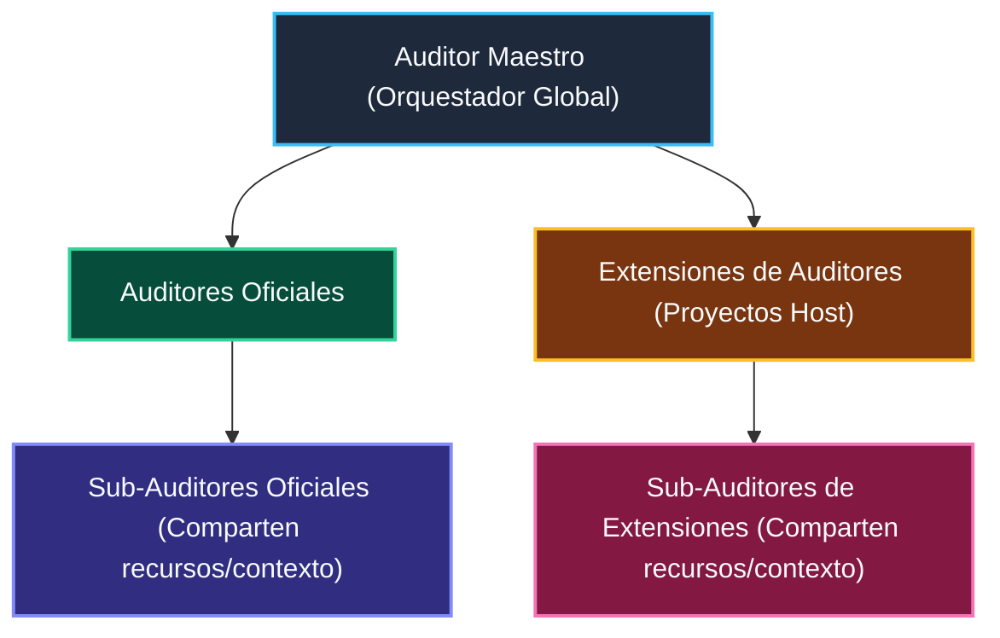

# Step-by-Step Guide: How to Create a New Sub-Auditor

This reference provides exhaustive implementation examples and walkthroughs for authoring new sub-auditors in `@francogp/auditor` or host extensions in `scripts/auditors/`.

---

## 1. Bundled Boilerplate Templates (`assets/templates/`)

Pre-formatted, production-ready templates conforming to all project standards are bundled directly within this skill for instant scaffolding:

- **Line-by-Line Scanner**: [`assets/templates/file_scan_auditor_template.ts`](../assets/templates/file_scan_auditor_template.ts)
- **Composite / Database / Asset Auditor**: [`assets/templates/base_auditor_template.ts`](../assets/templates/base_auditor_template.ts)
- **AST-Driven Auditor**: [`assets/templates/ast_auditor_template.ts`](../assets/templates/ast_auditor_template.ts)
- **Dedicated Vitest Unit Test**: [`assets/templates/auditor_unit_test_template.test.ts`](../assets/templates/auditor_unit_test_template.test.ts)

---

## 2. Option A: File-Scanning Auditor (`FileScanAuditor`)

Use `FileScanAuditor` when the audit inspects files line-by-line across specific directories (e.g. searching for regex patterns, forbidden tokens, or syntax rules).

```typescript
/**
 * scripts/auditors/architecture/validate_my_feature.ts
 *
 * MY FEATURE AUDITOR (Node.js 26+ Native)
 */

import path from 'node:path';
import { enableCompileCache } from 'node:module';
import { BaseAuditor, FileScanAuditor, hasLineSuppression } from '@francogp/auditor';

enableCompileCache();

export type MyFeatureRuleId =
  | 'my-feature-forbidden-token'
  | 'my-feature-missing-attribute';

export const MY_FEATURE_RULES: readonly MyFeatureRuleId[] = [
  'my-feature-forbidden-token',
  'my-feature-missing-attribute'
];

export interface MyFeatureAuditorOptions {
  readonly projectRoot?: string;
  readonly roots?: readonly string[];
}

export class MyFeatureAuditor extends FileScanAuditor<MyFeatureRuleId> {
  constructor(options: MyFeatureAuditorOptions = {}) {
    super({
      id: 'validate_my_feature',
      name: 'My Feature Validator',
      description: 'Valida tokens prohibidos y atributos en src/',
      icon: '🔍', // Mandatory thematic emoji
      family: 'architecture',
      ruleIds: MY_FEATURE_RULES,
      packageName: 'MiModulo',
      configKey: 'paths.srcRoots',
      defaultConfig: {
        srcRoots: ['src']
      },
      ruleDescriptions: {
        'my-feature-forbidden-token': 'Token prohibido en archivo fuente',
        'my-feature-missing-attribute': 'Atributo obligatorio faltante'
      },
      roots: options.roots ?? ['src'],
      allowedExtensions: new Set(['.vue', '.ts']),
      projectRoot: options.projectRoot
    });
  }

  protected override scanFile(relPath: string, content: string): void {
    const lines = content.split(/\r?\n/);
    for (let i = 0; i < lines.length; i++) {
      const line = lines[i]!;
      const lineNum = i + 1;

      // Check escape hatches: // domain-ok, // my-feature-ok, or multiline comments
      if (this.isLineIgnored(line, ['my-feature-ok']) || hasLineSuppression(line, 'my-feature-forbidden-token', lines, i)) continue;

      if (line.includes('bannedToken')) {
        this.addViolation({
          ruleId: 'my-feature-forbidden-token',
          severity: 'error',
          file: relPath,
          line: lineNum,
          message: `Forbidden token 'bannedToken' detected. Use canonical helper instead.`,
          context: line.trim()
        });
      }
    }
  }
}

// Canonical CLI Entrypoint
await BaseAuditor.runCliIfMain(import.meta.url, new MyFeatureAuditor());
```

---

## 3. Option B: Composite / Data Auditor (`BaseAuditor`)

Use `BaseAuditor` when the audit performs multi-source comparisons, AST graphs, database schema validations, or dataset integrity checks.

```typescript
/**
 * scripts/auditors/domain_data/validate_my_data.ts
 *
 * MY DATA INTEGRITY AUDITOR (Node.js 26+ Native)
 */

import path from 'node:path';
import { enableCompileCache } from 'node:module';
import { BaseAuditor } from '@francogp/auditor';
import { MY_DATA } from '../../../src/data/myData.ts';

enableCompileCache();

export type MyDataRuleId = 'my-data-key-missing' | 'my-data-value-invalid';

export const MY_DATA_RULES: readonly MyDataRuleId[] = [
  'my-data-key-missing',
  'my-data-value-invalid'
];

export interface MyDataAuditorOptions {
  readonly projectRoot?: string;
}

export class MyDataAuditor extends BaseAuditor<MyDataRuleId> {
  constructor(options: MyDataAuditorOptions = {}) {
    super({
      id: 'validate_my_data',
      name: 'My Data Validator',
      description: 'Valida integridad y campos obligatorios en base de datos',
      icon: '📊', // Mandatory thematic emoji
      family: 'domain_data',
      ruleIds: MY_DATA_RULES,
      packageName: 'Datos',
      configKey: 'paths.dataRoots',
      defaultConfig: {
        dataRoots: ['src/data']
      },
      ruleDescriptions: {
        'my-data-key-missing': 'Clave faltante en registro de datos',
        'my-data-value-invalid': 'Valor no válido en propiedad requerida'
      },
      coverage: {
        include: ['src/data/myData.ts'],
        source: 'runtime'
      },
      projectRoot: options.projectRoot
    });
  }

  public override async runAudit(): Promise<void> {
    const dataFilePath = path.resolve(this.projectRoot, 'src/data/myData.ts');
    this.recordScanned(dataFilePath);
    this.markRuleEvaluated('my-data-key-missing');
    this.markRuleEvaluated('my-data-value-invalid');

    this.context.logStep(1, 2, 'Validating my data keys...');
    for (const [key, value] of Object.entries(MY_DATA)) {
      if (!value.requiredField) {
        this.addViolation({
          ruleId: 'my-data-key-missing',
          severity: 'error',
          file: 'src/data/myData.ts',
          line: 1,
          message: `Entry '${key}' is missing 'requiredField'.`,
          context: key
        });
      }
    }

    this.context.setMetric('Total Entries Checked', Object.keys(MY_DATA).length);
  }
}

// Canonical CLI Entrypoint
await BaseAuditor.runCliIfMain(import.meta.url, new MyDataAuditor());
```

---

## 4. Option C: AST-Driven Sub-Auditor (`requiresAst: true` & `SharedAstContext`)

Use `BaseAuditor` with `requiresAst: true` (or `FileScanAuditor` with `sourceFile`) when the audit inspects TypeScript syntax trees, imports, exports, decorators, types, or Vue SFC script blocks across codebase files.

```typescript
/**
 * scripts/auditors/architecture/validate_my_ast_rule.ts
 *
 * AST-DRIVEN AUDITOR (Node.js 26+ Native)
 */

import path from 'node:path';
import ts from 'typescript';
import { enableCompileCache } from 'node:module';
import { BaseAuditor, SharedAstContext } from '@francogp/auditor';

enableCompileCache();

export type MyAstRuleId = 'my-ast-forbidden-call';

export const MY_AST_RULES: readonly MyAstRuleId[] = [
  'my-ast-forbidden-call'
] as const;

export class MyAstAuditor extends BaseAuditor<MyAstRuleId> {
  constructor() {
    super({
      id: 'validate_my_ast_rule',
      name: 'My AST Rule Validator',
      description: 'Valida llamadas prohibidas en el AST de TypeScript',
      icon: '🌳', // Mandatory thematic emoji
      family: 'architecture',
      ruleIds: MY_AST_RULES,
      packageName: 'AST',
      configKey: 'paths.srcRoots',
      defaultConfig: {
        srcRoots: ['src']
      },
      ruleDescriptions: {
        'my-ast-forbidden-call': 'Llamada prohibida detectada en AST'
      },
      capabilities: { ast: true },
      requiresAst: true,
      roots: ['src'],
      allowedExtensions: new Set(['.ts', '.vue'])
    });
  }

  public override async runAudit(astContext?: SharedAstContext): Promise<void> {
    this.context.logStep(1, 1, 'Analizando AST con contexto compartido...');

    const astEngine = astContext ?? new SharedAstContext();
    const relFiles = await this.context.collectFiles(['src'], new Set(['.ts', '.vue']));

    for (const relFile of relFiles) {
      this.filesScannedCount++;
      const absPath = path.resolve(this.projectRoot, relFile);
      const sourceFile = astEngine.getSourceFile(absPath);

      ts.forEachChild(sourceFile, (node) => {
        if (ts.isCallExpression(node)) {
          // Inspect AST node properties...
        }
      });
    }

    this.context.setMetric('Files Scanned with AST', this.filesScannedCount);
  }
}

// Canonical CLI Entrypoint
await BaseAuditor.runCliIfMain(import.meta.url, new MyAstAuditor());
```

---

## 5. Universal Sub-Auditor Progress Contract (`ICompositeAuditor`)

All sub-auditors in `@francogp/auditor` adhere to the **Universal Sub-Auditor Progress Contract**, ensuring that every sub-rule, internal verification step, and returning result is disclosed live in the console of the main auditor (`audit_full.ts`) and recorded in `StandardAuditResult.subAuditors`.

### The Contract Types (`auditContract.ts`)

```typescript
export interface SubAuditorStep {
  readonly id: string;
  readonly name: string;
  readonly description: string;
}

export interface SubAuditorReport {
  readonly id: string;
  readonly name: string;
  readonly status: 'passed' | 'failed';
  readonly count: number;
  readonly detail?: string;
}

export interface ICompositeAuditor {
  getSubAuditors(): readonly SubAuditorStep[];
}
```

### In FileScanAuditor (Automatic Ingestion)

When you inherit from `FileScanAuditor`, every rule declared in `this.ruleIds` is automatically mapped into `getSubAuditors()` using `this.formatRuleDescription(ruleId)`.
Upon completing the file scan, `ensureSubAuditorsLogged()` automatically logs each sub-auditor step:

```text
🔍 [1/2] MiModulo: Token prohibido en archivo fuente
🔍 [2/2] MiModulo: Atributo obligatorio faltante (🐛 2)
```

- **Zero Findings**: Silent and clean, with no badges or verbose text like `(0 encontradas)`.
- **With Findings**: Displays `(🐛 <count>)` prominently.
- **Description Length Cap**: The composed string `${packageName}: ${ruleDescription}` MUST remain `<= 50` characters (`MAX_AUDITOR_DESCRIPTION_LENGTH = 50`) and contain zero newlines. If a rule description exceeds 50 characters, `BaseAuditor` throws an explicit runtime `Error` during instantiation.
Zero manual logging code is required.

### In Composite / Multi-Phase BaseAuditor (Explicit Progress)

If your auditor performs multiple distinct phases (such as database indexing followed by parity checks, or running multiple AST sub-analyzers):

1. Override `getSubAuditors()`:

   ```typescript
   public override getSubAuditors(): readonly SubAuditorStep[] {
     return [
       { id: 'step-1-index', name: 'Indexación de datos', description: 'Indexa registros' },
       { id: 'step-2-parity', name: 'Paridad cruzada', description: 'Verifica paridad' }
     ];
   }
   ```

2. Call `this.logSubAudit(...)` as each sub-phase completes:

   ```typescript
   this.logSubAudit(1, 2, 'Indexación de datos', indexViolationsCount);
   // ... run phase 2 ...
   this.logSubAudit(2, 2, 'Paridad cruzada', parityViolationsCount);
   ```

Any unlogged steps will be backfilled automatically by `ensureSubAuditorsLogged()` when `finishAudit()` runs.

---

## 6. Official Stylelint Engine & Pure In-Memory Analysis (Zero External Binaries)

Sub-auditors validating styles, stylesheets (`.css`, `.scss`), or Vue SFC `<style>` blocks **MUST NOT** spawn external native binaries (such as `css-checker-kit`, Go binaries, or unmaintained tools). These binaries cause Smart App Control (SAC) blocks on Windows, fail under `ignore-scripts: true`, and create platform fragility.

Instead, stylesheet and component style hygiene, duplicate class rules, similar selectors, empty blocks, property order, and SCSS syntax are analyzed strictly through the official Stylelint engine with Vue SFC and SCSS support (`stylelint`, `stylelint-scss`, `stylelint-order`) and in-memory PostCSS AST processing:

```typescript
import stylelint from 'stylelint';

export async function lintStyleContent(code: string, codeFilename: string) {
  const result = await stylelint.lint({
    code,
    codeFilename,
    config: {
      extends: ['stylelint-config-standard-scss', 'stylelint-config-recommended-vue/scss']
    }
  });
  return result.results;
}
```

This pattern powers [`src/suites/architecture/validate_stylelint.ts`](../../../../src/suites/architecture/validate_stylelint.ts), evaluating all CSS hygiene, property order, duplicate rules, and SCSS syntax cleanly in milliseconds across all platforms.

### Dart Sass Function Collision Prevention (`sass-traps/collision-casing`)

In SCSS and Vue SFC `<style lang="scss">`, standard CSS functions that share names with Dart Sass built-in functions (`scale`, `scaleX`, `scaleY`, `scaleZ`, `scale3d`, `saturate`, `grayscale`, `invert`, `alpha`, `brightness`, `contrast`, `drop-shadow`, `hue-rotate`, `translateX`, `translateY`, `translateZ`, `translate3d`, `radial-gradient`, `linear-gradient`) must be written with PascalCase/CamelCase initial letters (e.g. `Scale(1.1)`, `Saturate(0.9)`, `Drop-Shadow(...)`, `hue-Rotate(...)`).

Lowercase invocations collide with Dart Sass internal evaluation and cause fatal build crashes:

```text
[sass] $color: 1.1 is not a color.
[sass] Missing argument $amount.
```

The native Stylelint plugin [`src/suites/architecture/stylelintSassTrapsPlugin.ts`](../../../../src/suites/architecture/stylelintSassTrapsPlugin.ts) (`sass-traps/collision-casing`) inspects PostCSS value AST nodes and automatically repairs colliding functions to their canonical capitalized forms when running in `--fix` mode. Standard `.stylelintrc.json` preserves `function-name-case: ['lower', { ignoreFunctions: ['/^[A-Z]/', 'Drop-Shadow', 'Drop-shadow', 'hue-Rotate', 'Hue-Rotate'] }]` and `value-keyword-case: ['lower', { camelCaseSvgKeywords: true, ignoreProperties: ['/--.*/'], ignoreFunctions: ['v-bind'] }]` to ensure zero rule deactivation while preserving unquoted `v-bind(...)` in Vue SFC. Furthermore, `order/order` partitions `@include` mixins by `hasBlock` (`hasBlock: false` before declarations, `hasBlock: true` after declarations) so that media queries properly override declarations down the CSS cascade without being superseded in mobile-first layouts.

---

## 7. Sub-Auditor Capabilities Contract (`AuditorCapabilities`) & Zero-Boilerplate Defaults

Every sub-auditor declares its execution capabilities dynamically. The orchestrator inspects these capabilities to coordinate specialized execution modes (such as `auditor fix`, fast presets, differential runs, or AST sharing) without maintaining hardcoded suite lists.

### The Standard Capabilities

```typescript
export interface AuditorCapabilities {
  /** Supports automatic fixing/repair of detected violations (--fix / auditor fix). */
  readonly fix: boolean;
  /** High priority in auto-repair mode; executed FIRST to bootstrap environment, configs, and scripts. */
  readonly fixPriority: boolean;
  /** Included in fast lint preset (preset=lint). */
  readonly lint: boolean;
  /** Included in markdown documentation preset (preset=md). */
  readonly md: boolean;
  /** Requires in-memory TypeScript AST parsing engine (SharedAstContext). */
  readonly ast: boolean;
  /** Supports differential file scanning (--changed-since / changed-since=origin/main). */
  readonly changedSince: boolean;
  /** Heavy computation / long-running suite, excluded by default from fast presets. */
  readonly heavy: boolean;
  /** Requires compilation / distribution artifacts (dist/) to exist prior to audit (auditor:build). */
  readonly requiresBuild: boolean;
  /** Lifecycle hook executed after primary scan. */
  readonly postRun: boolean;
}
```

### Mandatory Capabilities Contract & 100% Complete Initialization

`BaseAuditor` enforces strict, complete initialization with **zero fallbacks**. Sub-auditors and host extensions **MUST explicitly declare all 9 boolean capabilities** (`fix`, `fixPriority`, `lint`, `md`, `ast`, `changedSince`, `heavy`, `requiresBuild`, `postRun`) as booleans (`true` or `false`). Omitting capabilities or relying on fallback objects is strictly prohibited and fails loudly:

```typescript
// Standard sub-auditor: explicitly initialize all 9 capabilities
export class MyValidator extends BaseAuditor<MyRuleId> {
  constructor() {
    super({
      id: 'validate_my_validator',
      capabilities: {
        fix: false,
        fixPriority: false,
        lint: true,
        md: false,
        ast: false,
        changedSince: false,
        heavy: false,
        requiresBuild: false,
        postRun: false
      },
      ...
    });
  }
}

// Auto-repair capable sub-auditor: declare fix: true, fixableRuleIds, and all other 8 flags explicitly
export class MyAutoFixValidator extends BaseAuditor<MyRuleId> {
  constructor() {
    super({
      id: 'validate_my_auto_fix',
      capabilities: {
        fix: true,
        fixPriority: false,
        lint: true,
        md: false,
        ast: false,
        changedSince: false,
        heavy: false,
        requiresBuild: false,
        postRun: false
      },
      fixableRuleIds: ['my-fixable-rule'],
      ...
    });
  }
}
```

### Dynamic Auto-Coordination in the Runner (Zero Hardcoding)

- **`auditor fix` / `auditor --fix`**: Automatically discovers all suites declaring `capabilities.fix === true`. Suites declaring `capabilities.fixPriority === true` (environment, tooling, and configuration generators) execute **FIRST**, ensuring `.auditor/audit.config.ts`, `.gitignore`, `package.json` scripts, and linter configs are established before dependent code/style fixers run.
- **Fast presets (`preset=lint`, `preset=md`)**: Automatically run suites with `capabilities.lint === true` or `capabilities.md === true`, while bypassing suites with `capabilities.heavy === true`.
- **Post-Build verification (`auditor:build` / `preset=build`)**: Automatically runs suites with `capabilities.requiresBuild === true` against `dist/` post-compilation, excluding them from source audits.
- **Pre-heat AST**: Automatically initializes `SharedAstContext` before executing any suite with `capabilities.ast === true`.

---

## 8. Registering Host Extensions in `.auditor/audit.config.ts`

Host applications implementing custom rules in `scripts/auditors/<family>/validate_<name>.ts` register them dynamically in `.auditor/audit.config.ts`:

```typescript
import { defineAuditConfig } from '@francogp/auditor/config';
import { MyCompositeAuditor } from '../scripts/auditors/domain_data/validate_my_composite.ts';

export default defineAuditConfig({
  extensions: [
    {
      auditor: new MyCompositeAuditor(),
      family: 'domain_data',
      name: 'Custom Domain Validator'
    }
  ]
});
```

When `auditor` or `npm run auditor` runs, `auditScanner.ts` automatically discovers registered extensions and executes them seamlessly within the main Box-Drawing summary table.

---

## 9. Dynamic GitIgnore Requirements Contract (`gitIgnoreEntries`)

Sub-auditors and extensions MUST NOT rely on hardcoded tool lists in the general framework. If a sub-auditor, tool, or CLI runner produces intermediate artifacts (e.g. `.mytoolcache`, `dist/`), it must declare its required patterns via `gitIgnoreEntries`:

```typescript
import { BaseAuditor, type GitIgnoreRequirement } from '@francogp/auditor';

export class MyCustomAuditor extends BaseAuditor<MyRuleId> {
  public static readonly gitIgnoreEntries: readonly GitIgnoreRequirement[] = [
    {
      id: 'my-cache',
      pattern: '.my-cache/',
      samplePath: '.my-cache/cache.json',
      reason: 'Caché de herramienta personalizada'
    }
  ];

  constructor() {
    super({
      id: 'validate_my_custom',
      name: 'My Custom Validator',
      description: 'Valida reglas personalizadas',
      family: 'architecture',
      packageName: 'MiModulo',
      gitIgnoreEntries: MyCustomAuditor.gitIgnoreEntries
    });
  }
}
```

The orchestrator and `validate_audit_config` will:

1. Dynamically discover this requirement from your extension or subauditor without hardcoding.
2. Assert that `.gitignore` contains the pattern matching your entry (`severity: 'error'`).
3. Automatically append missing entries to `.gitignore` when running with `--fix` (`npm run auditor:fix` or `auditor fix`).

---

## 10. Mandatory Hermetic Unit Testing

Every sub-auditor MUST have a companion unit test file in `tests/<suite_name>.test.ts` (or `tests/node/auditors/` for host extensions) adhering to:

1. **Negative Verification**: Asserts that clean code yields `0 errors` and `status: 'passed'`.
2. **RuleId Coverage**: Every declared rule ID has dedicated dirty snippet assertions.
3. **Zero Live Scanning**: Use `auditor.testScanFile(...)` followed by `await auditor.finishAudit()`, or initialize `BaseAuditor({ projectRoot: tempDir })`. Never run `auditor.execute()` on `process.cwd()`.

---

## 11. Mandatory Thematic Emoji Contract (`AuditorOptions.icon`)

Every sub-auditor (built-in framework suites and user host extensions alike) **MUST** declare a non-empty thematic emoji in `AuditorOptions.icon`:

```typescript
super({
  id: 'validate_combat_invariants',
  name: 'Combat Engine & Invariants Auditor',
  description: 'Invariantes de combate y bifurcación p1/p2',
  icon: '🛡️', // MANDATORY: thematic emoji representing the suite
  family: 'fsm',
  ruleIds: COMBAT_INVARIANTS_RULES,
  packageName: 'Combate',
  ruleDescriptions: COMBAT_INVARIANTS_DESCRIPTIONS
});
```

- **Strict Instantiation Validation**: If `icon` is omitted, `undefined`, or whitespace-only, `validateAuditorOptions` throws an explicit, loud runtime `Error: Auditor [<id>] must define a mandatory thematic icon/emoji`.
- **Zero Fallback Compromise**: Core suites and host extensions are prohibited from relying on generic cogs (`⚙️`) or generic folders (`📁`). Every suite author chooses a meaningful visual symbol matching their domain (e.g. ⚔️, 🛡️, 🎒, 🔴, 🔤, 💾, 📊).
- **Scanner Propagation**: The streaming runner and terminal tables render this icon directly on progress lines and finding breakdowns.

---

## 12. Transparent Skip Reporting Contract (`markSkipped`, `status: 'skipped'`)

When an auditor must be bypassed (e.g. due to environmental guards, configuration flags, or fast presets), it **MUST NOT** pretend to have passed (`status: 'passed'`) with a green checkmark `✅`. Doing so creates cognitive friction and conceals skipped checks.

Instead, sub-auditors call `this.markSkipped(reason)`:

```typescript
if (isSkippedByEnvironment()) {
  this.markSkipped('Omitido por variable de entorno AUDITOR_SKIP_SIMILAR_CODE_VECTOR_ANALYSIS=1');
  return;
}
```

- **Contract Transition**: Sets `result.status = 'skipped'`, updates `result.metrics['Estado'] = 'OMITIDO ⏭️'`, and records the skip justification.
- **Console Stream**: Displays `⏭️  SKIP` in cyan with the suite's thematic icon and skip reason.
- **Summary Accounting**: The Box-Drawing summary table and total footer clearly reflect skipped suites: `(1 Omitida ⏭️)` rather than masking them as passed.

---

## 13. Anti-Abuse Protection for `constants.exemptGlobs`

When configuring path-based constant exceptions, host projects configure `constants.exemptGlobs`:

```typescript
constants: {
  exemptGlobs: [
    'scripts/maintenance/**',
    'src/data/seed/**'
  ]
}
```

---

## 14. Introspection & Canonical DTO Contract (`toManifest()`, `AuditorManifestDTO`)

Every sub-auditor and host extension inherits from `BaseAuditor` and provides the typed `toManifest(): AuditorManifestDTO` method:

```typescript
export interface AuditorManifestDTO {
  readonly id: string;
  readonly name: string;
  readonly family: string;
  readonly icon: string;
  readonly description: string; // <= 60 characters
  readonly capabilities: AuditorCapabilities;
  readonly rules: Readonly<Record<string, string>>;
  readonly configKey?: string;
}
```

### Constraints

1. **Concise Descriptions (Zero Text Walls)**: `description` must not exceed 60 characters and must contain zero newlines.
2. **Dynamic Exposure**: The CLI inspects all suites dynamically via `node --experimental-strip-types src/cli/audit_full.ts --list --json` (or `auditor --list --json`) and `--info=<suiteId>` without hardcoding.

- **Strict Specificity Guard**: Broad wildcards matching entire repositories or primary source trees (`**/*`, `*`, `src/**`, `src/*`) are strictly rejected with an explicit validation error, preventing evasion of the Named Constants Mandate.
- **Safe Scope**: Use specific maintenance scripts, seed files, or test generator catalogs where inline numbers are strictly non-semantic tabular data.

---

## 15. Hierarchical Architecture & Sub-Auditor Composition

The auditor framework follows a 3-tier hierarchical structure:



### Key Principles for Authors

1. **Symmetric Class Inheritance**:
   Both official suites in `@francogp/auditor` and host project extensions in `scripts/auditors/` inherit from `BaseAuditor<TRuleId>` (or `FileScanAuditor<TRuleId>`). They share identical options, capabilities, and lifecycle methods without duplicate code.
2. **Sub-Auditors Share Resources**:
   When an auditor contains sub-auditors, it coordinates their execution and provides shared resources (e.g. parsed AST, loaded datasets, or external command results) so each sub-check doesn't repeat heavy filesystem or parsing operations.
3. **Atomic Console Reporting**:
   An auditor with sub-auditors MUST wait for all its sub-auditors to complete execution before emitting its progress step lines (`│  🔍 [X/Y] ...`). This prevents mixed line outputs across concurrent background workers.
4. **Mandatory Construction & Runtime Rule Registration Guard**:
   Every rule ID emitted via `this.addViolation` must be explicitly declared in `ruleDescriptions: Record<TRuleId, string>` passed to `super({...})`. Any violation for an undeclared rule throws a loud runtime error immediately.

---

## 16. Declarative Configuration File Requirements & Auto-Fix Contract

Sub-auditors and extensions that validate or depend on external tool configuration files (such as `eslint.config.js`, `.fallowrc.json`, `.stylelintrc.json`, `.htmlvalidate.json`, `.markdownlint.json`, or custom host configs) MUST NOT implement bespoke file writers or manual boilerplate checking.

Instead, declare configuration requirements declaratively via `AuditorConfigFileRequirement` and `configFiles`:

```typescript
import {
  BaseAuditor,
  type AuditorConfigFileRequirement
} from '@francogp/auditor';

export class MyToolAuditor extends BaseAuditor<MyToolRuleId> {
  public static readonly configFiles: readonly AuditorConfigFileRequirement[] = [
    {
      file: '.mytoolrc.json',
      content: () => JSON.stringify({ version: 1, strict: true }, null, 2) + '\n',
      description: 'Canonical MyTool configuration',
      customMissingMessage: 'Missing .mytoolrc.json configuration file.'
    }
  ];

  constructor() {
    super({
      id: 'validate_my_tool',
      name: 'My Tool Validator',
      description: 'Valida contratos y configuración de MyTool',
      icon: '🔧',
      family: 'architecture',
      packageName: 'MyTool',
      ruleIds: MY_TOOL_RULES,
      configKey: 'tools.myTool',
      defaultConfig: {
        enabled: true
      },
      configFiles: MyToolAuditor.configFiles,
      ruleDescriptions: MY_TOOL_DESCRIPTIONS
    });
  }

  public override async runAudit(): Promise<void> {
    // 1. Automatically verifies config existence and creates default files if in --fix mode:
    const missingConfigs = await this.verifyAndFixConfigFiles();
    for (const missing of missingConfigs) {
      this.addViolation({
        ruleId: 'my-tool-missing-config',
        severity: 'error',
        file: missing.file,
        message: missing.message
      });
    }

    // 2. Or programmatically ensure a specific config file if needed:
    // const result = await this.ensureConfigFile(MyToolAuditor.configFiles[0]);
  }
}
```

### Core Architecture

1. **Dynamic Registration**: `BaseAuditor` registers all declared `configFiles` into `ConfigFileRegistry` automatically during instantiation.
2. **Auto-Repair Protocol (`--fix`)**: When executed with `auditor fix` (`this.isFixActive()`), `verifyAndFixConfigFiles()` writes the canonical default content atomically to disk and avoids logging violations.
3. **Extension Support**: Extensions registered via `defineAuditorExtension({ configFiles: [...] })` also register requirements dynamically without modifying framework internals.

---

## 17. Mandatory Constructor Metadata Contract (Zero Bypass / Zero Optional Defaults)

Under the v5 architecture, it is mathematically impossible to instantiate a sub-auditor or extension without supplying all canonical metadata in the constructor:

| Option | Type | Constraint | Purpose |
| :--- | :--- | :--- | :--- |
| `id` | `string` | Canonical ID | Unique identifier across the orchestrator (`validate_<name>`). |
| `name` | `string` | Non-empty | Formal human-readable name of the suite. |
| `description` | `string` | `<= 60` chars | Concise Spanish explanation of what the suite verifies. |
| `family` | `AuditFamily` | Strict enum | One of `'architecture'`, `'domain_data'`, `'persistence'`, `'fsm'`, `'assets'`, `'documentation'`. |
| `packageName` | `string` | Non-empty | Technology scope prefix (`'ESLint'`, `'TypeScript'`, `'Config'`, `'Estilos'`, `'DOX'`). |
| `icon` | `string` | Thematic emoji | Mandatory visual emoji icon (`'🏛️'`, `'🔍'`, `'🎨'`). |
| `ruleIds` | `readonly TRuleId[]` | Exhaustive | Array of declared rule IDs. |
| `ruleDescriptions` | `Record<TRuleId, string>` | 100% of rules | Pure Spanish description (prefixed `${packageName}: ${desc}` must be `<= 50` chars). |
| `configKey` | `string` | Dotted path | Mandatory SSoT configuration key inspected by the dynamic gating engine. |
| `defaultConfig` | `Record<string, unknown>` | Valid object | Mandatory default object dynamically collected by `auditor fix` to scaffold `.auditor/audit.config.ts`. For all subsystems, `enabled: boolean` is mandatory. |

If any of these fields are missing or invalid, `BaseAuditor` throws an immediate runtime `Error` during instantiation.

---

## 18. Dynamic Introspection, Auto-Registration & Dynamic Suite Gating

The master orchestrator does not maintain hardcoded lists of enabled suites. Every auditor dropped into `src/suites/` or declared as a host extension is discovered automatically:

1. **Dynamic Status Resolution**: `evaluateSuiteStatus(suiteId, config, declaredConfigKey)` evaluates the declared `configKey` against `.auditor/audit.config.ts`. If the value resolves to `false` or `'none'`, the suite is cleanly marked `⏭️  SKIP`.
2. **Dynamic Config Scaffolding (`auditor fix`)**: When generating `.auditor/audit.config.ts`, `collectConfigSectionsFromTasks` iterates over all discovered tasks, dynamically assembling their declared `defaultConfig` with zero hardcoding.

---

## 19. Post-Build Compiled Artifact Partitioning (`audit:build` / `preset=build`)

Suites that validate compiled distribution artifacts (such as bundle budgets, export maps, or TypeScript `.d.ts` declaration maps) declare:

```typescript
capabilities: { requiresBuild: true }
```

1. **Pre-Build Exclusion**: `npm run auditor` automatically filters out suites with `capabilities.requiresBuild === true` so pre-build development checks never fail due to missing `dist/` folders.
2. **Post-Build Chaining**: In `package.json`, the standard build script chains `auditor:build`:

   ```json
   "build": "npm run auditor && tsc -p tsconfig.build.json && npm run auditor:build"
   ```

   Executing `npm run auditor:build` isolates and evaluates only compiled artifact suites against the fresh `dist/` output.

---

## 20. Mandatory Dynamic Testing Conformance & 5-Point Unit Test Contract

Every official sub-auditor in `@francogp/auditor` and every extension created in host projects (`scripts/auditors/`) MUST have a dedicated Vitest unit test. The test runner dynamically discovers all declared tasks and verifies conformance via `auditorContractConformance.ts`.

### The 5-Point Testing Contract

1. **Construction & Metadata Integrity**:
   Verify that the sub-auditor instantiates cleanly and satisfies all mandatory metadata requirements:

   ```typescript
   import { validateAuditorConstruction } from '@francogp/auditor';

   it('conforms to construction metadata contract and exposes manifest', () => {
     const auditor = new MyFeatureAuditor({ projectRoot: TEST_DIR });
     validateAuditorConstruction(auditor);
     const manifest = auditor.toManifest();
     expect(manifest.packageName).toBe('MiModulo');
     expect(manifest.configKey).toBe('paths.srcRoots');
   });
   ```

2. **Clean Path Verification**:
   Assert that when code has zero violations, the auditor produces zero errors and passes:

   ```typescript
   expect(result.summary.errors).toBe(0);
   expect(result.summary.warnings).toBe(0);
   expect(result.status).toBe('passed');
   expect(result.findings.length).toBe(0);
   ```

3. **Violation Path Verification**:
   Assert that non-compliant code produces errors, a failed status, and structured error findings:

   ```typescript
   expect(result.summary.errors).toBeGreaterThan(0);
   expect(result.status).toBe('failed');
   expect(result.findings.some(f => f.ruleId === 'my-rule-id' && f.severity === 'error')).toBe(true);
   ```

4. **Warning Path Verification**:
   Assert that advisory issues produce warnings and warned status (`severity === 'warning'`, `status === 'warned'`).
5. **100% of Declared Rule IDs Tested**:
   Every rule ID declared in `ruleIds` must be evaluated and covered in unit tests.

### Whole-Workspace Dynamic Conformance in 2 Lines

Host projects can verify all their custom extension sub-auditors dynamically by creating `tests/node/auditors/conformance.test.ts`:

```typescript
import { describe } from 'vitest';
import { runAuditorContractConformanceTests } from '@francogp/auditor';

describe('All Auditors Dynamic Conformance', () => {
  runAuditorContractConformanceTests();
});
```

---

## 21. Dynamic Package Script Contract & Collision Prevention (`PackageScriptRegistry`)

Every sub-auditor and host extension has a mandatory execution contract (`scripts`) defining how it is invoked via CLI and package scripts:

### 1. Automatic Derivation by Convention (`BaseAuditor`)

Sub-auditors and extensions extending `BaseAuditor` do not need to write manual script definitions. The base class automatically derives canonical script requirements by convention:

- **Script Name**: `audit:<short-id>` (e.g. `validate_my_feature` -> `audit:my-feature`).
- **Command**: `auditor task=<id>` (e.g. `auditor task=validate_my_feature`).
- **Description**: Derived directly from the auditor's `description`.
- **Category**: Derived directly from the auditor's `family`.

### 2. Custom Aliases & Flags (`AuditorOptions.scripts`)

If a sub-auditor or extension requires custom aliases or specialized multi-flag commands, they can be declared explicitly:

```typescript
import { BaseAuditor, type AuditorPackageScriptRequirement } from '@francogp/auditor';

export class MyFeatureAuditor extends BaseAuditor<MyFeatureRuleId> {
  public static readonly scripts: readonly AuditorPackageScriptRequirement[] = [
    {
      name: 'audit:my-feature:fast',
      command: 'auditor task=validate_my_feature fast=true',
      description: 'Fast check for my feature violations',
      category: 'architecture'
    }
  ];

  constructor(options: MyFeatureAuditorOptions = {}) {
    super({
      // ...
      scripts: MyFeatureAuditor.scripts,
      // ...
    });
  }
}
```

### 3. Collision Prevention (`[COLISIÓN DE COMANDOS]`)

All scripts are registered into `PackageScriptRegistry`. If two sub-auditors or extensions declare the same command name with conflicting commands, the registry throws an immediate, loud error:

```text
[COLISIÓN DE COMANDOS] El comando de script 'auditor:my-feature' está duplicado entre 'validate_my_feature' ('auditor task=validate_my_feature') y 'otra_extension' ('auditor task=otra_extension'). Cada sub-auditor y extensión DEBE declarar nombres de comandos únicos en package.json. Cambia el nombre del comando para resolver la colisión.
```

### 4. Automated Non-Destructive Injection (`auditor fix`)

When running `auditor fix` (or `npm run auditor:fix`), `validate_audit_config` dynamically inspects the host's `package.json` against all registered scripts in `PackageScriptRegistry` and appends missing ones without modifying existing custom scripts.

---

## 22. Sub-Auditor & Extension Hygiene Governance (`validate_auditor_hygiene`)

All sub-auditors in `@francogp/auditor` and host project extensions (`scripts/auditors/`) are strictly evaluated by `validate_auditor_hygiene`. To guarantee performance, cross-platform stability, and architectural cleanliness, all sub-auditors and extensions MUST follow these 10 invariants:

1. **Zero Manual `package.json` Reading (`auditor-manual-package-json`)**:
   - ❌ **Prohibited**: `fs.readFileSync(path.join(root, 'package.json'))` + `JSON.parse`.
   - ✅ **Canonical**: `getPackageJson(projectRoot)`.

2. **Zero Handcrafted Vue SFC Block Regexes (`auditor-manual-vue-sfc-regex`)**:
   - ❌ **Prohibited**: `/<template[\s\S]*<\/template>/` or manual tag slicing.
   - ✅ **Canonical**: `parseVueSfc(content)` from `@francogp/auditor`.

3. **Zero Isolated AST Creation (`auditor-manual-ts-ast`)**:
   - ❌ **Prohibited**: Direct calls to `ts.createSourceFile()` in scan loops.
   - ✅ **Canonical**: `this.context.getAst()`, `SharedAstContext`, or `AuditedDocument`.

4. **Zero Manual Path Normalization (`auditor-manual-path-normalize`)**:
   - ❌ **Prohibited**: `path.split('\\').join('/')` or `.replace(/\\/g, '/')`.
   - ✅ **Canonical**: `normalizePosixPath(filePath)` or `toPosixRelative(filePath, root)` from `@francogp/auditor`.

5. **Zero Direct Console Logging (`auditor-raw-console`)**:
   - ❌ **Prohibited**: `console.log()` or `console.warn()` inside sub-auditors.
   - ✅ **Canonical**: `this.addViolation()`, `this.context.setMetric()`, or `UnifiedTheme`.

6. **Zero Handcrafted Comment Stripping (`auditor-manual-comment-stripping`)**:
   - ❌ **Prohibited**: Fragile regexes like `code.replace(/\/\*[\s\S]*?\*\/|\/\/.*/g, '')`.
   - ✅ **Canonical**: `stripComments()` and `stripCommentsAndStrings()` from `@francogp/auditor`.

7. **Zero Manual Delimiter/Brace Counting (`auditor-manual-brace-counting`)**:
   - ❌ **Prohibited**: Handcrafted loops counting `braceDepth` or `parenDepth`.
   - ✅ **Canonical**: `scanBalancedDelimiter()` or `isPositionInsideFunctionParams()` from `@francogp/auditor`.

8. **Zero Manual CWE-22 Path Containment (`auditor-manual-path-containment`)**:
   - ❌ **Prohibited**: Ad-hoc checks using `.startsWith('..')`.
   - ✅ **Canonical**: `isPathInside(candidatePath, parentPath)` or `isInsideRoot()`.

9. **Zero Handcrafted Recursive File Walkers (`auditor-manual-file-walker`)**:
   - ❌ **Prohibited**: Manual recursive `readdirSync` or custom traversing helpers.
   - ✅ **Canonical**: `this.context.collectFiles()` or `FileScanAuditor` automated file discovery.

10. **Zero Ad-Hoc Test File Predicates (`auditor-homebrew-predicates`)**:
    - ❌ **Prohibited**: Ad-hoc regexes like `/\.(test|spec)\.ts$/`.
    - ✅ **Canonical**: `isTestPath(filePath)` or `isTestFileForCodeAudit(filePath)`.
