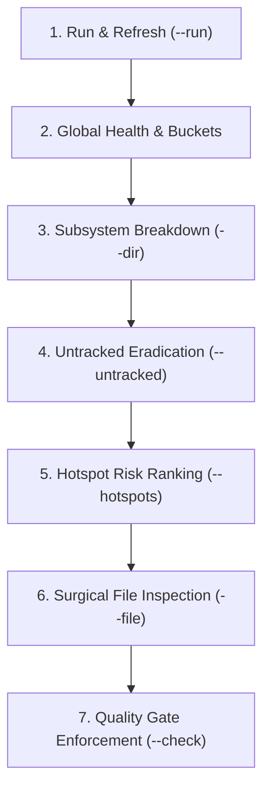

# Test Execution Coverage Guide (`report_test_coverage.ts`) & Best Practices

This guide provides the official operational reference, CLI options, architectural workflows, and best practices for test execution coverage analysis within `@francogp/auditor`.

---

## 1. Executive Summary & Conceptual Distinction

`@francogp/auditor` provides three distinct, non-overlapping coverage inspection tools:

| Script / Command | Purpose | Underlying Data Source |
| :--- | :--- | :--- |
| `npm run audit:test-coverage`<br>`auditor-test-coverage` | **Real test execution code coverage** (statements, branches, functions, lines, uncovered line ranges, untracked files). | Vitest / Jest / V8 / Istanbul `coverage-final.json`. |
| `npm run audit:coverage-map`<br>`auditor-coverage-map` | **Auditor suite coverage** (which static analysis rules and architectural suites scan each versioned file). | Auditor runtime ledgers (`scratch/audits/coverage/`). |
| `npm run audit:coverage-gaps`<br>`auditor-fallow category=coverage-gaps` | **Fallow reachable exports without tests** (untested public API contracts). | Fallow graph analysis. |

### Strict Prohibition on Ad-Hoc Scripts & Walkers
AI agents and developers are **STRICTLY PROHIBITED** from writing custom `node -e` scripts, ad-hoc Python/shell one-liners, or manual filesystem walkers to parse `coverage-final.json` or inspect test coverage. All coverage investigation, drill-down, line range inspection, and CI gating MUST be performed strictly through `npm run audit:test-coverage` (`auditor-test-coverage`).

---

## 2. Vitest & Framework Setup

To generate standard coverage data compatible with `@francogp/auditor`, configure Vitest with `@vitest/coverage-v8` or `@vitest/coverage-istanbul`:

### 2.1. Install Provider
```bash
npm install -D @vitest/coverage-v8
```

### 2.2. Configure `vitest.config.ts`
```ts
import { defineConfig } from 'vitest/config';

export default defineConfig({
  test: {
    coverage: {
      provider: 'v8',
      reporter: ['text', 'json', 'html'],
      reportsDirectory: 'coverage',
      include: ['src/**/*.ts', 'src/**/*.vue']
    }
  }
});
```

### 2.3. Configure `.auditor/audit.config.ts`
```ts
import { defineAuditConfig } from '@francogp/auditor';

export default defineAuditConfig({
  name: 'my-project',
  testCoverage: {
    enabled: true,
    threshold: 80,
    path: 'coverage/coverage-final.json',
    runCommand: 'npm test -- --coverage',
    roots: ['src'],
    extensions: ['.ts', '.vue', '.js'],
    exemptGlobs: [
      'src/**/*.d.ts',
      'src/types/**'
    ],
    enforceInAudit: false // Set to true to fail full audit if coverage drops below threshold
  }
});
```

---

## 3. CLI Command Options & Flags

| Flag / Option | Description | Example Usage |
| :--- | :--- | :--- |
| `--run` | Runs the test suite with coverage before analyzing. | `npm run audit:test-coverage -- --run` |
| `--check` | Quality Gate: Exits with code `1` if overall statements coverage is below threshold. | `npm run audit:test-coverage -- --check` |
| `--threshold=<N>` | Sets custom target coverage threshold percentage (default: `80`). Alias: `--min=<N>`. | `npm run audit:test-coverage -- --threshold=85` |
| `--dir=<path>` | Filters directory breakdown and file listings to a specific subsystem prefix. | `npm run audit:test-coverage -- --dir=src/core` |
| `--file=<path>` | Displays detailed file metrics and exact uncovered line ranges. | `npm run audit:test-coverage -- --file=src/core/math.ts` |
| `--below` | Displays only files whose statements coverage is below the threshold. | `npm run audit:test-coverage -- --below` |
| `--zero` | Displays only files with 0% test coverage. | `npm run audit:test-coverage -- --zero` |
| `--untracked` | Identifies files existing on disk in `roots` that were never executed in tests. | `npm run audit:test-coverage -- --untracked` |
| `--hotspots` | Correlates Fallow cognitive complexity with lack of tests to prioritize risk. | `npm run audit:test-coverage -- --hotspots` |
| `--top=<N>` | Limits the number of rows rendered in detailed tables (default: `20`). | `npm run audit:test-coverage -- --below --top=50` |
| `--json` | Outputs machine-readable JSON for CI integration or programmatic scripts. | `npm run audit:test-coverage -- --json` |

---

## 4. Best Practices & Standard 7-Step Workflow

When tasked with auditing, improving, or investigating test coverage in any project, AI agents and engineers MUST follow this structured workflow:



### Step 1: Run & Refresh Coverage
Never rely on stale coverage files. Always execute tests with fresh coverage data:
```bash
npm run audit:test-coverage -- --run
```

### Step 2: Inspect Global Metrics & File Buckets
Examine the overall statements, branches, functions, and lines percentages along with file bucket distribution:
- **🟢 Excellent ($\ge 80\%$)**: Target state for business logic, services, and core utilities.
- **🟡 Acceptable ($50-79\%$)**: Secondary priority for progressive test expansion.
- **🔴 Low ($< 50\%$)**: Needs immediate test coverage attention.
- **⚪ Untested ($0\%$)**: High risk if in production paths.
- **⚠️ Untracked**: Files on disk never imported or evaluated by any test suite.

### Step 3: Drill Down into Subsystems
Identify which directory or architectural module pulls the average down:
```bash
npm run audit:test-coverage -- --dir=src/services
```

### Step 4: Eradicate Untracked Files
Check if there are entire components, views, or utilities on disk that have zero tests:
```bash
npm run audit:test-coverage -- --untracked
```
*Action*: Either create dedicated unit/integration tests for these files, or add legitimate non-testable files (e.g. constant dictionaries or static schemas) to `exemptGlobs` in `audit.config.ts`.

### Step 5: Prioritize via Complexity Hotspots
Not all uncovered files represent equal risk. A 5-line simple helper with 0% coverage is trivial, while a 300-line complex state machine with 0% coverage is a critical defect hazard:
```bash
npm run audit:test-coverage -- --hotspots --top=10
```
*Formula*: $\text{Risk Score} = \text{Cognitive Complexity} \times (1 - \frac{\text{Coverage \%}}{100})$. Files with high complexity and low coverage appear at the very top.

### Step 6: Surgically Inspect Uncovered Line Ranges
Inspect the exact lines that were not hit by tests before authoring new test cases:
```bash
npm run audit:test-coverage -- --file=src/services/sessionService.ts
```
The output displays exact uncovered line ranges (e.g. `14-22, 45, 88-102`), pinpointing error branches, edge cases, or exception handlers that need tests.

### Step 7: Enforce CI Quality Gate
In pull request pipelines or pre-release checks, verify that overall coverage meets or exceeds the required threshold:
```bash
npm run audit:test-coverage -- --check --threshold=80
```

---

## 5. Practical Agent Recipes

### Recipe A: Finding the Worst 10 Files in a Project
```bash
npm run audit:test-coverage -- --below --top=10
```

### Recipe B: Checking Coverage of a Specific Subsystem
```bash
npm run audit:test-coverage -- --dir=src/core
```

### Recipe C: Automated CI Step
```bash
npm run audit:test-coverage -- --run --check --threshold=80
```
