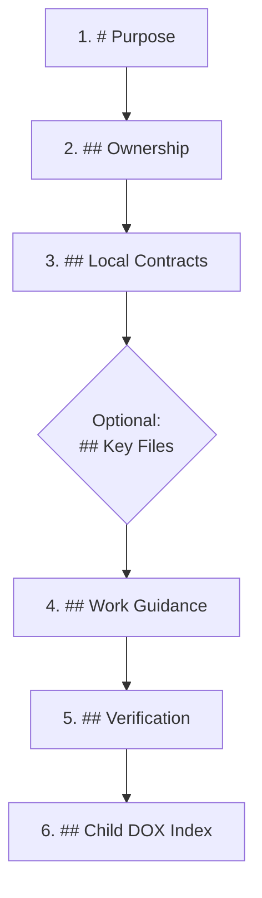

# DOX Authoring Tutorial & Canonical Guidelines

This guide establishes the official standard, architectural requirements, canonical templates, and authoring tutorial for creating and maintaining **DOX documentation indices** (`AGENTS.md`) across the repository.

---

## 1. Core Philosophy: DOX as Binding Work Contracts

In the DOX framework, `AGENTS.md` files are not passive readmes or scratch notes. They are **binding architectural contracts** for their subtrees:

1. **Context Proximity**: Instructions must reside as close to the code as possible. The closer a doc is to the work, the more specific and practical it must be.
2. **Zero Waste & Zero Hallucination**: AI agents and developers read the nearest `AGENTS.md` plus parent files before touching code. Precise documentation prevents hallucinated patterns and broken subsystem invariants.
3. **No Empty or Filler Stubs**: Every required section MUST contain useful, actionable content. Stubs with `TODO`, `TBD`, `N/A`, `None`, or empty text are strictly prohibited.

---

## 2. The 6 Mandatory Sections in Strict Canonical Order

Every `AGENTS.md` file must implement the following 6 sections in the exact sequential order:



| Order | Heading | Requirement | Content Purpose |
| :---: | :--- | :---: | :--- |
| **1** | `# Purpose` | **Mandatory** | High-level role of the directory, subsystem boundaries, and primary responsibilities. |
| **2** | `## Ownership` | **Mandatory** | Explicit engineering team or role owning the subsystem (e.g. `Architecture & Tooling Engineers.`). |
| **3** | `## Local Contracts` | **Mandatory** | Inviolable architectural invariants, domain rules, naming conventions, and constraints governing code inside this directory. |
| *opt* | `## Key Files` | *Optional* | Bidirectional file inventory mapping every non-test source code file in this directory to its architectural role. |
| **4** | `## Work Guidance` | **Mandatory** | Actionable instructions for developers and AI agents on how to modify, extend, or refactor code in this folder. |
| **5** | `## Verification` | **Mandatory** | Real, runnable terminal commands (e.g. `npm test -- tests/...`, `npm run audit:...`) to verify changes hermetically. |
| **6** | `## Child DOX Index` | **Mandatory** | Relative links to child `AGENTS.md` files, or an explicit note stating that no subdirectories exist. |

> [!NOTE]
> **Placement of Optional `## Key Files`**:
> When mandated by local repository contracts (such as `@francogp/auditor` rule `dox-unindexed-file`), `## Key Files` must be placed **immediately after `## Local Contracts`** (before `## Work Guidance`) or **immediately before `## Child DOX Index`** (after `## Verification`). Any other placement triggers a `dox-section-order` error.

---

## 3. Section Content Specifications

### 1. `# Purpose`
- Must be a Level 1 heading (`# Purpose`).
- Explains the domain purpose, architectural responsibilities, and boundary of the directory.
- Avoid generic phrases like "Contains code files". Be precise about what subsystem or architectural family lives here.

### 2. `## Ownership`
- Must be a Level 2 heading (`## Ownership`).
- Identifies who owns and reviews changes (e.g. `Architecture & Tooling Engineers.` or `Core Platform Team.`).

### 3. `## Local Contracts`
- Must be a Level 2 heading (`## Local Contracts`).
- Contains bulleted, bolded rules that apply specifically to code in this directory.
- Examples:
  - `- **Domain-Agnostic Engine**: Zero coupling to specific host business domains.`
  - `- **Node.js 26+ Native Execution**: All scripts must run directly via native standard library.`

### 4. `## Key Files` (Optional)
- When present, lists each non-test code file (`.ts`, `.vue`, `.js`, etc.) with its relative link and role summary:
  ```markdown
  ## Key Files

  - [`parser.ts`](./parser.ts): AST parsing and context extraction engine.
  - [`visitor.ts`](./visitor.ts): Traversal visitor checking rule violations.
  ```

### 5. `## Work Guidance`
- Must be a Level 2 heading (`## Work Guidance`).
- Provides concrete, operational guidance for agents and engineers when editing or creating files in this directory.
- **Strict Prohibition**: Leaving this section empty, whitespace-only, comment-only (`<!-- ... -->`), or writing placeholder text (`TODO`, `TBD`, `N/A`, `None`) triggers a blocking `dox-empty-section` violation.

### 6. `## Verification`
- Must be a Level 2 heading (`## Verification`).
- Provides exact commands that can be copied and executed in the terminal to verify the subsystem.
- Examples:
  ```markdown
  ## Verification

  - Run unit tests: `npm test -- tests/parser.test.ts`
  - Run lint suite: `npm run audit:lint`
  ```
- **Strict Prohibition**: Stubs like `npm test` alone or `TODO: Add tests` trigger `dox-empty-section`.

### 7. `## Child DOX Index`
- Must be a Level 2 heading (`## Child DOX Index`).
- **If subdirectories with code exist**: Must link each direct child `AGENTS.md` using relative paths:
  ```markdown
  ## Child DOX Index

  - [`subsystem/AGENTS.md`](./subsystem/AGENTS.md): Subsystem parser and rules engine.
  ```
- **If no subdirectories exist**: Must contain an explicit contextual statement:
  ```markdown
  ## Child DOX Index

  - _This directory contains specialized parser modules with no subdirectories._
  ```
- **If child directories are gitignored**: Must append the suffix `_(gitignored — reason)_`:
  ```markdown
  - [`scratch/`](./scratch/) _(gitignored — ephemeral test artifacts)_
  ```

---

## 4. Canonical Templates

### Template A: Subsystem / Feature Directory (With Code Files)

```markdown
# Purpose

Specialized static analyzers supporting auditor suites. Contains TypeScript AST constant analysis and documentation tree validation.

## Ownership

Architecture & Tooling Engineers.

## Local Contracts

- **Pure Diagnostics**: Analyzers produce canonical violation records without direct terminal side-effects.
- **Hermetic AST Processing**: Utilizes the shared TypeScript AST context for zero platform dependency.

## Key Files

- [`constantAnalyzer.ts`](./constantAnalyzer.ts): TypeScript AST visitor detecting duplicate constants.
- [`doxAnalyzer.ts`](./doxAnalyzer.ts): AGENTS.md documentation tree walker and integrity verifier.

## Work Guidance

- Analyzers must be stateless or manage caches predictably through AST visitor structures.
- Return structured `Violation[]` objects rather than throwing unhandled runtime exceptions.
- Never hardcode candidate file names; resolve dynamic configuration through `getAuditConfig()`.

## Verification

- Run constant analyzer unit tests: `npm test -- tests/validate_duplicate_constants.test.ts`
- Run DOX analyzer unit tests: `npm test -- tests/validate_dox_integrity.test.ts`

## Child DOX Index

- _This directory contains specialized analyzer modules with no subdirectories._
```

### Template B: Parent / Orchestrating Directory (With Child Subdirectories)

```markdown
# Purpose

Modular static analysis and architecture verification suites. Contains domain-agnostic suites organized across canonical families.

## Ownership

Architecture & Tooling Engineers.

## Local Contracts

- **Family Organization**: Every suite resides in its canonical family directory.
- **Suite Naming Convention**: Generic suites follow `validate_<topic>.ts`.
- **Inheritance Mandate**: Every suite extends `BaseAuditor` or `FileScanAuditor`.

## Work Guidance

- Ensure all sub-auditors implement `toManifest()` accurately with description `<= 60` characters.
- Maintain pure Spanish `ruleDescriptions` composed as `${packageName}: ${ruleDescription}` under `<= 50` characters.
- Use explicit capabilities (`fix`, `lint`, `md`, `ast`) and avoid repeating default false flags.

## Verification

- Run all family suites: `npm test -- tests/validate_*.test.ts`
- Run lint preset suites: `npm run audit:lint`

## Child DOX Index

- [`architecture/AGENTS.md`](./architecture/AGENTS.md): Architectural integrity suites (Vue, GSAP, CSS, Fallow).
- [`documentation/AGENTS.md`](./documentation/AGENTS.md): Documentation integrity suites (DOX, links, markdownlint).
- [`domain_data/AGENTS.md`](./domain_data/AGENTS.md): Domain modeling and O(1) data structure suites.
- [`persistence/AGENTS.md`](./persistence/AGENTS.md): Persistence integrity and SQL anti-pattern suites.
```

---

## 5. Audit Rules & Troubleshooting

The DOX integrity auditor ([`validate_dox_integrity.ts`](../../../../src/suites/documentation/validate_dox_integrity.ts)) enforces 9 distinct static rules:

### 1. `dox-missing-section`
- **Symptom**: `Falta la sección obligatoria '## Work Guidance' en 'src/module/AGENTS.md'.`
- **Cause**: One of the 6 canonical sections is missing.
- **Resolution**: Add the missing heading and populate it with substantive content.

### 2. `dox-section-order`
- **Symptom**: `Orden incorrecto de secciones en 'src/module/AGENTS.md': '## Verification' no debe aparecer después de '## Child DOX Index'.`
- **Cause**: Headings appear out of canonical order, are duplicated, or use non-standard H1/H2 titles.
- **Resolution**: Reorder headings to match `# Purpose` ➔ `## Ownership` ➔ `## Local Contracts` ➔ `## Work Guidance` ➔ `## Verification` ➔ `## Child DOX Index`.

### 3. `dox-empty-section`
- **Symptom**: `La sección obligatoria '## Work Guidance' está vacía o contiene texto de relleno/basura.`
- **Cause**: The section body has 0 non-whitespace lines, contains only HTML comments, or has placeholder tokens (`TODO`, `TBD`, `N/A`, `None`, `< 10` chars).
- **Resolution**: Replace the placeholder with genuine operational standards, constraints, or commands.

### 4. `dox-missing-agents-md`
- **Symptom**: `Falta el archivo obligatorio de documentación 'AGENTS.md' en el directorio 'src/new-feature'.`
- **Cause**: A directory containing source code files (`.ts`, `.vue`, `.js`, etc.) lacks an `AGENTS.md`.
- **Resolution**: Create an `AGENTS.md` following Template A.

### 5. `dox-unregistered-child`
- **Symptom**: `El archivo 'src/feature/AGENTS.md' no está registrado en el índice DOX de 'src/AGENTS.md'.`
- **Cause**: A child `AGENTS.md` was created but not linked in its nearest parent's `## Child DOX Index`.
- **Resolution**: Add a relative link to the child file in the parent's `## Child DOX Index`.

### 6. `dox-unindexed-file`
- **Symptom**: `El archivo de código 'src/feature/helper.ts' no está indexado en el AGENTS.md local.`
- **Cause**: A source code file is not listed under `## Key Files` in the directory's `AGENTS.md`.
- **Resolution**: Document `helper.ts` under `## Key Files`.

### 7. `dox-absolute-link`
- **Symptom**: `Enlace absoluto o ruta completa prohibida '/home/user/...'.`
- **Cause**: Markdown link uses an absolute filesystem or URL path.
- **Resolution**: Change the link to a relative POSIX path (e.g. `./helper.ts` or `../other/AGENTS.md`).

### 8. `dox-broken-link`
- **Symptom**: `Enlace roto: './old.ts' no existe en el disco.`
- **Cause**: Markdown link targets a non-existent file or directory.
- **Resolution**: Update the link to the correct target or delete stale references.

### 9. `dox-gitignore-target`
- **Symptom**: `Enlace a ruta ignorada por Git (.gitignore): './dist/index.js'.`
- **Cause**: Link targets unversioned build outputs or dependencies.
- **Resolution**: Link only to versioned repository assets, or annotate with `_(gitignored — reason)_` in `## Child DOX Index`.

---

## 6. Verification Commands

To check DOX integrity across the entire workspace:

```bash
# Run standalone DOX suite:
node --experimental-strip-types src/suites/documentation/validate_dox_integrity.ts

# Run general Markdown and DOX preset:
npm run audit:md
```
