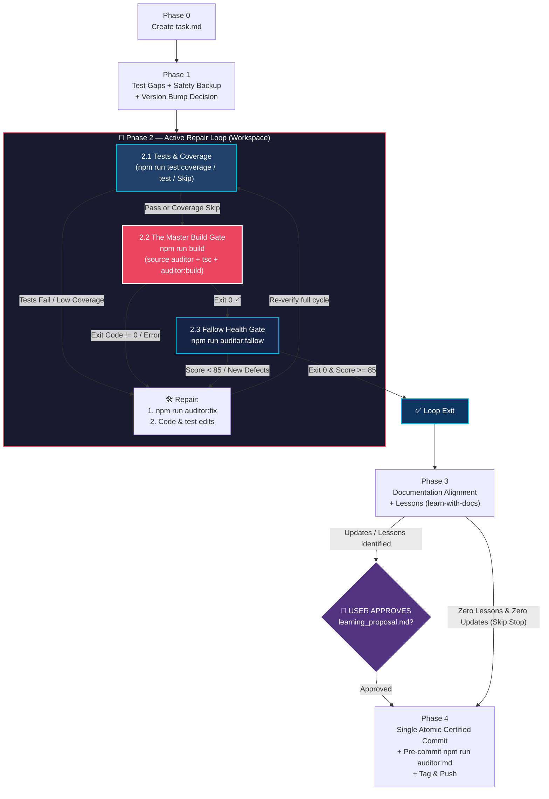

# Safe Commit Workflow (@francogp/auditor Edition)

> [!CAUTION]
> **PRIMORDIAL & FOUNDATIONAL MANDATE: ABSOLUTE PROHIBITION ON DISABLING OR MODIFYING CONFIGURATION TO BYPASS ERRORS WITHOUT EXPLICIT PROGRAMMER CONSULTATION**
> You MUST NEVER turn off, disable, relax, revert, or modify auditor configuration (`.auditor/audit.config.ts`, `eslint.config.js`, `.stylelintrc.json`, `.fallowrc.json`, etc.) because a verification suite reported errors or warnings. If a check fails (even with hundreds or thousands of errors), **THEY ARE REAL DEFECTS**.
>
> Making changes to configurations to produce a "fake pass" is **STRICTLY AND CATEGORICALLY PROHIBITED**. If defects cannot be legitimately resolved in the source code or via canonical auto-repair (`npm run auditor:fix`), the agent **MUST HALT SAFE-COMMIT IMMEDIATELY**, report the exact defects truthfully, and **OBLIGATORILY CONSULT THE HUMAN PROGRAMMER** before touching any configuration.

---

> [!IMPORTANT]
> **PROMPT-DRIVEN TRIGGER ONLY**: Activate when the user explicitly requests a commit or push. Do NOT activate for automatic agent-internal saves or background operations.
>
> **SINGLE AUDIT GATE (`npm run auditor`)**: There is no separate differential commit gate. The full `npm run auditor` enforces **0 errors AND 0 new warnings** through the built-in warning ratchet, which compares every warning fingerprint against `.auditor/audit-baseline.json` committed at `ratchet.productionRef` (default `origin/main`). The removed `audit:for-commit` / `auditor-commit` commands MUST NOT be invoked or recreated.

---

## ⚡ Sequential Execution Contract

This workflow is a **strict state machine**, not a loose checklist. Each step produces output that the next step consumes.

| Rule | What it means |
|---|---|
| **One command per turn** | Issue one tool call, read its output, then decide the next step. Never batch. |
| **Read before continuing** | "I ran it" ≠ "I verified the result." Read every output before proceeding. |
| **No optional phases** | Phases 0–4 are mandatory. Skipping phases is STRICTLY FORBIDDEN. |
| **Update `task.md` continuously** | Update `<appDataDir>/brain/<conversation-id>/task.md` after each step. |
| **Unbroken Repair Loop** | You MUST NEVER exit Phase 2 until all 3 validation gates exit cleanly with code 0 on the final code. |
| **Zero Gatekeeper Tampering & Proactive Evolution** | Agents MUST NEVER unilaterally weaken, alter, relax, or reinterpret the verification rules, thresholds, ratchet logic (`auditRatchet.ts`), `audit_bundle.ts`, or any quality gatekeeper to make checks pass. Hand-editing `.auditor/audit-baseline.json` to add fingerprints, re-running `--init-baseline`, or disabling `ratchet.enabled` to absorb new warnings is gross misconduct. All errors and NEW warnings must be resolved at the code source. |
| **Categorical Prohibition on Modifying or Turning Off Audit Configurations (`audit.config.ts`, Linters, Subsystems)** | During `/safe-commit`, agents are STRICTLY AND CATEGORICALLY FORBIDDEN from disabling, turning off, reverting, or tampering with `.auditor/audit.config.ts` (such as setting `domain.enabled: false`, `bundle.enabled: false`, `enforceTargets: false`, neutering thresholds, or adding ad-hoc whitelist entries), ESLint configurations, Stylelint configurations, or Fallow configurations to make gates pass or silence findings. If an audit gate reveals errors or warnings (even hundreds or thousands), THEY ARE REAL DEFECTS. The agent MUST NOT touch configuration to fake a clean pass. If issues cannot be legitimately resolved in the source code or via canonical auto-fix (`npm run auditor:fix`), the agent MUST STOP the safe-commit immediately, halt Phase 2, report the exact defects to the user, and ask how they wish to proceed. Silencing rules or flipping config toggles during safe-commit is considered a critical architectural violation and gross misconduct. |
| **Dynamic Modules & Domain Exports Analysis** | When resolving unused exports (Fallow), NEVER blindly strip `export` without analyzing whether the symbol is needed by dynamically loaded modules, test suites, or public contracts. Register legitimate public exports in `.fallowrc.json` under `ignoreExports`. |
| **Strict Single Build Mandate** | `npm run build` MUST run exactly once per safe-commit cycle (in Gate 2.2). Because the version bump decision occurs in Phase 1 (Step 1.4), the build in Gate 2.2 already compiles the freshly stamped version. Re-running `build` in Phase 4 is strictly eliminated. |
| **Mandatory Atomic Tag Mandate** | Whenever a version bump is approved in Step 1.4, creating the git commit without simultaneously creating the annotated Git tag is STRICTLY FORBIDDEN. Agents MUST chain the tag creation directly to the commit, annotating the tag with the FULL synthesized commit message / release notes: `git add . && git commit -F scratch/release_notes.txt && git tag -a v<base_version> -F scratch/release_notes.txt`. Annotating tags with terse summaries like `-m "Release v..."` is STRICTLY PROHIBITED; tags MUST contain the complete title and technical chronicle so GitHub Tags and Releases display full changelogs. |
| **Strict Template Adherence Mandate** | `task.md` MUST match `task-template.md` 100% byte-for-byte in structure, exact headings (`# Safe Commit Task Ledger`, `## Task Progress Checklist`, `## Step Records & Execution Metrics`), and checklist hierarchy. Any pre-existing `task.md` from previous planning or features MUST be completely overwritten (`Overwrite: true`). Inventing ad-hoc checklist names (e.g. `Safe-Commit Pipeline Progress`), placing commit drafts before the checklist, reordering sections, altering step wording, or omitting the execution metrics is STRICTLY FORBIDDEN. |
| **Dynamic Configuration-Driven Language Resolution (Zero Hardcoding)** | The agent MUST inspect `.auditor/audit.config.ts`: `config.documentation.chatLanguage` dynamically governs interactive chat messages, step notifications, user review dialogs (`ask_question` in Step 1.4, regular text review in Step 3.4), the completion template, AND the narrative explanations in brain artifacts (`learning_proposal.md`, `walkthrough.md`); `config.documentation.language` dynamically governs repository files, code, comments, documentation, markdown files, commit messages, `scratch/release_notes.txt`, and git tags, as well as code contracts and diffs embedded within artifacts. Zero hardcoded languages. |

> [!CAUTION]
> The most common failure modes are batching commands, assuming a fix worked without re-running the gate, skipping output verification, or **modifying auditor scripts to suppress warnings instead of fixing source code**. The cost is committing unverified or degraded code into **permanent, irreversible** git history.

---

## Workflow Overview



---

## Phase 0: Mandatory Artifact Initialization

> [!CAUTION]
> This is the absolute first action — before `git status`, before any npm command, before anything.

**Step 0.1** — Initialize `task.md` (Strict Overwrite)

Call `write_to_file` to create or completely overwrite (`Overwrite: true`) `<appDataDir>/brain/<conversation-id>/task.md` using the exact structure and headings from [task-template.md](./references/task-template.md). Agents MUST view `references/task-template.md` and replicate it verbatim without inventing custom headings, moving sections above the checklist, altering step wording, or omitting the `## Step Records & Execution Metrics` section. All phase items start as `[ ]`.

**Step 0.2** — Note scratch directory

The temporary working directory is `<appDataDir>/brain/<conversation-id>/scratch/`.

**✓ Completion gate**: Mark Phase 0 `[x]` in `task.md` and include a snippet in your response. Proceed to Phase 1.

---

## Phase 1: Test Gap Analysis & Zero-Commit Safety Backup

This phase audits test coverage for modified logic and captures a zero-commit safety backup in the workspace. If subsequent audit auto-fixes or repairs corrupt logic, the patch file in `scratch/backups/` allows instantaneous recovery without polluting git history with premature, unverified commits.

**Step 1.1** — Inspect changes (`git status` & `git diff`)

- Run `git status` to identify 100% of modified, untracked, and deleted files across the entire repository.
- Pay special attention to `.auditor/audit-baseline.json`: if warnings were resolved during the task, `npm run auditor` auto-shrinks this file. It is a versioned framework artifact and MUST be staged and committed alongside your code changes.
- Record the full list under `### Workspace Safety Backup` in `task.md`.

**Step 1.2** — Test Gap Analysis

- Verify if any non-trivial logic was modified in `src/` without corresponding unit tests.
- If gaps exist, write the unit tests immediately in `tests/` before moving forward.

**Step 1.3** — Record Baseline Health & Create Code-Only Safety Patch

- Run `npm run auditor:fallow` (or `fallow health --format json --quiet`) to record `BASELINE_HEALTH`.
- Create the safety patch:

  ```bash
  mkdir -p scratch/backups && git diff HEAD -- '*.ts' '*.vue' '*.js' '*.scss' '*.css' '*.sql' ':!*.json' > scratch/backups/pre_audit_backup.patch
  ```

**Step 1.4** — Version Bump Analysis & User Decision (`ask_question`)

- Execute `npm run version:analyze -- --json` (or `auditor-version analyze --json`) to evaluate Git diff metrics, affected subsystems, commit intent, and fresh candidate version stamps.
- **Mandatory Analysis Presentation in Chat Before Prompting**:
  Before calling `ask_question`, the agent MUST display the complete Version Analysis breakdown table directly in the visible chat message (detected Git diff metrics, affected subsystems, candidate version options with their freshly updated build identifiers and timestamps `-build.YYYYMMDD-HHmmss`, and SemVer rationale), along with a clickable link to `task.md`. Calling `ask_question` blindly without displaying the version candidates table in chat is STRICTLY FORBIDDEN, as the modal blocks the UI and conceals the analysis.
- Solicit explicit user review via `ask_question` at this early stage:
  - **MANDATORY UPDATED BUILD & TIMESTAMP ACROSS ALL 3 SEMVER OPTIONS**:
    The build identifier and timestamp (`-build.YYYYMMDD-HHmmss`) **MUST ALWAYS BE FRESHLY UPDATED AND EXPLICITLY INCLUDED IN ALL 3 VERSION OPTIONS (MAJOR, MINOR, BUGFIX/PATCH)** as well as in the build-only option.
    - **Foundational Rationale**: The build and timestamp ALWAYS change on every build/commit (`generateBuildId()`), whereas the base SemVer version (major, minor, bugfix) may change or not depending on the commit scope.
    - **Strict Prohibition on Naked Versions**: Presenting bare base versions without the updated build timestamp (e.g. `(1.0.0)`, `(0.7.0)`, `(0.6.3)`) or preserving stale build timestamps across options is STRICTLY AND CATEGORICALLY PROHIBITED.
    - The agent MUST retrieve the freshly computed candidate strings from the `npm run version:analyze -- --json` output (`candidates.major`, `candidates.minor`, `candidates.patch`, `candidates.build`).
  - **Canonical Options Structure for `ask_question`**:
    1. `(Recommended) Aplicar salto SemVer: <RECOMENDADO> (<candidates.recommended>) - <justificación de analyze>`
    2. `Aplicar salto SemVer: <OTRA_OPCIÓN_1> (<candidates.otra_1>) - <descripción de alcance>`
    3. `Aplicar salto SemVer: <OTRA_OPCIÓN_2> (<candidates.otra_2>) - <descripción de alcance>`
    4. `Solo actualizar build y timestamp: BUILD (<candidates.build>) - Mantener versión base <baseVersion> sin salto en mayor, menor ni bugfix, estampando nueva build y timestamp`
    5. `Mantener versión actual intacta (<currentVersion>) sin actualizar build ni versión base (solo para ramas de trabajo intermedias)`
- If the user approves a bump, execute immediately:

  ```bash
  npm run version:bump -- --type=<approved_type>
  # or directly: auditor-version bump --type=<approved_type>
  ```

  *(This ensures that `package.json` has the definitive release version BEFORE Phase 2 runs, allowing Gate 2.3 to compile the final stamped version in a single pass without needing a redundant second build!)*

**Step 1.5** — Pre-Draft Commit Message

- Pre-draft the commit message in `task.md` following [commit-standards.md](./references/commit-standards.md).

**✓ Completion gate**: Mark Phase 1 `[x]` in `task.md`. Proceed to Phase 2.

---

## Phase 2: Active Verification & Repair Loop 🔁

You must execute the 3 gates sequentially. If ANY gate fails, execute the repair protocol and restart the loop from Gate 2.1 until all pass consecutively.

### 2.1 Dynamic Test Suite & Coverage Gate (`npm run test:coverage` / `npm test` / Skip)

- **Dynamic Configuration Check**: Consult `.auditor/audit.config.ts` (`config.testCoverage`):
  - **Coverage Active (`testCoverage.enabled !== false && testCoverage.enforceInAudit !== false`)**:
    Run `npm run test:coverage` (or `vitest run --coverage`). 100% of automated unit and integration suites must pass AND emit a freshly updated `coverage/coverage-final.json` artifact for the upstream auditor.
  - **Coverage Inactive / Disabled (`testCoverage.enabled === false || testCoverage.enforceInAudit === false`)**:
    The coverage reporting requirement is dynamically marked as **`[SKIPPED]`**. Run `npm run test` (or `npm test`) to verify that 100% of test suites pass without coverage instrumentation overhead.
  - **No Tests Declared / Deactivated**:
    If the project does not declare automated test scripts in `package.json` or tests are explicitly disabled in configuration, Gate 2.1 is marked as **`[SKIPPED]`** and execution advances immediately to Gate 2.2.

### 2.2 The Master Build & Audit Gate (`npm run build`)

- Run `npm run build`.
- **Strict Single Build & Atomic Verification**: This is the ONLY time `npm run build` executes in the workflow. Because `validate_audit_config` mandates that `"build"` chains `"npm run auditor && <compile> && npm run auditor:build"`:
  1. **Pre-build Source Audit & Ratchet**: `npm run auditor` runs first, evaluating source code against 0 errors and 0 new warnings vs `ratchet.productionRef`, verifying freshly generated test coverage (if active) or skipping it cleanly (if disabled).
  2. **Production Compilation**: TypeScript / bundler compiles the stamped code into `dist/` with strict exit code 0.
  3. **Post-build Artifact Audit**: `npm run auditor:build` executes immediately post-compilation, evaluating chunk budgets, entrypoint types, and distribution hygiene in `dist/`.
- Strict exit code 0. Zero bypasses.

### 2.3 Fallow Health & Quality Gate (`npm run auditor:fallow`)

- Run `npm run auditor:fallow`.
- Score must be >= 85 and >= `BASELINE_HEALTH`, with zero unaddressed high-severity issues.

### Repair Protocol (on ANY Gate Failure)

1. **Auto-Repair**: Run `npm run auditor:fix` (or `auditor fix`) to automatically repair fixable lint/style/import/config issues.
2. **Manual Repair**: Manually resolve remaining source code, test, build, or DOX defects.
3. **Loop Restart**: Always re-start the loop from **Gate 2.1**, ensuring all 3 gates pass consecutively on the final code.

**✓ Completion gate**: All 3 gates passed consecutively on the final code. Mark Phase 2 `[x]` in `task.md`. Proceed to Phase 3.

---

## Phase 3: Documentation Alignment, Lessons Extraction & User Approval Gate (🛑 HARD STOP)

**Step 3.1** — Workspace Scratch Cleanup

- Remove transient debug files, leaving only `scratch/backups/`. Ensure cleanup runs before writing final artifacts.

**Step 3.2** — Create Informative Walkthrough

- Document changes and verification evidence in `<appDataDir>/brain/<conversation-id>/walkthrough.md`.
- Save `walkthrough.md` using `write_to_file` with `ArtifactMetadata` (`UserFacing: true`, `RequestFeedback: false`, and a detailed `Summary`).
- `walkthrough.md` is an informative verification record of past actions and MUST NOT request execution feedback (`RequestFeedback: false`).

**Step 3.3** — Documentation Alignment, Lessons Extraction & Conditional Approval Gate (`learn-with-docs`)

- Activate [learn-with-docs](../learn-with-docs/SKILL.md) to govern documentation synchronization, lessons extraction, and DOX placement.
- **Mandatory 3-Pillar Documentation, Skills & DOX Alignment Sweep**:
  Analyze the full scope of changes, newly introduced features, interfaces, architectural decisions, or user corrections made during the session, and thoroughly inspect all documentation surfaces across the repository:
  1. **Host Program & Repository Documentation (`README.md`, `docs/**`, architecture guides, manuals)**:
     Thoroughly inspect the documentation of the program/application where the auditor is installed and running:
     - Root and nested `README.md` files (usage instructions, script tables, setup prerequisites, architectural overview).
     - Dedicated project documentation folders (`docs/**`, `manual/**`, `guides/**`, `specs/**`).
     - Actively search for and resolve:
       - **Outdated / Legacy Documentation**: Eradicate obsolete instructions, deprecated commands, removed flags/options, or legacy code signatures that no longer reflect the codebase.
       - **Contradictions with New Code**: Correct any statement, workflow, or architectural description that contradicts the newly implemented behavior or contracts.
       - **Missing New Content**: Document newly added commands, configurations, parameters, architectural standards, or public features introduced in the session so program documentation stays 100% synchronized with reality.
  2. **Hierarchical DOX Indices (`AGENTS.md`)**:
     Inspect the relevant `AGENTS.md` boundaries across the project tree:
     - Update local contracts, directory summaries, and documentation tables.
     - Eliminate obsolete statements, legacy patterns, or rules contradicting the new code.
     - Document new architectural invariants and module responsibilities.
  3. **Agent Skills & Bundled Resources (`.agents/skills/**`)**:
     Inspect affected agent skills and their internal assets:
     - Skill instructions (`SKILL.md`)
     - Internal references, tutorials, and guides (`references/**`)
     - Code examples and sample implementations (`examples/**`)
     - Bundled templates or asset files (`templates/**`, `assets/**`)
     Ensure skill guidance reflects newly introduced patterns, removes deprecated legacy syntax, resolves contradictions, and incorporates missing new content so agents always consult up-to-date guidance.
- **Differentiating Scope**:
  - **MANDATORY**: Synchronizing host program documentation (`README.md`, `docs/**`), DOX indices, and affected skills directly related to or impacted by the session's changes.
  - **STRICTLY PROHIBITED**: Unrelated repository-wide sweeps (fixing random typos in unrelated files or auditing unimpacted modules).
- **Conditional Approval Gate**:
  - **When Pending Documentation Updates, New Lessons or Unresolved Contradictions Exist**:
    - If there are new contracts or harmonizations that have **not yet been applied to disk**, `learn-with-docs` generates `<appDataDir>/brain/<conversation-id>/learning_proposal.md` detailing the primary DOX contract updates AND the collateral skill/documentation modernizations.
    - **CRITICAL SEQUENCING RULE**: `learning_proposal.md` MUST be the **FINAL tool call** executed in the turn so the native feedback card remains active in the UI.
    - Present direct clickable Markdown links (`👉 [learning_proposal.md](file://...)` and `[walkthrough.md](file://...)`) and stop the turn to wait for user confirmation on the learning proposal before proceeding to Phase 4.
  - **When Zero Updates Exist or All Changes Are Already Applied on Disk**:
    - If no contracts changed, no documentation was affected, or all updates/harmonizations are ALREADY written to disk in the working tree, **DO NOT invent artifacts or trigger an artificial hard stop**.
    - Advance directly to **Phase 4** (commit and release). Since the user already commanded `/safe-commit` and all changes are already on disk, prompting for confirmation creates cognitive friction and wastes time.

**✓ Completion gate**: If pending documentation updates or lessons were proposed via `learning_proposal.md`, wait for user approval; if no unapplied updates exist, proceed directly to Phase 4.

---

## Phase 4: Single Atomic Certified Commit & Release

Once the user approves:

- **Step 4.1**: Apply approved lessons and modernizations across targeted `AGENTS.md` files and affected documentation.
- **Step 4.2**: Run pre-commit sanity check: `npm run auditor:md`.
- **Step 4.3**: Synthesize the final commit message following [commit-standards.md](./references/commit-standards.md).
- **Step 4.4**: **Single Atomic Commit & Tag**:
  - If version was bumped in Step 1.4, write the synthesized message to a temporary file (`scratch/release_notes.txt`) and run the atomic chained command:

    ```bash
    git add . && git commit -F scratch/release_notes.txt && git tag -a v<base_version> -F scratch/release_notes.txt
    ```

    *(The tag annotation MUST contain 100% of the synthesized commit message and subsystem breakdown, ensuring GitHub Tags and Releases display the technical details rather than a blank "Release v...". The tag name MUST be strictly `v<base_version>` e.g. `v1.2.0`).*
  - If no version bump occurred:

    ```bash
    git add . && git commit -F scratch/release_notes.txt
    ```

- **Step 4.5**: **Autonomous Git Push Prohibition & User Handoff**:
  - **AI AGENTS MUST NEVER EXECUTE `git push` AUTONOMOUSLY**: Publishing commits and tags to remote repositories (`origin`) is an external, irreversible operation. Once the atomic commit and tag are created locally, Phase 4 execution stops.
  - Do NOT run `git push` unless the user explicitly gave an unambiguous command in their prompt (e.g. "hace push", "push changes to remote").
  - Conclude the workflow by rendering the **Mandatory Safe-Commit Completion Template** in the chat response, providing the user with the exact command to push when they are ready.
- **Step 4.6**: Mark Phase 4 `[x]` in `task.md` and render the final completion response.

---

## Mandatory Safe-Commit Completion Template

Every completed safe-commit run MUST finish with a standardized Markdown template rendered dynamically in the language resolved from `config.documentation.chatLanguage`. The agent MUST NEVER hardcode the template language, but select the appropriate canonical variant matching the resolved `chatLanguage`:

### Spanish Variant (`chatLanguage: 'es'`)

````markdown
# ✅ SAFE-COMMIT COMPLETADO CON ÉXITO

### Resumen de la Operación
- **Commit Hash**: `<commit-hash>`
- **Tag Creado**: `v<version>` (o `Ninguno - Versión mantenida`)
- **Mensaje**: `<commit-title>`
- **Archivos Modificados**: `<count>` archivos

### Puertas de Calidad Verificadas (3/3)
| Puerta | Descripción | Estado |
|:---|:---|:---:|
| 2.1 | `npm run test:coverage` (Tests & Cobertura Dinámica) | ✅ Aprobado / Skip |
| 2.2 | `npm run build` (Master Build: Auditoría + Compilación + Post-Build) | ✅ Aprobado (Exit 0) |
| 2.3 | `npm run auditor:fallow` (Salud y Arquitectura) | ✅ Aprobado (Score ≥ 85) |

### Publicación Remota (Git Push)
> ⚠️ **Control de Seguridad**: Por gobernanza del repositorio, el agente **NO** realiza push automático a ramas remotas sin petición explícita previa.

Para publicar los cambios y tags en el repositorio remoto, ejecuta manualmente:
```bash
git push origin <branch> --follow-tags
```

*O indícame explícitamente "hace push" si deseas que lo ejecute por ti.*

````

### English Variant (`chatLanguage: 'en'`)

````markdown
# ✅ SAFE-COMMIT SUCCESSFULLY COMPLETED

### Operation Summary
- **Commit Hash**: `<commit-hash>`
- **Tag Created**: `v<version>` (or `None - Version maintained`)
- **Message**: `<commit-title>`
- **Modified Files**: `<count>` files

### Quality Gates Verified (3/3)
| Gate | Description | Status |
|:---|:---|:---:|
| 2.1 | `npm run test:coverage` (Automated Tests & Dynamic Coverage) | ✅ Passed / Skip |
| 2.2 | `npm run build` (Master Build: Pre-Audit + Compile + Post-Audit) | ✅ Passed (Exit 0) |
| 2.3 | `npm run auditor:fallow` (Architecture & Health) | ✅ Passed (Score ≥ 85) |

### Remote Publishing (Git Push)
> ⚠️ **Security Control**: Repository governance strictly bars automated push to remote branches without prior explicit instructions.

To publish commits and tags to the remote repository, execute manually:
```bash
git push origin <branch> --follow-tags
```

*Or explicitly tell me "push" if you want me to execute it for you.*

````
