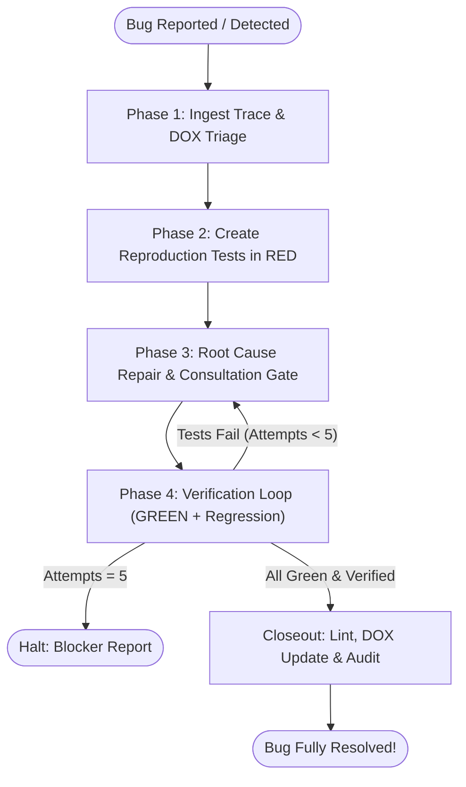

# Systematic Debugging

> **The Single Source of Truth for Evidence-Based Troubleshooting & Reactive Bug Fixing.**
> Simulations and tests are the proof of correctness. `src/` must conform to them, never the reverse.

---

## ⛔ INVIOLABLE DEBUGGING GATES (ZERO DEVIATION)

1. **⛔ GATE 1: PROHIBITION ON EDITING `src/` BEFORE RED REPRODUCTION**:
   - It is STRICTLY FORBIDDEN to modify `src/` or apply speculative patches before creating an isolated reproduction test in `tests/node/` or `tests/unit/` and observing a deterministic failure in **RED**.
2. **⛔ GATE 2: ZERO RUNTIME FALLBACKS & SILENT CATCH BLOCKS**:
   - Never mask bugs with default fallbacks (`||`, `??`, dummy derivations) or silent catches (`.catch(() => true)`).
   - System logic MUST fail fast and loudly (`throw new Error(...)`) so root causes can be diagnosed at the source.
3. **⛔ GATE 3: IMMUTABLE STATIC FIXTURES ONLY**:
   - Reproduction tests MUST extract and inline static fixture data (or use a dedicated static fixture file).
   - Querying mutable live fuzzer files (`fuzzer_certified_cases.json`) dynamically is strictly prohibited.
4. **⛔ GATE 4: MAXIMUM 5-ITERATION CAP**:
   - The repair loop is strictly capped at 5 attempts. If a bug resists repair after 5 attempts, execution MUST halt with a structured blocker report.
5. **⛔ GATE 5: PERSISTENCE & MIGRATION VERIFICATION GATE**:
   - Whenever a bug touches persistence, SQL queries, schemas, database migrations, RPCs, or store serialization/rehydration:
     - Verify against the active database schema and SQL migrations in the project migrations directory (`config.paths.migrationsDir` or `supabase/migrations/`).
     - Static SQL migrations ONLY; runtime schema auto-healing or data patching is strictly forbidden.
     - Multi-host/multi-engine support MUST be preserved: connection configurations must work cleanly across test, local container, and production instances.
6. **⛔ GATE 6: ABSOLUTE PROHIBITION ON MODIFYING HISTORICAL / PUSHED MIGRATIONS**:
   - When debugging database, migration, or schema failures, agents MUST NEVER modify historical migration files in the migrations directory that were committed in prior commits or pushed to `main`.
   - Any database bug, schema addition, missing column, constraint fix, or data repair MUST ALWAYS be resolved by creating a NEW forward-only timestamped migration (`YYYYMMDDHHmmss_<name>.sql`), NEVER by editing past migrations.

---

## 🔄 The 4-Phase Reactive Bug Resolution Lifecycle



---

### Phase 1: Trace Ingestion & DOX Triage

1. **Extract & Parse Available Traces**:
   - **Playwright Failures**: Read `scratch/test-results/` for console logs, stack traces, and screenshots.
   - **Calculation & Parser Failures**: Extract failing calculation inputs, serialized payload records, precision metrics, numerical indicators, or diverging tolerance delta ($|calc - expected| > \epsilon$).
   - **Database & Persistence Failures**: Detect whether the failure originates from SQL syntax, migrations, schema discrepancies, RLS policies, or Supabase client queries.
   - **Verbal / Informal Reports**: If the report lacks traces, prompt the user for minimal context: (1) exact reproduction steps, (2) domain entity/input data, and (3) observed error message in DevTools console.
   - *Detailed extraction guide: [Trace Ingestion & Bug Triage Guide](./references/trace_ingestion_and_triage.md)*.

2. **Map to Authoritative DOX Contract (`dox-navigator`)**:
   - Identify the owning module in `src/` (e.g. `src/logic/`, `src/stores/`, `src/components/`, `supabase/`).
   - Read the nearest `AGENTS.md` to identify non-negotiable invariants before planning fixes.

3. **Pre-Fix Fallback Audit**:
   - Scan the failing code path for existing masking fallbacks (`||`, `??`, default assignments). Remove them immediately so the engine fails loudly with an explicit stack trace.

---

### Phase 2: Mandatory 3-Tier Reproduction Tests (RED First)

Create deterministic reproduction tests before touching `src/`:

| Testing Tier | Scope & Trigger Condition | Target Location | Template |
| :--- | :--- | :--- | :--- |
| **Tier 1: Unit Test (Mandatory)** | Isolated logic, pure functions, state actions, schema parsing, SQL queries. | `tests/node/<domain>/reproduce_<slug>.test.ts` or `tests/unit/` | [Unit Template](./templates/reproduction_unit_test.template.ts) |
| **Tier 2: Integrity Test (Mandatory)** | Cross-boundary contracts, state engine parity, Supabase roundtrips, SQL migrations. | `tests/node/<domain>/` | [Integration Template](./templates/reproduction_integration_test.template.ts) |
| **Tier 3: UI Interaction Test (Conditional)** | **ONLY IF** the bug affects UI interaction, GSAP animations, dashboard metrics, or page navigation. | `tests/unit/views/reproduce_<slug>.test.ts` | [Unit Template](./templates/reproduction_unit_test.template.ts) |

#### Rules for Reproduction Tests:
1. **Inline Static Data**: Inline all failing inputs, entity definitions, mock records, and formula ASTs.
2. **Pure Supabase Testing for Database Bugs**:
   - If the bug involves database queries, migrations, schemas, or persistence roundtrips, verify against the dynamic client in `src/logic/db/supabase.ts`.
   - Assert deterministic constraint enforcement and error shapes.
3. **Confirm Deterministic RED**: Execute the reproduction test and confirm that it fails with the exact reported error (always use official NPM scripts to guarantee Rolldown native bindings load correctly):
   ```bash
   npm run test:node -- tests/node/<domain>/reproduce_<slug>.test.ts
   ```

---

### Phase 3: Root Cause Repair & Dual Consultation Gate

Diagnose the upstream root cause and apply a clean fix adhering to Senior Developer / Ponytail principles (minimum working code, standard library, zero over-engineering).

#### 🚪 Dual Consultation Gate:
Before modifying `src/` or `database/`, evaluate the invocation context:

1. **Explicit Mode (Invoked by User via `/systematic-debugging` or Direct Prompt)**:
   - **MANDATORY PAUSE**: If the fix requires:
     - SQL database migrations or schema alterations (`database/migrations/`, Supabase). All schema changes MUST deliver synchronized companion `.sql` (PostgreSQL) and `.sqlite.sql` (SQLite) migrations with monotonic timestamps and bumped `db_version`.
     - Breaking changes to public store actions, DTOs, or engine APIs.
     - Contradictions or relaxations of rules in `AGENTS.md` or `references/rules/`.
     - Non-trivial architectural trade-offs between two or more valid designs.
   - The agent MUST halt, consult `.auditor/audit.config.ts` to determine `config.documentation.chatLanguage` (defaulting strictly to `'es'` if unconfigured), formulate a structured options matrix in the resolved chat language with pros, cons, and architectural impact, and await user approval. The agent must never hardcode the consultation language, while code, tests, and documentation adhere to `config.documentation.language` (defaulting to `'en'`).
2. **Automatic Mode (Invoked Autonomously via Subagent, CI, or Simulation Self-Healing)**:
   - Proceed autonomously choosing the most minimalist Ponytail solution.
   - Log all decisions into the final execution ledger under `## Critical Decisions`.
   - *Detailed consultation rules: [Consultation & Redesign Rules](./references/consultation_and_redesign_rules.md)*.

---

### Phase 4: Closed-Loop Verification & Regression Gate

Verify all test tiers in strict sequential order. If any test fails, re-enter Phase 3 (capped at 5 attempts total):

1. **Tier 1 Pass**: Re-run the reproduction unit test. Confirm that it turns **GREEN** (across both SQLite and PostgreSQL if database-related):
   ```bash
   npm run test:node -- tests/node/<domain>/reproduce_<slug>.test.ts
   ```
2. **Tier 2 Pass**: Verify integrity/integration tests turn **GREEN** (across both database engines for persistence bugs).
3. **Full Node Unit Regression**: Run the entire Node test suite to confirm 0 regressions:
   ```bash
   npm run test:node
   ```
4. **Tier 3 Playwright Pass (If Applicable)**:
   - Re-run the affected simulation suite:
     ```bash
     npm run <sim_or_e2e_script> filter=<suite_name>
     ```
   - **Step 6B Dual Clean Zero Pass**: If the simulation suite reached the end via checkpoint resumption, execute a clean pass from case 1 in dual mode (`sqlite` + `postgres`):
     ```bash
     npm run <sim_or_e2e_script> filter=<suite_name> clean=true
     ```
5. **Iteration Cap Escalation**:
   - If after 5 attempts the tests do not pass, HALT immediately and emit the structured blocker report detailing all failed hypotheses.
   - *Detailed verification loop protocol: [Verification & Repair Loop Protocol](./references/verification_and_repair_loop.md)*.

---

## 🏁 Closeout & Knowledge Persistence

Once all tests pass cleanly:

1. **Fast Development Lint**:
   ```bash
   npm run lint
   ```
2. **DOX Pass (`dox-navigator`)**:
   - Update the nearest owning `AGENTS.md` to persist the lesson learned, contract clarification, or invariant established by this fix.
   - Run `npm run audit:md` to ensure zero broken links or unindexed paths.
3. **Final Status Walkthrough**:
   - Present a concise walkthrough summarizing root cause, files touched, test results, and critical decisions.

---

## 📋 Comprehensive Reference Index

- [Trace Ingestion & Bug Triage Guide](./references/trace_ingestion_and_triage.md)
- [Consultation & Redesign Rules](./references/consultation_and_redesign_rules.md)
- [Verification & Repair Loop Protocol](./references/verification_and_repair_loop.md)
- [Unit Test Template](./templates/reproduction_unit_test.template.ts)
- [Integration Test Template](./templates/reproduction_integration_test.template.ts)
- [DOX Navigator](../dox-navigator/SKILL.md)
