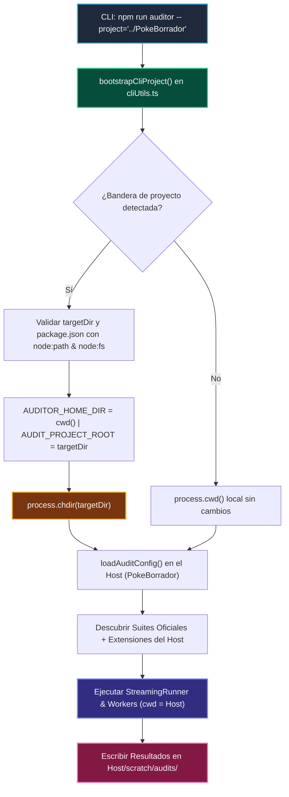

# @francogp/auditor

> **Autonomous static analysis, architectural governance, AI agent skills packaging, and zero-tolerance code quality engine for native Node.js 26+ (`--permission`, `--experimental-strip-types`).**

Provides the `BaseAuditor` and `FileScanAuditor` object-oriented frameworks, streaming concurrent runner, standardized Box-Drawing terminal reporting (80 fixed columns, visual width emoji alignment, and mandatory `TOTAL CONSOLIDADO` footer row), built-in generic suites across all architectural families, **native distribution of Antigravity AI agent skills**, **centralized single source of truth (SSoT) dependencies**, and a **cross-platform environment governance system (Linux/Windows) with zero hardcoded paths**.

---

## 📑 Table of Contents

1. [Key Features & Architectural Architecture](#1-key-features--architectural-architecture)
2. [Quickstart & Local Environment Setup](#2-quickstart--local-environment-setup)
3. [Host Project Installation & Governance](#3-host-project-installation--governance)
4. [Execution Modes & Capability-Driven Presets](#4-execution-modes--capability-driven-presets)
5. [Strict Type Safety & ESLint Flat Config Governance](#5-strict-type-safety--eslint-flat-config-governance)
6. [Integrated Quality & Analysis Tools (SSoT)](#6-integrated-quality--analysis-tools-ssot)
7. [Bundle & Performance Budget Auditing](#7-bundle--performance-budget-auditing)
8. [AI Agent Integration (52 Antigravity Skills)](#8-ai-agent-integration-52-antigravity-skills)
9. [Authoring Custom Sub-Auditors](#9-authoring-custom-sub-auditors)
10. [Centralized Configuration (`audit.config.ts`)](#10-centralized-configuration-auditconfigts)
11. [Hermetic Testing with Vitest](#11-hermetic-testing-with-vitest)
12. [CLI Tools & Reporters Reference](#12-cli-tools--reporters-reference)
13. [License & Third-Party Open Source Attribution](#13-license--third-party-open-source-attribution)

---

## 1. Key Features & Architectural Architecture

- **Built-In Generic Architectural Suites**: Comprehensive static verification across 4 canonical families (`architecture/`, `domain_data/`, `persistence/`, `documentation/`).
- **Capability-Driven Auto-Coordination (`AuditorCapabilities`)**: Sub-auditors declare capabilities (`lint`, `fix`, `md`, `heavy`, `requiresBuild`, `ast`, `changedSince`) cleanly with immutable zero-boilerplate defaults (`DEFAULT_AUDITOR_CAPABILITIES`). No hardcoded suite lists in runners or scanners.
- **Strict Domain-Type-First Governance**: Complete static eradication of arbitrary type bypasses (`: any`, `as any`, `<any>`, and `as unknown as`) and legacy `new Date()` / `Date.now()` constructors in favor of Temporal API.
- **Automated ESLint Configuration Auditor (`validate_eslint_config`)**: Statically analyzes `eslint.config.js` to ensure host projects enforce strict type safety, banning `any`, double casting, and legacy dates.
- **Official Living Specification Engines**: Standards enforcement via official linters (`html-validate`, `stylelint`, `knip`, `publint`, `type-coverage`, `vue-tsc`) rather than handcrafted regex.
- **Fallow Intelligence & Vector Semantic Duplication**: Code complexity, dead code, circular dependencies, CWE security sink auditing (100% error severity mandate), and Candle CPU vector embeddings (`jina-embeddings-v2-base-code`) with OS cache pre-creation.
- **Child Process Stream Isolation (`executeCliAndReadJson`)**: External subprocesses pipe stdout directly to ephemeral file descriptors, preventing output truncation and heap exhaustion.
- **UnifiedTheme Box-Drawing Output**: 80-column terminal tables with exact Unicode visual width measurement (`getVisualWidth`), live progress badges, and mandatory `TOTAL CONSOLIDADO` footer row.

---

## 2. Quickstart & Local Environment Setup

When developing directly inside `@francogp/auditor`:

### On Linux / macOS

```bash
./setup-linux.sh
```

### On Windows (PowerShell)

```powershell
.\setup-windows.ps1
```

> [!IMPORTANT]
> **Hermetic Multi-Project Coexistence & Windows Security**:
> Setup scripts preserve all other installed Node.js versions on the host, activate local versions via `.nvmrc` without overriding NVM's `default` alias, scope npm configurations strictly to project `.npmrc` without mutating `~/.npmrc`, and automatically enforce local Git repository settings (`core.filemode false`, `core.autocrlf input`, `core.eol lf`). On Windows, `setup-windows.ps1` configures Windows Defender exclusions and removes Zone.Identifier marks for native Fallow binaries, requesting UAC elevation interactively if executed in a non-elevated terminal for NVM for Windows installation via winget and Defender whitelist configuration.

---

## 3. Host Project Installation & Governance

Install `@francogp/auditor` in any consumer project (Vue/React applications, backend APIs, libraries, or monorepos) as a development dependency:

### Option A: Install from GitHub (Recommended for FrancoGP Projects & CI)

In your `package.json`:

```json
{
  "devDependencies": {
    "@francogp/auditor": "github:francogp/auditor"
  }
}
```

Then install:

```bash
npm install
```

### Option B: Local File Link (Concurrent local development)

```json
{
  "devDependencies": {
    "@francogp/auditor": "file:../auditor"
  }
}
```

### Automated Package Scripts Setup (`auditor fix`)

Every sub-auditor and registered host extension automatically derives and exposes its canonical package scripts (`auditor:<short-id>` and CLI utilities) via `PackageScriptRegistry`.

To automatically and non-destructively inject missing auditor scripts into your host `package.json`, simply run:

```bash
auditor fix
# or if running via npm:
npm run auditor:fix
```

The engine will:

1. Inspect all active built-in sub-auditors and registered host extensions.
2. Check for naming collisions across commands (`[COLISIÓN DE COMANDOS]`).
3. Inject any missing scripts into your `package.json` without modifying or duplicating your existing custom scripts or aliases.
4. Automatically chain `npm run auditor` and `npm run auditor:build` into your `build` script.

### 3.1. AI Agent Installation & Onboarding Protocol (Environment & Config First)

When an AI coding agent (Antigravity, Claude, Cursor, Copilot, etc.) integrates, installs, or updates `@francogp/auditor` in any host repository, it **MUST strictly execute this sequence**:

> [!IMPORTANT]
> **Environment & Auditor Configuration Priority Mandate**:
> When running fixes, the engine and agents **MUST ALWAYS PRIORITIZE ENVIRONMENT AND AUDITOR CONFIGURATION FIRST**. If the environment (`.npmrc`, `setup-windows.ps1`/`setup-linux.sh`), `.auditor/audit.config.ts`, and root linter configurations are not established before running code inspections, downstream fixers will fail or execute against malformed standards.

#### Step 1: Declare the Dependency

Add `@francogp/auditor` to `devDependencies` in `package.json` (`"github:francogp/auditor"` or local file link).

#### Step 2: Bootstrap the Environment

Run project setup scripts (`./setup-linux.sh` on Linux/macOS, `.\setup-windows.ps1` on Windows) or `npm install`. The canonical setup scripts automatically unlock native Windows binaries (`Unblock-File`), configure Windows Defender exclusions (requesting UAC elevation if required for `fallow-similar-code.exe`), initialize local AI vector embedding models, and execute initial synchronization.

#### Step 3: IMMEDIATELY Run `auditor fix` (`npm run auditor:fix`)

The very first action an AI agent MUST perform after installing or upgrading the package is executing auto-fix:

```bash
npm run auditor:fix
# or directly:
auditor fix
```

In fix mode, `@francogp/auditor` deterministically executes **Environment & Configuration suites FIRST**:

1. `validate_audit_config`: Scaffolds `.auditor/audit.config.ts` if missing, injects required subsystem sections (`eslint`, `htmlValidate`, `valibot`, etc.), and populates all canonical `package.json` scripts (`auditor:*`, `lint`, `lint:fix`, `typecheck`) while chaining `npm run auditor` into `build`.
2. `validate_git_config`: Enforces and auto-repairs local Git repository configuration (`core.filemode false`, `core.autocrlf input`, `core.eol lf`).
3. `validate_eslint_config`: Enforces and repairs `eslint.config.js` with strict type safety.
4. `validate_fallow_config`: Synchronizes `.fallowrc.json` configuration.
5. `validate_agent_plugin`: Registers `.agents/plugins.json` and `.agents/skills.json` for immediate Antigravity agent discovery.
6. **Code & Content Fixers**: Only after the environment, git, and configurations are established do code fixers (`validate_eslint`, `validate_stylelint`, `validate_html_validate`, `validate_markdown_lint`, `validate_package_hygiene`) execute.

#### Step 4: Verify Clean Baseline

Establish the clean baseline by running fast presets:

```bash
npm run auditor:lint
npm run auditor:md
```

#### Step 5: Absolute Prohibition on Silencing Rules

AI agents and developers are strictly forbidden from suppressing, disabling, or bypassing audit rules in panic (`"rule": "off"`, skip flags, etc.). All architectural findings must be legitimately resolved in the source code or repaired via canonical tools.

---

## 4. Execution Modes & Capability-Driven Presets

### 4.1. Full Project Audit

Executes all discovered built-in suites and registered host extensions:

```bash
npm run auditor
# or directly with binary in PATH:
auditor
```

- Streams real-time progress in completion order across background workers.
- Renders the Box-Drawing consolidated summary table with the `TOTAL CONSOLIDADO` footer row.
- Saves full structured results to `scratch/audits/latest_audit.json`.

### 4.2. Dynamic Discovery & Suite Introspection (`--list`, `--info`)

Discover and inspect suites dynamically without reading source code:

```bash
# Render 80-column Box-Drawing table of all discovered suites and capabilities:
auditor --list

# Emit complete manifest catalog in JSON format (AuditorManifestDTO[]):
auditor --list --json

# Inspect single suite specification, purpose, evaluated rules, and configuration key:
auditor --info=validate_eslint

# Interactive CLI manual:
auditor --help
```

### 4.3. Fast Lint Preset (`preset=lint`)

Dynamically isolates and executes only suites declaring `capabilities: { lint: true }` in milliseconds:

```bash
npm run auditor:lint
# or:
auditor preset=lint
```

Discovers lint-capable suites dynamically (including ESLint, Stylelint, HTML-Validate, Markdownlint, A11y, Domain Types, Vue SFC hygiene, and AST checkers).

### 4.4. Documentation Preset (`preset=md`)

Dynamically isolates and executes suites declaring `capabilities: { md: true }`:

```bash
npm run auditor:md
# or:
auditor preset=md
```

Discovers documentation suites dynamically (including DOX hierarchy, Markdown syntax, link integrity, Mermaid diagram syntax, code references, and authentic documented commands).

### 4.5. Auto-Fix Mode (`auditor fix`)

Dynamically isolates and runs only suites declaring `capabilities: { fix: true }` under the dedicated `[ 🛠️ MODO REPARACIÓN AUTOMÁTICA ]` terminal interface:

```bash
npm run auditor:fix
# or:
auditor fix
```

Auto-repair suites include: `validate_eslint`, `validate_stylelint`, `validate_html_validate`, `validate_markdown_lint`, `validate_package_hygiene` (Knip dependency fixes), `validate_z_index`, and `validate_agent_plugin`.

### 4.6. Built-In Warning Ratchet (0 errors, 0 new warnings)

Every full default run (`npm run auditor` / `auditor`) is also the commit gate. Each warning is fingerprinted by content (suite, rule, file, normalized source line, occurrence index), so moving code does not change it, while new or edited offending lines do. The run fails when any fingerprint is missing from `.auditor/audit-baseline.json` as committed at `ratchet.productionRef` (default `origin/main`), including warnings in files you did not touch.

```bash
git fetch origin
npm run auditor                     # 0 errors + 0 new warnings vs origin/main
npm run auditor -- --init-baseline  # one-time bootstrap when the production ref has no baseline yet
```

- The baseline only shrinks: clean full runs rewrite it when warnings disappear; commit the updated file.
- Local fingerprints absent from the production baseline, a missing local baseline, or an unresolvable ref fail loudly. There is no accept-new escape hatch.
- Partial runs (presets, families, tasks, rules, `changed-since`, `fix`, `build`) skip the ratchet.
- CI checkouts must expose the production ref (for example `fetch-depth: 0`).
- The former `audit:for-commit` / `auditor-commit` gate is removed; `validate_audit_config` flags leftover scripts (`audit-config-removed-commit-gate`) and `auditor fix` rewrites them.

### 4.7. Post-Build Artifact Preset (`preset=build` / `auditor-build`)

Dynamically isolates and executes suites declaring `capabilities: { requiresBuild: true }` against compiled distribution artifacts in `dist/`:

```bash
npm run auditor:build
# or:
auditor preset=build
```

Executes `validate_package_distribution` (Publint), `validate_package_types` (ATTW), and `validate_bundle_budget` post-compilation.

### 4.8. Production Build Runner (`build:prod` / `auditor-build-prod`)

In production environments (Docker builds, deployment scripts, CI containers), execute:

```bash
npm run build:prod
# or directly:
auditor-build-prod
```

Under `AUDITOR_ENV=production`:

- Automatically skips `validate_similar_code` (Candle CPU vector embeddings).
- Automatically skips `validate_test_coverage` (coverage artifacts are git-ignored and not generated in production).
- Executes all remaining 48+ static analysis suites and post-build verification (`auditor:build`) at 100% strictness.

### 4.9. Remote Project Execution (`--project`, `-p`)

During framework development or refactoring of `@francogp/auditor`, you can test changes, auto-fixers, and new sub-auditors against any local repository on the same machine **without publishing, linking (`npm link`), or committing to GitHub**:

```bash
# Run full audit against another project on the local disk:
npm run auditor -- project="../PokeBorrador"

# Run quick lint against remote project:
npm run auditor:lint -- project="../PokeBorrador"

# Run auto-fix on remote project:
npm run auditor:fix -- project="../PokeBorrador"

# Inspect findings report from remote project:
npm run auditor:findings -- project="../PokeBorrador"
```

#### Supported Flag Formats

- `--project=<path>` or `--project <path>`
- `project=<path>`
- `-p <path>` or `-p=<path>`

#### Architecture & Subprocess Coordination



- **Early Chdir**: Operates natively in the host's directory, ensuring ESLint, Stylelint, HTML-Validate, Fallow (Candle CPU), and Git inspect local host configs directly.
- **Binary Fallback**: If an external linter binary is not installed in the host's `node_modules/.bin/`, the framework falls back to `AUDITOR_HOME_DIR/node_modules/.bin/`.
- **Zero Host Pollution**: Runs directly from `@francogp/auditor` in memory and writes reports directly into `host/scratch/audits/`.

---

## 5. Strict Type Safety & ESLint Flat Config Governance

All repositories governed by `@francogp/auditor` enforce strict `/domain-type-first` principles:

1. **Mandatory Flat Config (`eslint.config.js`)**:
   - `@typescript-eslint/no-explicit-any: 'error'`
   - `@typescript-eslint/ban-ts-comment: ['error', { 'ts-ignore': false }]`
   - `no-restricted-syntax`: Banning `TSUnknownKeyword` (`as unknown as`) and legacy `new Date()` / `Date.now()`.
2. **Static AST Rule `forbiddenTypeCasts`**:
   - Evaluated by `audit_project.ts` across all source roots.
   - Detects `: any`, `as any`, `<any>`, and `as unknown as` with zero tolerance.
   - Requires explicit interfaces, branded types, or domain guards.
3. **ESLint Config Sub-Auditor (`validate_eslint_config`)**:
   - Automatically inspects `eslint.config.js` to prevent regressions or accidental disabling of type safety rules.

---

## 6. Integrated Quality & Analysis Tools (SSoT)

`@francogp/auditor` serves as the Single Source of Truth for static analysis dependencies:

| Tool | Integrated Suite | Capability |
| :--- | :--- | :--- |
| **`fallow`** | `validate_fallow`, `report_fallow`, `validate_similar_code` | Refactoring targets, dead code, AST duplicates, Candle CPU vector similarity, CWE security. |
| **Git** | `validate_git_config` | Local repository configuration governance (`core.filemode false`, `core.autocrlf input`, `core.eol lf`) with auto-fix. |
| **Auditor Hygiene** | `validate_auditor_hygiene` | Anti-pattern and homebrew helper governance across core sub-auditors and host extensions (`scripts/auditors/`). |
| **`valibot`** | `validate_valibot_parity` | Bidirectional parity between TypeScript interfaces, Valibot schemas, and persistence serializers. |
| **`stylelint`** | `validate_stylelint` | CSS, SCSS, and Vue SFC style validation, property order, Wallace complexity, `--fix`. |
| **`html-validate`** | `validate_html_validate` | Strict W3C/WHATWG Living Standard HTML5 markup and accessibility validation. |
| **`knip`** | `validate_package_hygiene` | Dead dependency, unlisted phantom package, and orphan binary script detection with `--fix`. |
| **`publint`** | `validate_package_distribution` | Package export maps, dual ESM/CJS hazard verification, and `.d.ts` entrypoint validation. |
| **`@arethetypeswrong/core`** | `validate_package_types` | Multi-resolution `.d.ts` typing validation and dual-package hazard checks. |
| **`@secretlint/core`** | `validate_secret_leaks` | High-entropy secret, API key, and cryptographic token leak detection. |
| **`npm audit`** | `validate_dependency_vulnerabilities` | Vulnerability scanning and known CVEs across package dependencies. |
| **`type-coverage`** | `validate_type_coverage` | Quantitative TypeScript coverage percentage (≥95%) and untyped symbol discovery. |
| **`eslint-plugin-vuejs-accessibility`** | `validate_accessibility` | Static WCAG 2.2 accessibility rules for Vue SFC templates. |
| **`markdownlint-cli`** | `validate_markdown_lint` | Markdown style, table formatting, and document hygiene with `--fix`. |
| **Mermaid Linter** | `validate_mermaid_syntax` | Mermaid diagram syntax and special character quoting validator (`preset=lint`, `preset=md`). |
| **`vue-tsc` / `tsc`** | `validate_type_check` | Strict compiler type checking without emitting files (`--noEmit`). |

---

## 7. Bundle & Performance Budget Auditing

The `auditor-bundle` command inspects compiled production outputs in `dist/assets/`:

```bash
npm run auditor:bundle
# or directly:
auditor-bundle
```

- **Main Thread Budget Limits**: Flags JS/CSS chunks exceeding configured thresholds (configurable via `bundle.maxClientChunkWarnBytes` and `bundle.maxClientChunkErrorBytes`).
- **Web Worker Exemptions**: Legitimate heavy background worker chunks are configured via `bundle.exemptChunkPrefixes` without triggering size penalties.
- **Backend / CLI Exemption**: Non-web projects disable bundle validation cleanly via `bundle: { enabled: false }`.

---

## 8. AI Agent Integration (52 Antigravity Skills)

`@francogp/auditor` distributes **52 canonical engineering skills** for Google DeepMind Antigravity AI agents.

### 8.1. Initialize Plugin in Host Projects

```bash
auditor-init-agent
```

Automatically runs on `npm install` (via `postinstall`), or directly via the `auditor-init-agent` CLI.
Registers `"node_modules/@francogp/auditor"` in `.agents/plugins.json`. Autonomous agents automatically discover and trigger the bundled skills and `AGENTS.md` guidelines.

### 8.2. Skill Catalog Summary

- **Architecture & Governance**: `auditor`, `architecture`, `clean-code`, `codebase-design`, `domain-modeling`, `domain-type-first`, `improve-codebase-architecture`.
- **Vue 3, SFC & Reactivity**: `create-adaptable-composable`, `vue-best-practices`, `vue-debug-guides`, `vue-jsx-best-practices`, `vue-options-api-best-practices`, `vue-pinia-best-practices`, `vue-router-best-practices`, `vue-testing-best-practices`, `vueuse-functions`.
- **GSAP UI Animation**: `gsap-core`, `gsap-frameworks`, `gsap-performance`, `gsap-plugins`, `gsap-react`, `gsap-scrolltrigger`, `gsap-timeline`, `gsap-utils`.
- **Codebase Intelligence & Optimization**: `fallow`, `fallow-review`, `ponytail`, `ponytail-audit`, `ponytail-debt`, `ponytail-gain`, `ponytail-help`, `ponytail-review`.
- **Security, Pentesting & Hardening**: `security-and-hardening`, `security-review`.
- **Database & Validation**: `database-design`, `supabase-postgres-best-practices`, `valibot`.
- **Documentation & DOX Governance**: `dox-navigator`, `learn-with-docs`.
- **Testing & QA Automation**: `playwright-cli`, `tdd`, `testing-patterns`, `vitest`.
- **DevOps, Design, Discovery & Meta-Agent Skills**: `brainstorming`, `docker-patterns`, `find-skills`, `frontend-design`, `safe-commit`, `skill-creator`, `systematic-debugging`, `web-design-guidelines`.

### 8.3. Dynamic Dual-Language Governance (Zero Hardcoding)

`@francogp/auditor` enforces a strict architectural separation between **chat conversation** and **codebase artifacts**:

- `config.documentation.chatLanguage`: Governs interactive conversational chat, user interviews, options matrices, and completion reports with the human developer (defaults to `'es'`).
- `config.documentation.language`: Governs documentation, code comments, commit messages, and repository artifacts (defaults to `'en'`).

All agent skills dynamically consult `.auditor/audit.config.ts` without hardcoding language strings or assuming fixed locales.

---

## 9. Authoring Custom Sub-Auditors

Host applications can add bespoke domain sub-auditors in `scripts/auditors/<family>/` and register them in `audit.config.ts`. Production-ready blueprints reside in [`.agents/skills/auditor/assets/templates/`](.agents/skills/auditor/assets/templates/):

### Line-by-Line File Scanner (`FileScanAuditor`)

```typescript
// scripts/auditors/architecture/validate_no_inline_sql.ts
import { FileScanAuditor } from '@francogp/auditor';

export const NO_INLINE_SQL_RULES = ['inline-sql-detected'] as const;
export type NoInlineSqlRuleId = (typeof NO_INLINE_SQL_RULES)[number];

export class NoInlineSqlAuditor extends FileScanAuditor<NoInlineSqlRuleId> {
  constructor(roots: readonly string[] = ['src']) {
    super({
      capabilities: { lint: true },
      id: 'validate_no_inline_sql',
      name: 'No Inline SQL Auditor',
      description: 'Prohíbe consultas SQL directas en componentes de vista',
      icon: '💾', // Mandatory thematic emoji
      family: 'architecture',
      packageName: 'Base de Datos',
      configKey: 'persistence.enabled',
      defaultConfig: { enabled: true },
      ruleIds: NO_INLINE_SQL_RULES,
      ruleDescriptions: {
        'inline-sql-detected': 'Consulta SQL en capa de presentación'
      },
      roots,
      allowedExtensions: new Set(['.vue', '.ts'])
    });
  }

  protected override scanFile(relPath: string, content: string): void {
    if (relPath.includes('.test.') || relPath.includes('.spec.')) return;

    const lines = content.split('\n');
    for (let i = 0; i < lines.length; i++) {
      if (/SELECT\s+.*\s+FROM\s+/i.test(lines[i]!)) {
        this.addViolation({
          ruleId: 'inline-sql-detected',
          severity: 'error',
          file: relPath,
          line: i + 1,
          message: 'Extrae la consulta SQL al servicio o repositorio correspondiente.',
          context: lines[i]!.trim()
        });
      }
    }
  }
}
```

---

## 10. Centralized Configuration (`audit.config.ts`)

Every host project declares its configuration via `defineAuditConfig` in `.auditor/audit.config.ts`. The `.auditor/` directory holds every versioned auditor artifact (configuration and `.auditor/audit-baseline.json`), while run results stay in the git-ignored `scratch/audits/`. Tool configs such as `eslint.config.js` or `.stylelintrc.json` remain at the root so editors keep discovering them. A root-level `audit.config.ts` fails loudly; `auditor fix` (or `npm run auditor:fix`) moves it into `.auditor/` and rewrites its relative imports. Paths inside the config stay relative to the project root.

```typescript
// .auditor/audit.config.ts
import { defineAuditConfig } from '@francogp/auditor';

export default defineAuditConfig({
  name: 'My Web Application',
  paths: {
    srcRoots: ['src'],
    testRoots: ['tests'],
    scriptsRoots: ['scripts'],
    codeRoots: ['src', 'scripts'],
    cliRoots: ['scripts/cli'],
    ignoreGlobs: ['node_modules/**', 'dist/**', 'scratch/**'],
    ignoredDirs: ['backup', 'legacy']
  },
  persistence: {
    engine: 'supabase',
    schemaQualified: true,
    authorizedSaveFiles: ['src/logic/storage/saveCoordinator.ts']
  },
  domain: {
    enabled: true,
    finiteDomainTypes: ['UserId', 'StatusId', 'RoleId'],
    infraIdWhitelist: ['saveId', 'sessionId', 'fileId'],
    fallbackIdPatterns: ['userId', 'roleId', 'statusId']
  },
  bundle: {
    enabled: true,
    distDir: 'dist/assets',
    maxClientChunkErrorBytes: 2 * 1024 * 1024,
    maxClientChunkWarnBytes: 1.2 * 1024 * 1024,
    exemptChunkPrefixes: ['worker-vendor-', 'wasm-engine-'],
    allowMissingDist: true
  },
  styles: {
    zLayersEnabled: true,
    baseScssFile: 'src/styles/_base.scss',
    zLayersScssFile: 'src/styles/_base.scss',
    stylelint: {
      enabled: true
    }
  },
  templates: {
    requireInputIds: false,
    safeTemplateFunctions: ['formatMoney', 'translate']
  },
  constants: {
    exemptGlobs: ['scripts/maintenance/**', 'src/data/seed/**']
  },
  documentation: {
    language: 'en', // Primary documentation and file writing language ('en' | 'es', defaults to 'en')
    chatLanguage: 'es', // AI assistant conversational chat language ('en' | 'es', defaults to 'es')
    knownValidAbstractPaths: ['@docs/architecture.md'],
    languageExemptions: []
  },
  coverage: {
    enabled: true,
    exemptGlobs: [
      {
        glob: 'deploy-*.sh',
        reason: 'Host server provisioning and deployment shell scripts'
      }
    ],
    acknowledgedDegradations: [
      {
        policy: 'scripts',
        glob: 'scripts/**',
        reason: 'Maintenance, testing, and deployment scripts'
      },
      {
        policy: 'cli',
        glob: 'scripts/cli/**',
        reason: 'CLI scripts authorized for console operations'
      }
    ]
  },
  packageDistribution: {
    enabled: true
  },
  packageHygiene: {
    enabled: true
  },
  accessibility: {
    enabled: true
  },
  typeCoverage: {
    enabled: true,
    atLeast: 95
  },
  agentPlugin: {
    enabled: true
  },
  fallow: {
    enabled: true,
    security: {
      enabled: true
    },
    enforceTargets: true,
    maxTargetPriority: 'high',
    similarCode: {
      enabled: true,
      threshold: 0.95,
      ignoreSameFile: true
    }
  },
  valibot: {
    enabled: true,
    targets: [
      {
        interfaceName: 'SavePayload',
        schemaFile: 'src/logic/validation/saveSchema.ts',
        schemaName: 'saveSchema',
        typeFile: 'src/types/saveTypes.ts',
        serializerFile: 'src/logic/storage/saveSerializer.ts'
      }
    ]
  },
  extensions: [
    './scripts/auditors/architecture/validate_no_inline_sql.ts'
  ]
});
```

> [!IMPORTANT]
> **Active by Default Subsystem Mandate & Zero Silent Skips**:
> All configurations and subsystems in `@francogp/auditor` are ACTIVATED BY DEFAULT (`enabled: true`, `persistence.engine: 'supabase'`, `zLayersEnabled: true`, `requireInputIds: true`, `similarCode.enabled: true`, `packageScripts.enabled: true`, etc.). If a host project omits any subsystem in `audit.config.ts`, that subsystem automatically defaults to active with complete standard defaults. Non-applicable subsystems must be explicitly deactivated (`enabled: false`, `engine: 'none'`). Sub-auditors never silently bypass checks due to missing files or missing configuration.

---

> [!CAUTION]
> **Primordial Anti-Tampering Mandate & Absolute Ban on Silencing Configs**:
> Developers and AI agents are CATEGORICALLY PROHIBITED from turning off subsystems (`domain.enabled: false`, `bundle.enabled: false`, etc.), lowering thresholds, adding arbitrary whitelists, or tampering with `.auditor/audit.config.ts`, ESLint, Stylelint, or Fallow configurations when an audit reports errors or warnings. All findings are real architectural or code defects that must be resolved in source code or through canonical tools (`auditor fix`). Modifying or turning off configurations to achieve a fake clean pass without explicit human programmer consultation is strictly forbidden and considered architectural sabotage.

---

## 11. Hermetic Testing with Vitest

Every sub-auditor must be verified with negative (clean path) and positive (dirty fixture) test cases:

1. **Zero Live Repository Scanning**: Never execute `auditor.execute()` on `process.cwd()` in unit tests. Use isolated synthetic snippets with `testScanFile` or temporary sandboxes via `projectRoot`.
2. **Clean Path Verification Mandate**: Every suite must verify that clean code produces `0` errors and `passed` status (`expect(result.summary.errors).toBe(0)`, `expect(result.status).toBe('passed')`).
3. **Dynamic 5-Point Conformance Testing (`runAuditorContractConformanceTests`)**: Host extensions can verify dynamic conformance across all their custom extension sub-auditors in 2 lines:

```typescript
import { describe } from 'vitest';
import { runAuditorContractConformanceTests } from '@francogp/auditor';

describe('All Auditors Dynamic Conformance', () => {
  runAuditorContractConformanceTests();
});
```

---

## 12. CLI Tools & Reporters Reference

All binaries execute directly or through native `npm run` scripts. Running tools via `npx` is strictly prohibited.

| Binary Command | Script | Description |
| :--- | :--- | :--- |
| `auditor` | `src/cli/audit_full.ts` | Runs global project audit plus the warning ratchet. Supports `--list`, `--info`, `preset=lint`, `preset=md`, `fix`, `--family`, `--task`, `--init-baseline`. |
| `auditor-build` | `src/cli/audit_build.ts` | Runs post-build compiled artifact audit suites against `dist/` (`preset=build`). |
| `auditor-bundle` | `src/cli/audit_bundle.ts` | Audits chunk sizes in `dist/assets/`, checking thresholds and worker exemptions. |
| `auditor-findings` | `src/cli/report_findings.ts` | Interactive finding query and filtering tool (`severity=error`, `category=...`, `files`). |
| `auditor-by-file` | `src/cli/report_findings.ts` | Hierarchical tree report of findings grouped strictly by file and ordered by line ascending (`audit:by-file`). |
| `auditor-fallow` | `src/cli/report_fallow.ts` | Fallow intelligence breakdown (`category=dupes`, `category=circular`, `category=security`). |
| `auditor-complexity` | `src/cli/report_complexity.ts` | Fallow refactoring targets and code complexity analysis report. |
| `auditor-similar` | `src/cli/report_similar_code.ts` | Semantic clone and function similarity analysis via Fallow vector embeddings. |
| `auditor-review` | `src/cli/report_review.ts` | Graph-grounded architectural review brief for changed code. |
| `auditor-css` | `src/cli/report_css.ts` | Stylelint and stylesheet hygiene analysis report. |
| `auditor-update` | `src/cli/update_package.ts` | Pulls upstream updates from GitHub, verifies build stamps, and updates skills. |
| `auditor-version` | `src/cli/bump_version.ts` | Inspects version/build stamps, analyzes diff metrics (`analyze`), and applies SemVer bumps (`bump`). |
| `auditor-guard` | `src/cli/report_guard.ts` | Pre-flight architectural boundary and policy inspector for target files (`audit:guard <files>`). |
| `auditor-flags` | `src/cli/report_flags.ts` | Feature flag usage and retirement candidates governance tool (`audit:flags [--retirement]`). |
| `auditor-test-coverage` | `src/cli/report_test_coverage.ts` | Canonical test coverage analyzer, metrics calculator, and complexity hotspot correlator (`audit:test-coverage`). |
| `auditor-coverage` | `src/cli/report_test_coverage.ts` | Alias for `auditor-test-coverage` (`audit:coverage`). |
| `auditor-init-agent` | `src/cli/init_agent.ts` | Registers `@francogp/auditor` in `.agents/plugins.json` for AI agent skill discovery. |
| `auditor-sync-env` | `src/cli/sync_env_scripts.ts` | Synchronizes `setup-linux.sh`, `setup-windows.ps1` and setup plugins into host project. |
| `auditor-check-env` | `src/cli/check_environment.ts` | Validates Node.js and npm version invariants during host `preinstall`. |
| `auditor-setup-env` | `src/cli/setup_env.ts` | Detects host OS and runs appropriate setup script (`setup-linux.sh` / `setup-windows.ps1`). |

---

## 13. License & Third-Party Open Source Attribution

### Package License

**MIT License** © 2026 Franco Gastón Pellegrini ([`@francogp`](https://github.com/francogp)).  
See [`LICENSE`](LICENSE) for complete details.

### Third-Party Software & Open-Source Licenses

`@francogp/auditor` integrates and coordinates the following open-source libraries and living specification engines. All third-party software remains the intellectual property of its respective authors under its respective open-source licenses:

| Software / Library | Repository / Project | License |
| :--- | :--- | :--- |
| **ESLint** | [`eslint/eslint`](https://github.com/eslint/eslint) | [MIT License](https://github.com/eslint/eslint/blob/main/LICENSE) |
| **TypeScript ESLint** | [`typescript-eslint/typescript-eslint`](https://github.com/typescript-eslint/typescript-eslint) | [MIT License](https://github.com/typescript-eslint/typescript-eslint/blob/main/LICENSE) |
| **Stylelint** | [`stylelint/stylelint`](https://github.com/stylelint/stylelint) | [MIT License](https://github.com/stylelint/stylelint/blob/main/LICENSE) |
| **Stylelint SCSS** | [`stylelint-scss/stylelint-scss`](https://github.com/stylelint-scss/stylelint-scss) | [MIT License](https://github.com/stylelint-scss/stylelint-scss/blob/master/LICENSE) |
| **Stylelint Order** | [`hudochenkov/stylelint-order`](https://github.com/hudochenkov/stylelint-order) | [MIT License](https://github.com/hudochenkov/stylelint-order/blob/master/LICENSE) |
| **postcss-html** | [`ota-meshi/postcss-html`](https://github.com/ota-meshi/postcss-html) | [MIT License](https://github.com/ota-meshi/postcss-html/blob/master/LICENSE) |
| **postcss-scss** | [`postcss/postcss-scss`](https://github.com/postcss/postcss-scss) | [MIT License](https://github.com/postcss/postcss-scss/blob/main/LICENSE) |
| **postcss-value-parser** | [`TrySound/postcss-value-parser`](https://github.com/TrySound/postcss-value-parser) | [MIT License](https://github.com/TrySound/postcss-value-parser/blob/master/LICENSE) |
| **HTML-Validate** | [`html-validate/html-validate`](https://gitlab.com/html-validate/html-validate) | [MIT License](https://gitlab.com/html-validate/html-validate/-/blob/master/LICENSE) |
| **HTML-Validate Vue** | [`html-validate/html-validate-vue`](https://gitlab.com/html-validate/html-validate-vue) | [MIT License](https://gitlab.com/html-validate/html-validate-vue/-/blob/master/LICENSE) |
| **Markdownlint CLI** | [`igorshubovych/markdownlint-cli`](https://github.com/igorshubovych/markdownlint-cli) | [MIT License](https://github.com/igorshubovych/markdownlint-cli/blob/master/LICENSE) |
| **Markdownlint** | [`DavidAnson/markdownlint`](https://github.com/DavidAnson/markdownlint) | [MIT License](https://github.com/DavidAnson/markdownlint/blob/main/LICENSE.txt) |
| **Fallow** | [`fallow-rs/fallow`](https://git.mitgai.net/fallow-rs/fallow) | [Apache-2.0 / MIT Dual License](https://git.mitgai.net/fallow-rs/fallow/blob/main/LICENSE) |
| **Knip** | [`webpro-nl/knip`](https://github.com/webpro-nl/knip) | [ISC License](https://github.com/webpro-nl/knip/blob/main/LICENSE) |
| **Publint** | [`bluwy/publint`](https://github.com/bluwy/publint) | [MIT License](https://github.com/bluwy/publint/blob/master/LICENSE) |
| **@arethetypeswrong/core** | [`arethetypeswrong/arethetypeswrong`](https://github.com/arethetypeswrong/arethetypeswrong) | [MIT License](https://github.com/arethetypeswrong/arethetypeswrong/blob/main/LICENSE) |
| **@secretlint/core** | [`secretlint/secretlint`](https://github.com/secretlint/secretlint) | [MIT License](https://github.com/secretlint/secretlint/blob/master/LICENSE) |
| **Type-Coverage** | [`plantain-00/type-coverage`](https://github.com/plantain-00/type-coverage) | [MIT License](https://github.com/plantain-00/type-coverage/blob/master/LICENSE) |
| **TypeScript** | [`microsoft/TypeScript`](https://github.com/microsoft/TypeScript) | [Apache-2.0 License](https://github.com/microsoft/TypeScript/blob/main/LICENSE.txt) |
| **Vitest** | [`vitest-dev/vitest`](https://github.com/vitest-dev/vitest) | [MIT License](https://github.com/vitest-dev/vitest/blob/main/LICENSE) |
| **Valibot** | [`fabian-hiller/valibot`](https://github.com/fabian-hiller/valibot) | [MIT License](https://github.com/fabian-hiller/valibot/blob/main/LICENSE.md) |
| **GSAP** | [`greensock/GSAP`](https://github.com/greensock/GSAP) | [Standard GreenSock License](https://gsap.com/licensing/) |
| **Jina Embeddings v2** | [`jinaai/jina-embeddings-v2-base-code`](https://huggingface.co/jinaai/jina-embeddings-v2-base-code) | [Apache-2.0 License](https://huggingface.co/jinaai/jina-embeddings-v2-base-code/blob/main/LICENSE) |
