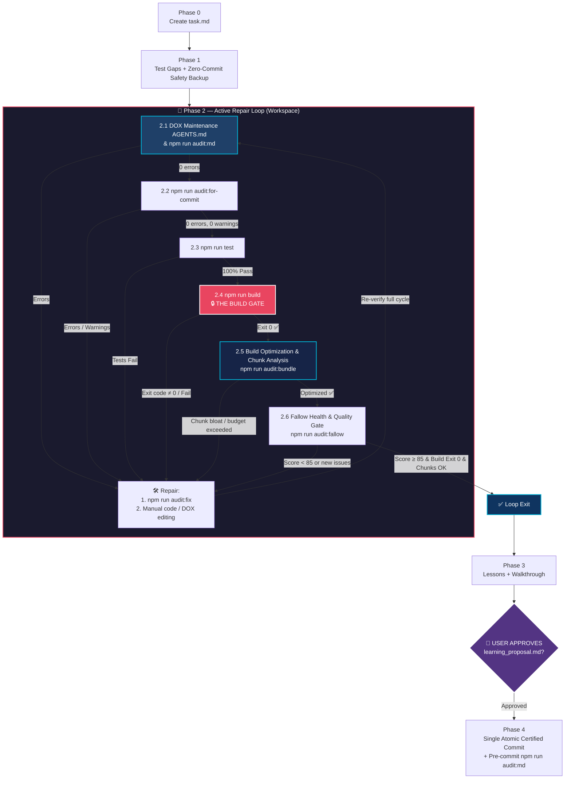

# Safe Commit Workflow (@francogp/auditor Edition)

> [!IMPORTANT]
> **PROMPT-DRIVEN TRIGGER ONLY**: Activate when the user explicitly requests a commit or push. Do NOT activate for automatic agent-internal saves or background operations.
>
> **EXCLUSIVE WORKFLOW BOUNDARY (`npm run audit:for-commit`)**: The command `npm run audit:for-commit` (or `npx auditor-commit`) belongs STRICTLY AND EXCLUSIVELY to this `/safe-commit` workflow. Agents MUST NEVER execute `npm run audit:for-commit` during routine feature development, bug fixes, or regular verification turns outside of `/safe-commit`. Running it right after `npm run audit` in normal tasks is redundant and strictly prohibited.

---

## ⚡ Sequential Execution Contract

This workflow is a **strict state machine**, not a loose checklist. Each step produces output that the next step consumes.

| Rule | What it means |
|---|---|
| **One command per turn** | Issue one tool call, read its output, then decide the next step. Never batch. |
| **Read before continuing** | "I ran it" ≠ "I verified the result." Read every output before proceeding. |
| **No optional phases** | Phases 0–4 are mandatory. Skipping phases is STRICTLY FORBIDDEN. |
| **Update `task.md` continuously** | Update `<appDataDir>/brain/<conversation-id>/task.md` after each step. |
| **Unbroken Repair Loop** | You MUST NEVER exit Phase 2 until all 6 validation gates exit cleanly with code 0 on the final code. |
| **Zero Gatekeeper Tampering & Proactive Evolution** | Agents MUST NEVER unilaterally weaken, alter, relax, or reinterpret the verification rules, thresholds, or filtering logic of `audit_for_commit.ts`, `audit_bundle.ts`, or any quality gatekeeper to make checks pass. All project errors and NEW warnings must be resolved cleanly at the code source. |
| **Dynamic Modules & Domain Exports Analysis** | When resolving unused exports (Fallow), NEVER blindly strip `export` without analyzing whether the symbol is needed by dynamically loaded modules, test suites, or public contracts. Register legitimate public exports in `.fallowrc.json` under `ignoreExports`. |

> [!CAUTION]
> The most common failure modes are batching commands, assuming a fix worked without re-running the gate, skipping output verification, or **modifying auditor scripts to suppress warnings instead of fixing source code**. The cost is committing unverified or degraded code into **permanent, irreversible** git history.

---

## Workflow Overview



---

## Phase 0: Mandatory Artifact Initialization

> [!CAUTION]
> This is the absolute first action — before `git status`, before any npm command, before anything.

**Step 0.1** — Initialize `task.md`

Call `write_to_file` to create `<appDataDir>/brain/<conversation-id>/task.md` using the exact structure from [task-template.md](./references/task-template.md). All phase items start as `[ ]`.

**Step 0.2** — Note scratch directory

The temporary working directory is `<appDataDir>/brain/<conversation-id>/scratch/`.

**✓ Completion gate**: Mark Phase 0 `[x]` in `task.md` and include a snippet in your response. Proceed to Phase 1.

---

## Phase 1: Test Gap Analysis & Zero-Commit Safety Backup

This phase audits test coverage for modified logic and captures a zero-commit safety backup in the workspace. If subsequent audit auto-fixes or repairs corrupt logic, the patch file in `scratch/backups/` allows instantaneous recovery without polluting git history with premature, unverified commits.

**Step 1.1** — Inspect changes (`git status` & `git diff`)
- Run `git status` to identify 100% of modified, untracked, and deleted files across the entire repository.
- Record the full list under `### Workspace Safety Backup` in `task.md`.

**Step 1.2** — Test Gap Analysis
- Verify if any non-trivial logic was modified in `src/` without corresponding unit tests.
- If gaps exist, write the unit tests immediately in `tests/` before moving forward.

**Step 1.3** — Record Baseline Health & Create Code-Only Safety Patch
- Run `npm run audit:fallow` (or `npx fallow health --format json --quiet`) to record `BASELINE_HEALTH`.
- Create the safety patch:
  ```bash
  mkdir -p scratch/backups && git diff HEAD -- '*.ts' '*.vue' '*.js' '*.scss' '*.css' '*.sql' ':!*.json' > scratch/backups/pre_audit_backup.patch
  ```

**Step 1.4** — Pre-Draft Commit Message
- Pre-draft the commit message in `task.md` following [commit-standards.md](./references/commit-standards.md).

**✓ Completion gate**: Mark Phase 1 `[x]` in `task.md`. Proceed to Phase 2.

---

## Phase 2: Active Verification & Repair Loop 🔁

You must execute the 6 gates sequentially. If ANY gate fails, execute the repair protocol and restart the loop from 2.1 until all pass consecutively.

### 2.1 DOX Maintenance & Markdown Audit
- Run `npm run audit:md`.
- Verifies that all modified directories have up-to-date `AGENTS.md` and zero broken links.
- MUST exit with 0 errors.

### 2.2 Auditor Differential Gate (`npm run audit:for-commit`)
- Run `npm run audit:for-commit` (or `npx auditor-commit`).
- Compares new errors and warnings in modified files against `origin/main`.
- MUST report 0 errors and 0 new warnings.

### 2.3 Test Suite Execution
- Run `npm run test` (or `npm test`).
- 100% of automated unit and integration suites must pass.

### 2.4 The Build Gate (`npm run build`)
- Run `npm run build`.
- Compiles the production bundle with strict exit code 0. Zero bypasses.

### 2.5 Production Bundle & Chunk Analysis (`npm run audit:bundle`)
- Run `npm run audit:bundle` (or `npx auditor-bundle`).
- Audits compiled chunks in `dist/assets/` against architectural budgets and verifies that no duplicate modules exceed 500 KB across multiple chunks in `scratch/bundle_stats.html`.

### 2.6 Fallow Health & Quality Gate (`npm run audit:fallow`)
- Run `npm run audit:fallow`.
- Score must be >= 85 and >= `BASELINE_HEALTH`, with zero unaddressed high-severity issues.

**✓ Completion gate**: All 6 gates passed consecutively on the final code. Mark Phase 2 `[x]` in `task.md`. Proceed to Phase 3.

---

## Phase 3: Lessons Extraction & User Approval Gate (🛑 HARD STOP)

**Step 3.1** — Extract Lessons Learned
- Analyze debugging discoveries, architectural insights, or edge cases resolved during the task.
- Draft `<appDataDir>/brain/<conversation-id>/learning_proposal.md`.

**Step 3.2** — Create Walkthrough
- Document changes and verification evidence in `<appDataDir>/brain/<conversation-id>/walkthrough.md`.

**Step 3.3** — Workspace Scratch Cleanup
- Remove transient debug files, leaving only `scratch/backups/`.

**Step 3.4** — 🛑 STOP & Call `ask_question`
- Solicit explicit user review and approval before creating the git commit.

---

## Phase 4: Single Atomic Certified Commit

Once the user approves:
1. Apply approved lessons to owning `AGENTS.md`.
2. Run pre-commit sanity check: `npm run audit:md`.
3. Synthesize the final commit message following [commit-standards.md](./references/commit-standards.md).
4. Run:
   ```bash
   git add . && git commit -m "<message>"
   ```
5. Mark Phase 4 `[x]` in `task.md` and display final confirmation.
